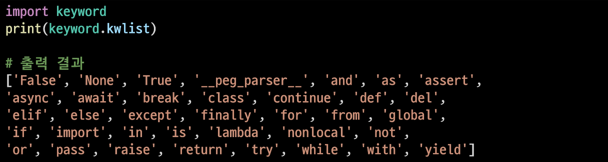
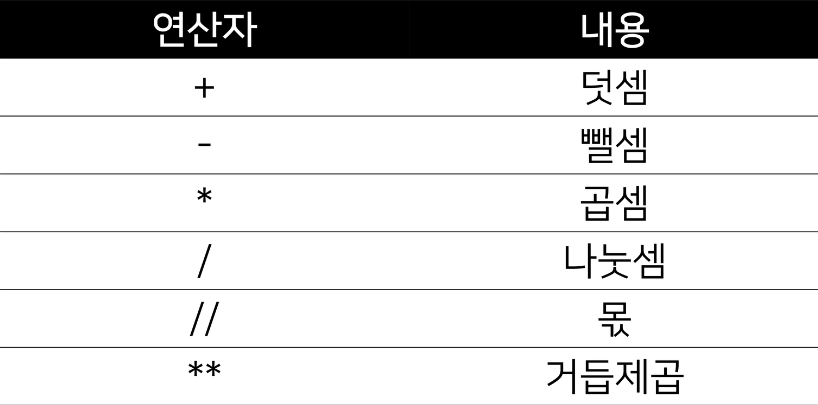
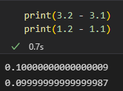
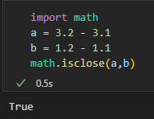
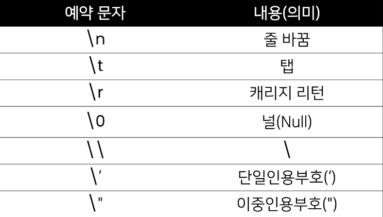
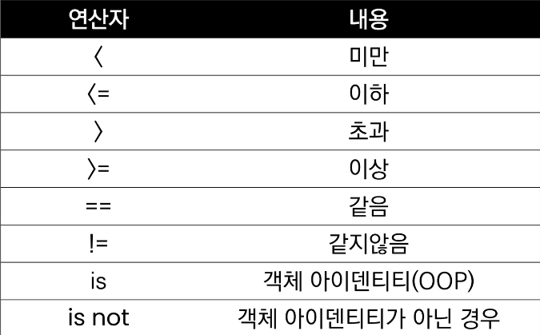
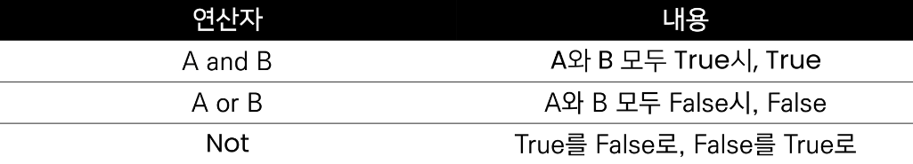
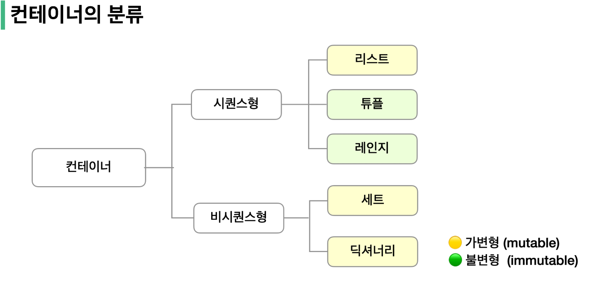
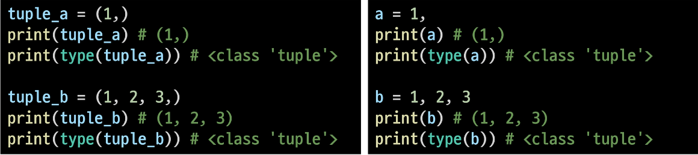
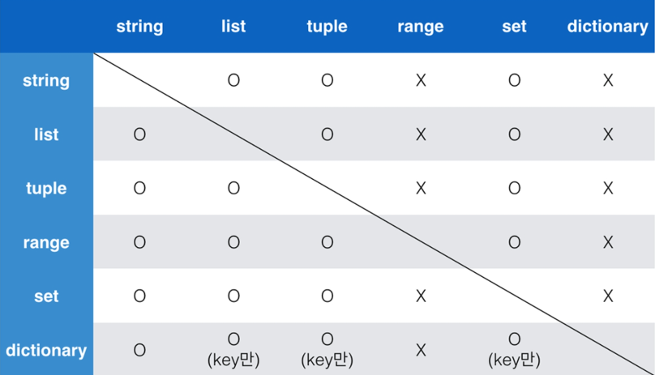

# 1/16

### python : 프로그래밍과 데이터

#### 프로그래밍이란?

> 프로그래밍 과정
> 
> > 1. 컴퓨터에게 시키고 싶은 일을 정한다.
> > 
> > 2. 컴퓨터가 이해할 수 있도록 수행절차를 정의해서 표현한다.
> > 
> > 3. 적절한 프로그래밍 언어를 선택하고, 언어를 이용해서 절차를 기술한다.
> > 
> > 4. 발생하는 오류를 수정한다.

> 컴퓨터 사고력(computational thinking)
> 
> > 컴퓨터의 특성을 잘 이해한다.
> > 
> > 문제 해결 능력을 기른다. (큰 문제를 작은 문제로 쪼갤 수 있는 능력)
> > 
> > 프로그래밍 언어에 능숙해진다.

> 컴퓨터는 기계어로 소통
> 
> - 기계어란 0과 1로 모든 것을 표현(2진법)

> 프로그래밍 언어
> 
> - 기계어의 대안으로 사람이 이해할 수 있는 새로운 언어 개발
> 
> - 특징
>   
>   - 사람이 이해할 수 있는 문자로 구성
>   
>   - 기본적인 규칙과 문법이 존재
> 
> - 소스 코드
>   
>   - 프로그래밍 언어로 작성된 프로그램
> 
> - 번역기 (interpreter or compiler)
>   
>   - 소스 코드를 컴퓨터가 이해할 수 있는 기계어로 번역
>   
>   - 파이썬의 경우 interpreter를 사용

#### 파이썬의 특징

> 다른 프로그래밍 언어(ex) 자바, C++)에 비해 문법이 간단하며, 엄격하지 않음
> 
> 별도의 데이터 타입 지정이 필요없으며, 재할당이 가능
> 
> 문장을 구분할 때 중괄호를 사용하지 않고 들여쓰기를 사용함
> 
> 소스코드를 기계어로 변환하는 컴파일 과정 없이 바로 실행이 가능함
> 
> 객체 지향 프로그래밍 언어로 모든 것이 객체로 구현되어 있음

- big data, AI, data analysis, ML, DL, Web, Fintech, system programming, Cloud, Block chain, Embedded, Game 등 많은 분야에 Python이 이용되고 있음

#### 파이썬 개발 환경 종류

- IDE(Intergrated Development Environment)
  
  - 통합 개발 환경의 약자로 개발에 필요한 다양하고 강력한 기능들을 모아둔 프로그램
  
  - 보통 개발은 IDE로 진행함

- Jupyter Notebook
  
  - 문법 학습을 위한 최적의 도구로, 소스코드와 함께 실행 결과와 마크다운 저장 가능
  
  - open source 기반의 웹 플랫폼 및 어플리케이션으로, 파이썬을 비롯한 다양한 프로그래밍 언어를 지원하며 셀 단위의 실행이 가능한 것이 특징

- IDLE(Intergrated Development and Learning Environment)

#### 파이썬 기초문법

1. 변수와 식별자
   
   1. 변수란?
      
      1. 데이터를 저장하기 위해서 사용
      
      2. 변수를 사용하면 복잡한 값들을 쉽게 사용할 수 있음(추상화)
      
      3. 동일 변수에 다른 데이터를 언제든 할당(저장)할 수 있기 떄문에, '변수'라고 불림
      
      4. 변수를 사용하면 이점
         
         - 코드의 가독성 증가
         
         - 숫자를 직접 적지 않고, 의미 단위로 작성 가능
         
         - 코드 수정이 용이해짐
   
   2- 식별자(Identifiers)
      
      - 변수의 이름을 식별자라고함
      
      - 일기 쉽고 이해하기 쉬운 변수명을 선호
      
      - 변수 이름 규칙
        
        - 식별자의 이름은 영문 알파벳, 언더 스코어(_), 숫자로 구성
        
        - 첫 글자에 숫자가 올 수 없음
        
        - 길이 제한이 없고, 대소문자를 구별
        
        - 다음의  keywords는 사용할 수 없음
          
          
        
        - 내장 함수나 모듈 등의 이름도 사용하지 않음
          
          동작을 예상할 수 없게 임의로 값을 할당하게 되기 때문에 범용적이지 않은 코드가 됨
   
   3. 주석(comment)
      
      1. 코드의 실행에 영향을 미치지 않는 나만의 메모
      
      2. 코드에 대한 쉬운 이해
      
      3. 유지보수 용이
      
      4. 협업 용이

2. 연산자
   
   - 기본적인 사칙연산 및 수식 계산
     
     
   
   - 연산자엔 기본 우선순위가 있음

3. 자료형
   
   - 데이터를 컴퓨터가 기억하는 과정
     
     1. 데이터를 저장할 공간을 메모리에 만들고 저장할 공간에 대한 주소(id)를 할당 받는다.
     
     2. 할당받은 주소를 기억했다가 데이터를 해당 주소로 찾아가서 저장한다.
     
     3. 이후 동일 데이터가 필요해지면 해당 주소로 가서 읽어온다.
   
   . 변수 선언(variable declaration)
     
     . 대부분의 프로그래밍에서 가장 먼저 하는 일
   
   . 자료형마다 차지하는 메모리의 크기가 다르다.
   
   . 자료형 분류
     
     . 수치형
       
       . Int(정수 Integer)
         
         . 진수 표현
           
           - 2진수(binary) : 0b
           
           - 8진수(octal) : 0o
           
           - 16진수(hexadecimal) : 0x
       
       . float(부동소수점, 실수, floating point number)
         
         . 실수 연산시 주의할 점(부동소수점)
           
           . 컴퓨터는 2진수를 사용
           
           . 10진수 0.1은 2진수로 표현하면 무한대로 반복하는 것을 알 수 있음
           
           . 무한대 숫자를 그대로 저장할 수 없어서 근사값만을 표시 및 저장
           
           . 그 숫자는 0.1과 근사하지만 정확히 같지는 않음!
             
             
           
           . 해결책
             
             . 값을 비교하는 과정에서 정수가 아닌 실수일 때 math module을 활용
               
               
       
       . complex(복소수, complex number)
     
     . 문자열(String Type)
       
       . 모든 문자는 str type
       
       . 문자열은 '' or ""를 사용하여 표기
         
         . 문자열을 묶을 때 동일한 문장부호를 활용
         
         . PEP8에서는 소스코드 내에서 하나의 문장부호를 선택하여 유지하도록 함
         
         
     
     . None
       
       . 파이썬 자료형 중 하나
       
       . 값이 없음을 표현하기 위해 None type이 존재
       
       . 일반적으로 반환 값이 없는 함수에서 사용하기도 함
     
     . Boolean type
       
       . 논리 자료형으로 참과 거짓을 표현하는 자료형
       
       . True or False을 output으로 가짐
       
       . 비교 / 논리 연산에서 활용
       
       . 비교 연산자
         
         
         
         
       
       . 논리 연산자도 우선순위가 존재
         
         - not, and, or 순으로 우선순위가 높음
       
       - True는 1, False는 0

4- 컨테이너
   
   - 여러 개의 값(데이터)을 담을 수 있는 것(객체)으로, 서로 다른 자료형을 저장할 수 있음 ex) List
   
   - 컨테이너의 분류
     
     - 순서가 있는 데이터 vs 순서가 없는 데이터
     
     - 순서가 있다 != 정렬되어 있다.
       
       
   
   - List
     
     - 여러 개의 값을 순서가 있는 구조로 저장하고 싶을 때 사용
     
     - 대괄호([]) or list()를 통해 생성
       
       - 생성된 이후 내용 변경이 가능한 가변 자료형
     
     - 순서가 있는 시퀀스로 인덱스를 통해 접근 가능
       
       - list[i]
   
   - Tuple
     
     - 여러 개의 값을 순서가 있는 구조로 저장하고 싶을 때 사용
       
       - list와의 차이점은 생성 후, 담고 있는 값 변경 불가능한 불변 자료형
     
     - 항상 소괄호() 형태로 사용
     
     - 소괄호(()) or tuple()을 통해 생성
     
     - immutable 시퀀스로 인덱스로 접근 가능
       
       - tuple[i]
     
     - 단일 항목의 경우
       
       - 하나의 항목으로 구성된 튜플은 생성 시 값 뒤에 쉼표를 붙여야 함
     
     - 복수 항목의 경우
       
       - 마지막 항목에 붙은 쉼표는 없어도 되지만, 넣는 것을 권장
         
         
   
   - Range
     
     - 숫자의 시퀀스를 나타내기 위해 사용
     
     - 주로 반복문과 함께 사용됨
     
     - Range(n) : 0 ~ (n-1)
     
     - Range(n, m) : n ~ (m-1)
   
   - Slicing
     
     - index와 콜론을 사용하여 문자열의 특정 부분만 잘라낼 수 있음
     
     - slicing을 이용하여 문자열을 나타낼 때 콜론을 기준으로 앞 인덱스에 해당하는 문자는 포함되지만 뒤 인덱스에 해당하는 문자는 미포함

5- 비시퀀스형 컨테이너
   
   - dictionary
     
     - key-value 쌍으로 이루어진 자료형
     
     - key
       
       - key는 변경 불가능한 데이터만 활용 가능
     
     - values
       
       - 어떠한 형태든 관계없음
     
     - 중괄호({}) or dict()을 통해 생성
     
     - key를 통해 value에 접근
   
   - 형 변환(typecasting)
     
     - 데이터 형태는 서로 변환할 수 있음
     
     - 암시적 형 변환(Implicit)
       
       - 사용자가 의도하지 않고, 파이썬 내부적으로 자료형을 반환하는 경우
       
       - boolean, numeric type
     
     - 명시적 형 변환(Explicit)
       
       - 사용자가 특정 함수를 활용하여 의도적으로 자료형을 변환하는 경우
         
         
         
         

