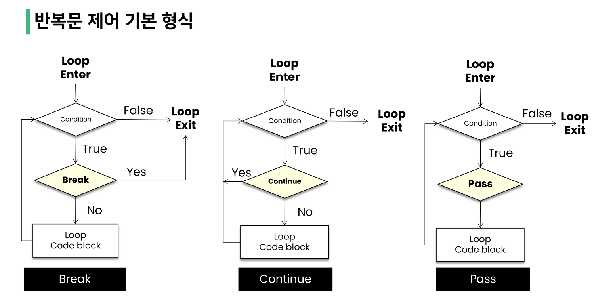
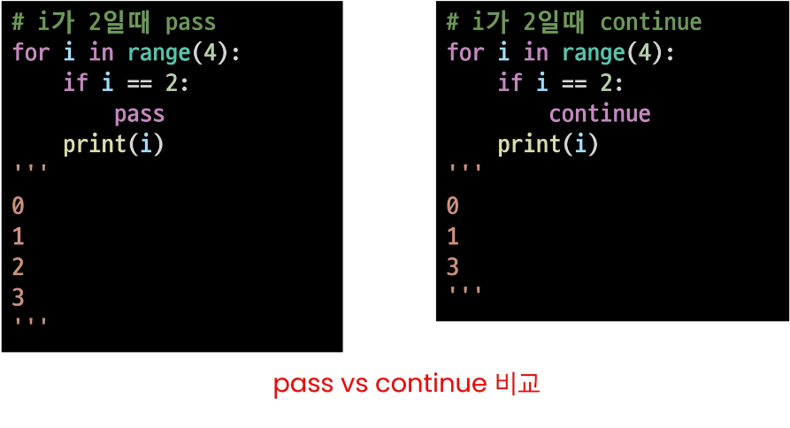

# 1_17

### code style guide

- 코드를 '어떻게 작성할지'에 대한 가이드라인

- 파이썬에서 제안하는 스타일 가이드
  
  - PEP8(https://www.python.org/dev/peps/pep-0008/)

- 각 회사/플젝마다 따로 스타일 가이드를 설정하기도 함
  
  - Google style guide (https://google.github.io/styleguide/pyguide.html)

> ##### 들여쓰기
> 
> - space sensitive
>   
>   - 문장을 구분할 때, 중괄호{} 대신 들여쓰기(indentation)를 사용
>   
>   - 들여쓰기를 할 때는 4칸(space키 4번) or Tab을 입력
>     
>     - 혼용 금지!!!!!!!!!!!!!!!! 에러남!!
>     
>     - Tab으로 들여쓰면 계속 탭으로 들여써야함
>     
>     - 원칙적으로는 공백(빈칸, space) 사용을 권장 *PEP8 권장사항

### 조건문

- 조건문은 참/거짓을 판단할 수 있는 조건식과 함께 사용

> ##### 기본 형식
> 
> - 조건에는 참/거짓에 대한 조건식
>   
>   - 조건이 참인 경우 이후 들여쓰기가 되어있는 코드 블록을 실행
>   
>   - 이외의 경우 else or else if 이후 들여쓰기 되어있는 코드 블록을 실행
>     
>     - else는 선택적으로 활용할 수 있음

> ##### 복수 조건문
> 
> - 복수의 조건식을 활용할 경우 elif( = else if )를 활용하여 표현함

> ##### 중첩 조건문
> 
> - 조건문은 다른 조건문에 중첩되어 사용할 수 있음
>   
>   - 들여쓰기에 유의하여 작성할 것

> ##### 조건 표현식
> 
> - 조건 표현식(conditional expression)이란?
>   
>   - 조건 표현식을 일반적으로 조건에 따라 값을 정할 때 활용
>   
>   - 삼항 연산자(ternary operator)로 부르기도 함
>     
>     - ex) value=num if num>=0 else -num
>     
>     - 설명) num이 0이상이면 value에 저장하고 아니면 num에 -를 붙여 value에 저장.

### 반복문의 종류

- while 문
  
  - 종료 조건에 해당하는 코드를 통해 반복문을 종료시켜야 함

- for 문
  
  - 반복 가능한 객체를 모두 순회하면 종료 (별도의 종료 조건이 필요 없음)

- 반복 제어
  
  - break, continue, for-else

> ##### while 문
> 
> - while문은 조건식이 참인 경우 반복적으로 코드를 실행
>   
>   - 조건이 참인 경우 들여쓰기 되어 있는 코드 블록이 실행됨
>   
>   - 코드 블록이 모두 실행되고, 다시 조건식을 검사하며 반복적으로 실행됨
>   
>   - while 문은 무한 루프를 하지 않도록 종료 조건이 반드시 필요

> ##### 복합 연산자(In-Place Operator)
> 
> - 복합 연산자는 연산과 할당을 합쳐 놓은 것
>   
>   - ex) 반복문을 통해서 개수를 카운트 하는 경우

> ##### for 문
> 
> - for문은 시퀀스(string, tuple, list, range)를 포함한 순회 가능한 객체(iterable)의 요소를 모두 순회
>   
>   - 처음부터 끝까지 모두 순회하므로 별도의 종료조건이 필요하지 않음
> 
> - iterable
>   
>   - 순회할 수 있는 자료형(string, tuple, list, range, dict, set 등)
>   
>   - 순회형 함수(range, enumerate)
> 
> - for문을 이용한 문자열(string) 순회
>   
>   - 문자열에도 index가 있으므로 for i in '문자열': print(i)
> 
> - for문을 이용한 dictionary 순회
>   
>   - dictionary는 기본적으로 key를 순회하며, key를 통해 값을 활용
>   
>   - 추가 method를 활용하여 순회할 수 있음
>     
>     - keys() : Key로 구성된 결과
>     
>     - values() : value로 구성된 결과
>     
>     - items() : (Key, Value)의 튜플로 구성된 결과
> 
> - enumerate 순회
>   
>   - index와 객체를 쌍으로 담은 열거형(enumerate) 객체 반환
>   
>   - (index, value) 형태의 tuple로 구성된 열거 객체를 반환
> 
> - List Comprehension
>   
>   - 표현식과 제어문을 통해 특정한 값을 가진 리스트를 간결하게 생성하는 방법
>   
>   - [code for 변수 in iterable]
>   
>   - [code for 변수 in iterable if 조건식]
>   
>   - [code if 조건식 else code for 변수 in iterable]
>   
>   - [code for 변수 in iterable for 변수 in iterable] : 뒤에서 먼저 돌아감
> 
> - Dictionary Comprehension
>   
>   - 표현식과 제어문을 통해 특정 값을 가진 딕셔너리를 간결하게 생성하는 방법
>   
>   - {key:value for 변수 in iterable}
>   
>   - {key:value for 변수 in iterable if 조건식}
>   
>   - {key:value if 조건식 else key:value for 변수 in iterable}

- 반복문 제어
  
  - break
    
    - 반복문을 종료
  
  - continue
    
    - continue 이후의 코드 블록은 수행하지 않고, 다음 반복을 수행
  
  - for-else
    
    - 끝까지 반복문을 실행한 이후에 else문 실행
      
      - break를 통해 중간에 종료되는 경우 else 문은 실행되지 않음
  
  - pass
    
    - 아무것도 하지 않음(문법적으로 필요하지만, 할 일이 없을 때 사용)
      
      
      
      

