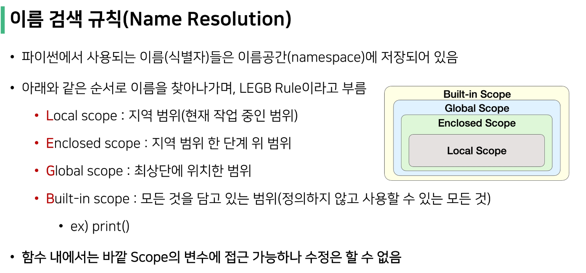
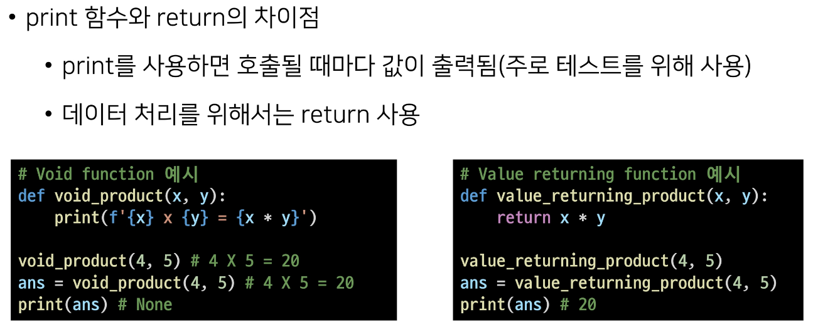

# 1_18

- 함수를 사용하는 이유
  
  - Decomposition(분해) : 기능을 분해하고 재사용 가능하게 만드는 것
  
  - Abstraction(추상화) :  재사용성과 가독성, 생산성이 좋음
    
    - 내부 구조를 변경할게 아니라면 몰라도 무방
      
      - ex) 스마트폰의 원리를 모르더라도 사용 가능

> ### 함수의 종류
> 
> - 함수는 크게 3가지로 분류
>   
>   - 내장 함수
>     
>     - 파이썬에 기본적으로 포함된 함수
>   
>   - 외장함수
>     
>     - import 문을 통해 사용하며, 외부 라이브러리에 제공하는 함수
>   
>   - 사용자 정의 함수
>     
>     - 직접 사용자가 만드는 함수

> ### 함수의 정의
> 
> - 함수(Function)
>   
>   - 특정한 기능을 하는 코드의 조각(묶음)
>   
>   - 특정 코드를 매번 다시 작성하지 않고, 필요시에만 호출하여 간편히 사용

> ### 함수의 기본 구조
> 
> - 선언과 호출(define & call)
>   
>   - 함수의 선언은 def를 활용함
>   
>   - 들여쓰기를 통해 Function body(실행될 코드 블록)를 작성함
>     
>     - docstring은 함수 body 앞에 선택적으로 작성 가능
>       
>       - 작성시에는 반드시 첫 번째 문장에 문자열 '''
>   
>   - 함수는 parameter를 넘겨줄 수 있음
>   
>   - 함수는 동작 후에 return을 통해 결과값을 전달함
>   
>   - 함수는 함수명()으로 호출하여 사용
>     
>     - parameter가 있는 경우, 함수명(값1, 값2,...)으로 호출
> 
> - 입력(input)
>   
>   - parameter와 argument
>     
>     - parameter : 함수를 정의할 때, 함수 내부에서 사용되는 변수
>     
>     - argument : 함수를 호출할 때, 넣어주는 값
>       
>       - 함수 호출 시 함수의 parameter를 통해 전달되는 값
>       
>       - argument는 소괄호 안에 할당 ex) func_name(argument)
>         
>         - 필수 argument : 반드시 전달되어야하는 argument
>         
>         - 선택 argument : 값을 전달하지 않아도 되는 경우는 기본값이 전달
>         
>         - default 값을 줄 수 있음
> 
> - 문서화(docstring)
> 
> - 범위(scope)
>   
>   - 함수는 코드 내부에 local scope를 생성하며, 그 외의 공간인 global scope로 구분
>   
>   - scope
>     
>     - global scope : 코드 어디에서든 참조할 수 있는 공간
>     
>     - local scope : 함수가 만든 scope로 함수 내부에서만 참조 가능
>   
>   - variable
>     
>     - global variable : global scope에 정의된 변수
>     
>     - local variable : local scope에 정의된 변수
>   
>   - namespace
>     
>     - built-in namespace
>       
>       - return, id, len 등 
>     
>     - global namespace
>       
>       - python script가 실행될 때 생성되는 namespace
>     
>     - enclosing namespace
>       
>       - 중첩된 함수를 실행할 때 바깥쪽에 있는 namespace
>     
>     - local namespace
>       
>       - 어떤 func을 실행할 때 생성되는 namespace
>   
>   - 변수 수명주기(lifecycle)
>     
>     - 변수는 각자의 수명주기(lifecycle)가 존재
>       
>       - built-in scope
>         
>         - 파이썬이 실행된 이후부터 영원히 유지
>       
>       - global scope
>         
>         - 모듈이 호출된 시점 이후 혹은 인터프리터가 끝날 때까지 유지
>       
>       - local scope
>         
>         - 함수가 호출될 때 생성되고, 함수가 종료될 때까지 유지
>         
>         
>   
>   - global
>     
>     - 현재 코드 블록 전체에 적용되며, 나열된 식별자(이름)이 global variable임을 나타냄
>       
>       - global에 나열된 이름은 같은 코드블록에서 global 앞에 등장할 수 없음
>       
>       - global에 나열된 이름은 parameter, for 루프 대상, 클래스/함수 정의 등으로 정의되지 않아야함
>   
>   - nonlocal
>     
>     - global을 제외하고 가장 가까운 scope의 변수를 연결하도록 함
>       
>       - nonlocal에 나열된 이름은 같은 코드 블록에서 nonlocal 앞에 등장할 수 없음
>       
>       - nonlocal에 나열된 이름은 parameter, for 루프 대상, 클래스/함수 등으로 정의되지 않아야함
>     
>     - global과는 달리 이미 존재하는 이름과의 연결만 가능함
> 
> - 결과값(output)
>   
>   - 값에 따른 함수의 종류
>     
>     - Void function
>       
>       - 명시적인 return 값이 없는 경우, None을 반환하고 종료
>     
>     - Value returning function
>       
>       - 함수 실행 후, return문을 통해 값 반환
>       
>       - return을 하게 되면 값 반환 후 함수가 바로 종료
>         
>         
>       
>       - 

