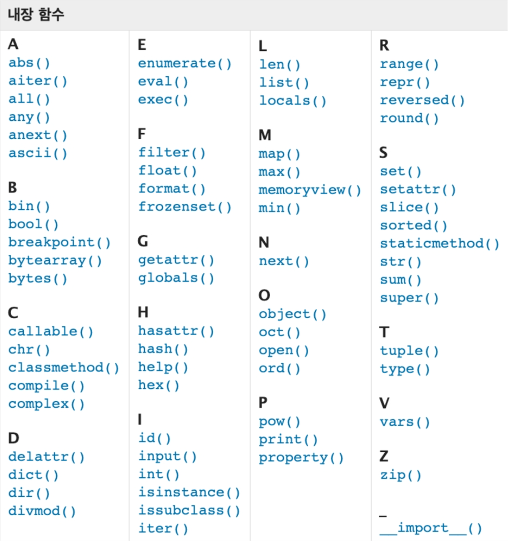

# 1_19

### 함수 응용

> 내장 함수(Built-in Functions)
> 
> - 파이썬 인터프리터에는 항상 사용할 수 있는 많은 함수와 type이 내장되어 있음
>   
>   

> map(function, iterable)
> 
> - 순회 가능한 데이터 구조(iterable)의 모든 요소에 함수(function)를 적용하고, 그 결과를 map object로 반환 > list, set, tuple등으로 형변환 필요
>   
>   ```python
>   n, m = map(int, input().split()) # 3,5를 입력하면
>   print(n, m) # 3,5
>   print(type(n), type(m)) # 둘 다 class가 int로 print됨
>   ```

> filter(function, iterable)
> 
> - 순회 가능한 데이터 구조(iterable)의 모든 요소에 함수(function)를 적용하고, 그 결과가 True인 것들을 filter object로 반환 > list, set, tuple등으로 형변환 필요
>   
>   ```python
>   def odd(n): # 2로 나눈 나머지를 return하는 func
>       return n % 2
>   numbers = [1,2,3] 
>   # num의 원소들을 하나하나 odd에 적용시키고 True인 것만 저장한다. 
>   result = filter(odd, num) 
>   print(result, type(result)) # filter object / class 'filter'
>   print(list(result)) # [1,3]
>   ```

> zip(*iterable)
> 
> - 복수의 iterable을 모아 tuple을 원소로 하는 zip object를 반환
>   
>   ```python
>   girls = ['jane','ashley']
>   boys = ['justin','eric']
>   pair = zip(girls, boys)
>   print(pair, type(pair)) # zip object / class 'zip'
>   print(list(pair)) # [('jane','justin'),('ashely','eirc)]
>   ```

> lambda [parameter] : 표현식
> 
> - 람다 함수
>   
>   - 표현식을 계산한 결과값을 반환하는 함수로, 이름이 없는 함수여서 익명 함수라고도 불림
> 
> - 특징
>   
>   - return문을 가질 수 없음
>   
>   - 간편 조건문 외 조건문이나 반복문을 가질 수 없음
> 
> - 장점
>   
>   - 함수를 정의해서 사용하는 것보다 간결하게 사용 가능
>   
>   - def를 사용할 수 없는 곳에서도 사용 가능
>   
>   ```python
>   # 삼각형의 넓이를 구하는 공식 - def
>   def triangle_area(b,h):
>       return 0.5 * b * h
>   print(triangle_area(5,6)) # 15.0
>   ```
> 
> # 삼각형의 넓이를 구하는 공식 - lambda
> 
>   triangle_area = lambda b, h : 0.5 * b * h
>   print(triangle_area(5,6)) # 15.0
> 
> # lambda와 map을 합쳐 x^2을 구하는 func
> 
>   list(map(lambda x : x ** 2, [1,2,3,4])
> 
> ```
> 
> ```

> 재귀 함수(recursive function)
> 
> - 자기 자신을 호출하는 함수
> 
> - 무한한 호출을 목표로 하는 것이 아니며, 알고리즘 설계 및 구현에서 유용하게 활용
>   
>   - 알고리즘 중 재귀 함수로 로직을 표현하기 쉬운 경우가 있음(ex) 점화식)
>   
>   - 변수의 사용이 줄어들며, 코드의 가독성이 높아짐
> 
> - 1개 이상의 base case(종료되는 상황)가 존재하고, 수렴하도록 작성
> 
> - 재귀 함수 예시
>   
>   ```python
>   def factorial(n):
>       if n == 0 or n == 1:
>           return 1
>       else :
>           return n * factorial(n-1)
>   print(factorial(4)) # 24
>   ```
> 
> - 재귀 함수 주의사항
>   
>   - 재귀 함수는 base case에 도달할 때까지 함수를 호출함
>   
>   - 메모리 스택이 넘치게 되면(stack overflow) 프로그램이 동작하지 않게 됨
>   
>   - 파이썬에서는 최대 재귀 깊이(maximum recursion depth)가 1,000번으로, 호출 횟수가 이를 넘어가게 되면 Recursion Error 발생
> 
> - 반복문(for, while)과 재귀 함수 비교
>   
>   - 알고리즘 자체가 재귀적인 표현이 자연스러운 경우 재귀함수를 사용함.
>   
>   - 재귀 호출은 변수 사용을 줄여줄 수 있음.
>   
>   - 재귀 호출은 입력 값이 커질 수록 연산 속도가 오래 걸림.

### 패킹 / 언패킹 (Packing / Unpacking)

> 패킹 / 언패킹 연산자 (Packing / Unpacking Operator)
> 
> - 모든 시퀀스형(list, tuple 등)은 패킹/언패킹 연산자 *을 사용하여 객체의 패킹 or 언패킹이 가능
>   
>   - ex) x, *y = i,j,k...
> 
> - 패킹
>   
>   - 대입문의 좌변 변수에 위치
>   
>   - 우변의 객체 수가 좌변의 변수 수보다 많을 경우 객체를 순서대로 대입
>   
>   - 나머지 항목들은 모두 별 기호 표시된 변수에 리스트로 대입
>     
>     ex)
>     
>     ```python
>     x, *y = 1, 2, 3, 4
>     print(x, y) # 1, [2,3,4]
>     ```
> 
> - 언패킹
>   
>   - argument 이름이 *로 시작하는 경우, argument unpacking이라 함
>     
>     - *패킹의 경우, 리스트로 대입
>     
>     - *언패킹의 경우 튜플 형태로 대입 
> 
> - 별표(*) 연산자가 곱셈을 의미하는지 packing / unpacking 연산자인지 구분
>   
>   - packing / unpacking 연산자 *
>     
>     - *가 대입식의 좌측에 위치하는 경우
>     
>     - *가 단항 연산자로 사용되는 경우
>       
>       - 단항 연산자 : 하나의 항을 대상으로 연산이 이루어지는 연산자
>   
>   - 산술 연산자로서의 *
>     
>     - *가 이항 연산자로 사용되는 경우
>       
>       - 이항 연산자 : 두 개의 항을 대상으로 연산이 이루어지는 연산자

### 함수 가변 입력

> - print 함수의 arguments의 개수가 변해도 문제없이 돌아가는 이유
>   
>   - print(*objects, 등등)
>   
>   - *objects 덕분에 정해지지 않은 여러 개의 arguments를 처리할 수 있다.

> 가변 인자(*args)
> 
> - 가변인자란 여러 개의 positional arguments를 하나의 필수 parameter로 받아서 사용
> 
> - 가변인자는 몇 개의 positional argument를 받을 지 모르는 함수를 정의할 때 유용하다

> 패킹 / 언패킹
> 
> - 가변 인자를 이해하기 위해서는 패킹, 언패킹을 이해해야 함
> 
> - 패킹
>   
>   - 여러 개의 데이터를 묶어서 변수에 할당하는 것
>     
>     ```python
>     numbers = (1,2,3,4,5) # packing
>     print(numbers) # (1,2,3,4,5)
>     ```
> 
> - 언패킹
>   
>   - 시퀀스 속의 요소들을 여러 개의 변수에 나눠 할당하는 것
>     
>     ```python
>     numbers = (1,2,3,4,5)
>     a, b, c, d, e = numbers # unpacking
>     print(a, b, c, d, e) # 1 2 3 4 5
>     ```
> 
> - 언패킹시 변수의 개수와 할당하고자 하는 요소의 갯수가 동일해야함
> 
> - 언패킹시 왼쪽의 변수에 asterisk(*)를 붙이면, 할당하고 남은 요소를 리스트에 담을 수 있음
>   
>   ```python
>   numbers = (1,2,3,4,5) # packing
>   
>   a, b, *rest = numbers # a에 1, b에 2, rest에 나머지를 대입
>   print(a,b,rest) # 1 2 [3,4,5]
>   
>   a, *rest, b = numbers # a에 1, b에 5, rest에 나머지를 대입
>   ```

> Asterisk(*)와 가변인자
> 
> - *는 시퀀스 언패킹 연산자라고도 불리며, 말 그대로 시퀀스를 풀어 헤치는 연산자
>   
>   - 주로 tuple or list를 unpacking할 때 사용
>   
>   - *를 활용하여 가변 인자를 만들 수 있음
>     
>     ```python
>     def print_family_name(father, mother, *pets):
>         print(f'아버지 : {father}')
>         print(f'어머니 : {mother}')
>         print()
>         for name in pets:
>             print(f'반려동물 : {name}')
>     print_family_name('아버지','어머니','멍멍이','냐옹이')
>     # 아버지 : 아버지 
>     # 어머니 : 어머니
>     # 반려동물 : 멍멍이
>     # 반려동물 : 냐옹
>     ```

> ### 가변 키워드 인자(**kwargs)
> 
> - 몇 개의 키워드 인자를 받을 지 모르는 함수를 정의할 때 유용
> 
> - **kwargs는 딕셔너리로 묶여 처리되며, parameter에 **를 붙여 표현
>   
>   ```python
>   def family(**kwargs):
>       for key, value in kwargs.items():
>           print(key, ':', value)
>   family(father = '아버지', mother = '어머니', baby = '아기')
>   # {father : 아버지, mother : 어머니, baby : 아기}
>   ```

> ### 모듈(module)
> 
> 모듈과 패키지(module, package) : 다양한 기능을 하나의 파일, 폴더로
> 
> 라이브러리(library) : 다양한 기능을 하나의 묶음으로
> 
> 위의 것들을 관리하는 관리자 : pip
> 
> 패키지의 활용 공간 : 가상환경 

> - 모듈
>   
>   - 특정 기능을 하는 코드를 파이썬 파일(.py) 단위로 작성한 것
> 
> - 패키지
>   
>   - 특정 기능과 관련된 여러 모듈의 집합
>   
>   - 패키지 안에는 또 다른 서브 패키지를 포함
