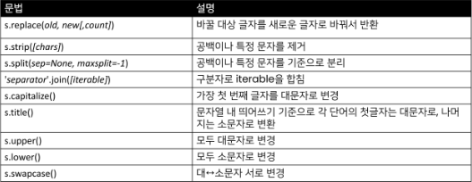

# 1_25

### 데이터 구조

- 데이터 구조(data structure)
  
  - 여러 데이터를 효과적으로 사용, 관리하기 위한 구조
  
  - 파이썬에는 대표적으로 List, Tuple, Dict, Set 등의 데이터 구조가 있음

### 자료구조

- 컴퓨터 공학에서는 '자료구조'라고 함

- 각 데이터의 효율적인 저장, 관리를 위한 구조를 나눠 놓은 것

### 데이터 구조 활용하기

- 데이터 구조를 활용하기 위해서는 method를 사용
  
  - method는 클래스 내부에 정의한 함수, 사실상 함수 동일
  
  - 쉽게 설명하자면 객체의 기능
  
  - ex) list.append(), string.split()

### 문자열(string type)

- 문자들의 나열(sequence of characters)
  
  - 모든 문자는 str type

- 문자열은 작은 따옴표(')나 큰 따옴표(")를 활용하여 표기
  
  - 문자열을 묶을 때 동일한 문장부호를 활용
  
  - PEP8에서는 소스코드 내에서 하나의 문장부호를 선택하여 유지하도록 함

- 문자열 변경 method
  
  

- 문자열은 immutable인데 변경되는 이유
  
  - 기존의 문자열을 변경하는게 아닌, 변경된 문자열을 새롭게 만들어서 반환
    
    - ex) replace, strip, title 등

- .replace(old, new, count)
  
  - 바꿀 대상 글자를 새로운 글자로 바꿔서 반환
  
  - count를 지정하면, 해당 count만큼만 변환

- .strip([chars])
  
  - 특정한 문자들을 지정하면
    
    - 양쪽을 제거(strip), 왼쪽 제거(lstrip), 오른쪽 제거(rstrip)
    
    - 문자열을 지정하지 않으면 공백을 제거함

- .split(sep = None, maxsplit = 1)
  
  - 문자열을 특정한 단위로 나눠 리스트로 반환
    
    - sep이 None이거나 지정되지 않으면 연속된 공백문자를 단일한 공백문자로 간주하고, 선행/후행 공백은 빈 문자열에 포함시키지 않음.
    
    - maxspilt이 -1인 경우에는 제한이 없음

- 'separator'.join([iterable])
  
  - iterable 컨테이너 요소들을 separator로 합쳐 문자열 반환
    
    - iterable에는 문자열만 가능

### List

- list는 여러 개의 값을 순서가 있는 구조로 저장하고 싶을 때 사용

> List의 생성과 접근
> 
> - 리스트는 대괄호([]) 혹은 list()를 통해 생성
>   
>   - python에서는 어떠한 자료형도 저장할 수 있으며, list안에 list를 넣을 수 있음
>   
>   - 생성된 이후 내용 변경이 가능
> 
> - 순서가 있는 sequence로 index를 통해 접근 가능
>   
>   - list[i]
> 
> - methods
>   
>   - 

### Tuple

> 정의
> 
> - tuple은 여러 개의 값을 순서가 있는 구조로 저장하고 싶을 때 사용
>   
>   - list와의 차이점은 생성 후, 담고 있는 값 변경 불가
> 
> - 항상 소괄호 형태로 사용
> 
> - methods
>   
>   - tuple은 변경할 수 없기 때문에 값에 영향을 미치치 않는 methods만을 지원
>   
>   - list methods 중 항목을 변경하는 methods를 제외하고 대부분 동일

### 연산자(Operator)

> membership operator
> 
> - 멤버십 연산자 in을 통해 특정 요소가 속해 있는지 여부를 확인
>   
>   - ex) 'a' in 'apple'
> 
> - 포함 여부 확인
>   
>   - in
>   
>   - not in

> sequence type operator
> 
> - 산술연산자 (+)
>   
>   - sequence 간의 concatenation(연결/연쇄)
> 
> - 반복연산자 (*)
>   
>   - sequence를 반복
> 
> - 

