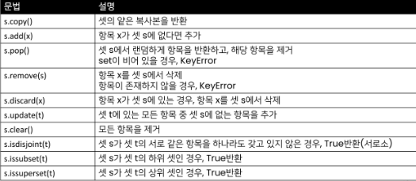
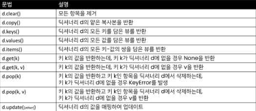

# 1_26

### 순서가 없는 데이터 구조

> #### Set
> 
> - Set이란 중복되는 요소가 없이 순서에 상관없는 데이터들의 묶음
>   
>   - 데이터의 중복을 허용하지 않기 때문에 중복되는 원소가 있다면 하나만 저장
>   
>   - 순서가 없기 때문에 인덱스를 이용한 접근 불가능
> 
> - 수학에서의 집합을 표현한 컨테이너
>   
>   - 집합 연산이 가능
>   
>   - 중복된 값이 존재하지 않음
> 
> - 담고 있는 요소를 삽입, 변경, 삭제 가능
>   
>   

> .add(elem)
> 
> - set에 값을 추가

> .update(*others)
> 
> - 여러 값을 추가

> .remove(elem)
> 
> - set에서 삭제하고, 없으면 KeyError

> .discard(elem)
> 
> - set에서 삭제하고 없어도 에러가 발생하지 않음

> .pop()
> 
> - 임의의 원소를 제거해 반환

> .clear()
> 
> - 모든 항목을 제거

> 관련 함수
> 
> - s.isdisjoint(t)
>   
>   - SET s가 SET t와 서로 같은 항목을 하나라도 갖고 있지 않은 경우, True 반환
> 
> - s.issubset(t)
>   
>   - SET s가 SET t의 하위 SET인 경우, True 반환
> 
> - s.issuperset(t)
>   
>   - SET s가 SET t의 상위 SET인 경우, True 반환

> #### dictionary

> 정의
> 
> - key-value 쌍으로 이뤄진 자료형
> 
> - key는 변경 불가능한 데이터만 활용 가능
>   
>   - string, integer, float, boolean, tuple, range
> 
> - values
>   
>   - 어떠한 형태는 관계 없음
>     
>     

> .get(key[,default])
> 
> - key를 통해 value를 가져옴
> 
> - KeyError가 발생하지 않으며, default값을 설정할 수 있음 (default = None)

> .pop(key[,default])
> 
> - key가 dictionary에 있으면 제거하고 해당 값을 반환
> 
> - 그렇지 않으면 default를 반환
> 
> - default값이 없으면 KeyError

> .update()
> 
> - 값을 제공하는 key, value로 덮어씁니다.

> #### 자료형과 메모리
> 
> 데이터 10을 컴퓨터가 기억하는 과정
> 
> 1. 10을 저장할 공간을 메모리에 만들고
> 
> 2. 저장할 공간에 대한 주소(id)를 할당받는다.
> 
> 3. 할당 받은 주소를 기억했다가
> 
> 4. 10이라는 데이터를 해당 주소로 찾아가서 저장한다
> 
> 5. 이후에 10이 필요해지면 해당 주소로 가서 읽어온다.

> 문제점 : 하나의 기억에 하나의 주소가 필요함 >> 방대한 데이터가 들어오면 방대한 주소를 필요로 함

> #### 깊은 복사와 얕은 복사
> 
> [얕은 복사(shallow copy)와 깊은 복사(deep copy)](https://wikidocs.net/16038)
> 
> - 얕은 복사는 객체를 새로운 객체로 복사하지만 원본 객체의 주소값을 복사하는 것이고, 깊은 복사는 전체 복사로 참조값의 복사가 아닌 참조된 객체 자체를 복사하는 것을 말한다.
> 
> ex) 
> 
> ```python
> # 얕은 복사
> 
> a = [1,2,3,4]
> b = a
> print(id(a) == id(b)) # True
> 
> # 깊은 복사
> 
> a = [1,2,3,4]
> b = a[:]
> b = copy.deepcopy(a)
> print(id(a) == id(b)) # False
> ```

> #### 복사 방법
> 
> - assignment
> 
> - shallow copy
> 
> - deep copy > 원본을 보존하고 싶을 때 이용

> #### Assignment(할당)
> 
> - 대입 연산자 (=)
>   
>   - 리스트 복사 확인하기
> 
> - 해당 주소의 일부 값을 변경하는 경우 이를 참조하는 모든 변수에 영향

> #### Shallow copy(얕은 복사)
> 
> - list slicing도 얕은 복사에 해당함
> 
> - list 안에 list mutable객체 안에 mutable객체인 경우 반례가 발생하기 때문.
> 
> - id(a) 값과 id(b) 값은 다르게 지정되지만 그 내부의 객체 id(a[0])과 id(b[0])은 같은 주소가 지정된 것을 볼 수 있음
> 
> ```python
> >>> a = [[1,2], [3,4]]
> >>> b = a[:]
> >>> id(a)
> 4395624328
> >>> id(b)
> 4396179592
> >>> id(a[0])
> 4396116040
> >>> id(b[0])
> 4396116040
> ```

> #### Deep copy(깊은 복사)
> 
> - 깊은 복사는 내부에 객체들까지 모두 새롭게 copy 되는 것을 보여줌
> - copy.deepcopy() methods가 해결해줌
> - 보통 원본을 유지하며 복사본을 변경하길 원할 때 이용
> - copy methods의 경우 메모리에 무리가 가기 때문에 보통 리스트의 슬라이싱을 택함

[Python Class의 __init__()과 __new__()](https://weeklyit.code.blog/2019/12/24/2019-12%EC%9B%94-3%EC%A3%BC-python%EC%9D%98-__init__%EA%B3%BC-__new__/)


