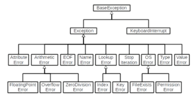

# 1_31

> #### 데코레이터
> 
> - 함수를 어떤 함수로 꾸며서 새로운 기능 부여
> 
> - @데코레이터(함수명) 형태로 함수 위에 작성
> 
> - 순서대로 적용되기 때문에 작성 순서가 중요

> #### static method
> 
> - 클래스 변수나 인스턴스 변수를 사용하지 않는 경우에 사용
>   
>   - 객체 상태나 클래스 상태를 수정할 수 없음

> #### instance method
> 
> - method를 호출한 instance를 의미하는 self 매개변수를 통해 인스턴스를 조작

> #### class method
> 
> - 클래스를 의미하는 cls 매개변수를 통해 클래스를 조작

> #### 객체지향의 핵심 4가지
> 
> - 추상화
> 
> - 상속
> 
> - 다형성
> 
> - 캡슐화

> #### 추상화
> 
> - 현실 세계를 프로그램 설계에 반영
>   
>   - 복잡한 것은 숨기고, 필요한 것만 드러내기

> #### 상속
> 
> - 정의
>   
>   - 두 클래스 사이 부모 - 자식 관계를 정립하는 것
> 
> - 클래스는 상속이 가능함
>   
>   - 모든 파이썬 클래스는 object를 상속 받음
>     
>     ```python
>     class Childclass(Parentclass)
>     ```
> 
> - 하위 클래스는 상위 클래스에 정의된 속성, 행동, 관계 및 제약 조건을 모두 상속 받음
> 
> - 부모 클래스의 속성, 메서드가 자식 클래스에 상속되므로, 코드 재사용성이 높아짐

> #### Method
> 
> - isinstance(object, classinfo)
>   
>   - classinfo의 instance거나 subclass인 경우 True
> 
> - issubclass(class, classinfo)
>   
>   - class가 classinfo의 subclass면 True
>   
>   - classinfo의 모든 항목을 검사
> 
> - super()
>   
>   - 자식클래스에서 부모클래스를 사용하고 싶은 경우
>   
>   - `super().__init__()`

> 상속 정리
> 
> - 파이썬의 모든 클래스는 object로부터 상속됨
> 
> - 부모 클래스의 모든 요소(속성, 메소드)가 상속됨
> 
> - super()를 통해 부모 클래스의 요소를 호출할 수 있음
> 
> - 메소드 오버라이딩을 통해 자식 클래스에서 재정의 가능함
> 
> - 상속관계에서의 이름 공간은 인스턴스, 자식클래스, 부모클래스 순으로 탐색

> 다중 상속
> 
> - 두 개 이상의 클래스를 상속 받는 경우
> 
> - 상속받은 모든 클래스의 요소를 활용 가능함
> 
> - 중복된 속성이나 메소드가 있는 경우 상속 순서에 의해 결정됨

> #### 다형성(polymorphism)
> 
> - 여러 모양을 뜻하는 그리스어
> 
> - 동일한 메소드가 클래스에 따라 다르게 행동할 수 있음을 의미
> 
> - 즉, 서로 다른 클래스에 속해있는 객체들이 동일한 메시지에 대해 다른 방식으로 응답할 수 있음.

> #### 메소드 오버라이딩
> 
> - 상속받을 메소드를 재정의
>   
>   - 클래스 상속 시, 부모 클래스에서 정의한 메소드를 자식 클래스에서 변경
>   
>   - 부모 클래스의 메소드 이름과 기본 기능은 그대로 사용하지만, 특정 기능을 바꾸고 싶을 때 사용
>   
>   - 상속받은 클래스에서 같은 이름으로 메소드를 덮어씀
>   
>   - 부모 클래스의 메소드를 실행시키고 싶은 경우 `super()`를 활용

> #### 캡슐화
> 
> - 객체의 일부 구현 내용에 대해 외부로부터의 직접적인 엑세스를 차단
>   
>   - 예시 : 주민등록번호
> 
> - 파이썬에서는 암묵적으로 존재하지만, 언어적으로는 존재하지않음
> 
> - 접근제어자 종류
>   
>   - Public Access Modifier : 모두 가능
>   
>   - Protected Access Modifier : 상속 관계에서만 가능
>   
>   - Private Access Modifier : 본인만 가능

> #### Public Access Modifier
> 
> - 언더바 없이 시작하는 메소드나 속성
> 
> - 어디서나 호출이 가능, 하위 클래스 override 허용
> 
> - 일반적으로 작성되는 메소드와 속성의 대다수를 차지

> #### Protected Member
> 
> - 언더바 1개로 시작하는 메소드나 속성
> 
> - 암묵적 규칙에 의해 부모 클래스 내부와 자식 클래스에서만 호출 가능
> 
> - 하위 클래스 override 허용

> #### Private Member
> 
> - 언더바 2개로 시작하는 메소드나 속성
> 
> - 본 클래스 내부에서만 사용이 가능
> 
> - 하위 클래스 상속 및 호출 불가능 (오류)
> 
> - 외부 호출 불가능 (오류)

> #### getter method / setter method
> 
> - 변수에 접근할 수 있는 method를 별도로 생성
>   
>   - getter method : 변수의 값을 읽는 method
>     
>     - @property 데코레이터 사용
>   
>   - setter method : 변수의 값을 설정하는 성격의 method
>     
>     - @변수.setter 사용

> #### 버그란?
> 
> - 최초의 버그는 1945년 프로그래밍 언어의 일종인 코볼 발명자 그레이스 호퍼가 발견
> 
> - 역사상 최초의 컴퓨터 버그는 Mark II라는 컴퓨터 회로에 벌레인 나방이 들어가 합선을 이르켜 비정상적으로 동장
> 
> - 이때부터 소프트웨어에서 발생하는 문제를 버그라고 부름

> #### 디버깅의 정의
> 
> - 잘못된 프로그램을 수정하는 것을 디버깅이라함 de(없앤다) + bugging(버그)
> 
> - 에러 메시지가 발생하는 경우
>   
>   - 해당하는 위치를 찾아 메시지를 해결
> 
> - 로직 에러가 발생하는 경우
>   
>   - 명시적인 에러 메시지 없이 예상과 다른 결과가 나온 경우
>     
>     - 정상적으로 동작하였던 코드 이후 작성된 코드를 생각해봄
>     
>     - 전체 코드를 살펴봄
>     
>     - 등등

> #### 디버깅
> 
> - print() 활용
> 
> - 개발환경등에서 제공하는 기능 활용
> 
> - python tutor 활용
> 
> - 뇌컴파일, 눈디버깅

> #### Syntax Error
> 
> - SyntaxError가 발생하면, 파이썬 프로그램은 실행이 되지 않음
> 
> - 파일이름, 줄번호, ^ 문자를 통해 파이썬이 코드를 읽어 나갈 때(parser) 문제가 발생한 위치를 표현
> 
> - 줄에서 에러가 감지된 가장 앞의 위치를 가리키는 캐럿(caret)기호(^)를 표시
> 
> - Invalid syntax : 문법 오류
> 
> - assign to literal : 잘못된 할당
> 
> - EOL (End of Line)
> 
> - EOF (End of File)

> #### 예외(Exception)
> 
> - 실행 도중 예상치 못한 상황을 맞이하면, 프로그램 실행을 멈춤
>   
>   - 문장이나 표현식이 문법적으로 올바르더라도 발생하는 에러
> 
> - 실행 중에 감지되는 에러들을 예외(Exception)라고 부름
> 
> - 예외는 여러 타입(type)으로 나타내고, 타입이 메시지의 일부로 출력됨
>   
>   - NameError, TypeError 등은 발생한 예외 타입의 종류(이름)
> 
> - 모든 내장 예외는 Exception Class를 상속받아 이뤄짐
> 
> - 사용자 정의 예외를 만들어 관리할 수 있음
> 
> - ZeroDivisionError : 10/0 - 0으로 나누고자 할 때 발생
> 
> - NameError : print(name_error) - namespace상에 이름이 없는 경우
> 
> - TypeError : 타입 불일치 or argument 누락, 개수 초과, type 불일치
> 
> - ValueError : 타입은 올바르나 값이 적절하지 않거나 없는 경우
> 
> - IndexError : index가 존재하지 않거나 범위를 벗어나는 경우
> 
> - KeyError : 해당 key가 존재하지 않는 경우
> 
> - ModuleNotFoundError
> 
> - ImportError : Module은 있으나 존재하지 않는 클래스/함수를 가져오는 경우
> 
> - KeyboardInterrupt : 임의로 프로그램을 종료하였을 때
> 
> - IndentationError : Indentation이 적절하지 않은 경우(들여쓰기를 Tab or space 중 하나로만 해야함)
>   
>   

> #### 예외 처리
> 
> - try 문(statement) / except 절(clause)을 이용하여 예외 처리를 할 수 있음
> 
> - try 문
>   
>   - 오류가 발생할 가능성이 있는 코드를 실행
>   
>   - 예외가 발생되지 않으면, except없이 실행 종료
> 
> - except 문
>   
>   - 예외가 발생하면, except 절이 실행
>   
>   - 예외 상황을 처리하는 코드를 받아서 적절한 조치를 취함

> #### 예외처리 종합
> 
> - try
>   
>   - 코드를 실행함
> 
> - except
>   
>   - try 문에서 예외가 발생 시 실행함
> 
> - else
>   
>   - try 문에서 예외가 발생하지 않으면 실행함
> 
> - finally
>   
>   - 예외 발생 여부와 관계없이 항상 실행함


