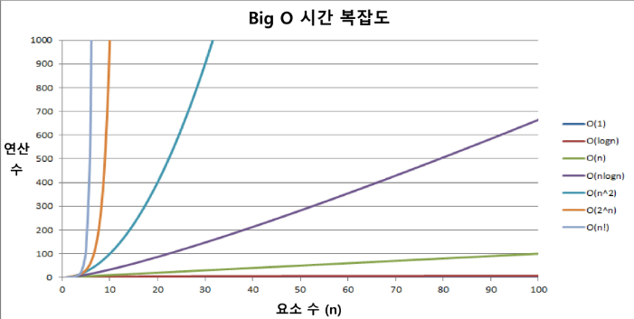
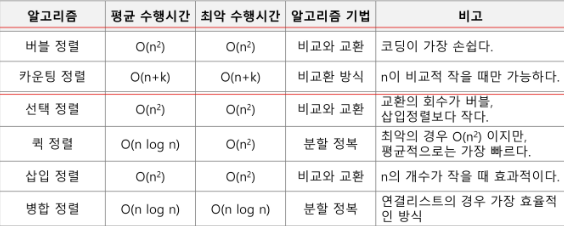

# 2_1

# 배열

#### Algorithm

- 유한한 단계를 통해 문제를 해결하기 위한 절차나 방법이다. 주로 컴퓨터 용어로 쓰이며, 컴퓨터가 어떤 일을 수행하기 위한 단계적 방법을 말한다.

- 다시 말하면 문제를 해결하기 위한 절차라고 할 수 있다.

- 좋은 알고리즘이란?
  
  - 정확성 - 얼마나 정확하게 동작하는가
  
  - 작업량 - 얼마나 적은 연산으로 원하는 결과를 얻어내는가
  
  - 메모리 사용량 - 얼마나 적은 메모리를 사용하는가
  
  - 단순성 - 얼마나 단순한가
  
  - 최적성 - 더 이상 개선할 여지없이 최적화되었는가

- 시간 복잡도 O(n)
  
  - 실제 걸리는 시간을 측정
  
  - 실행되는 명령문의 개수를 계산
  
  - n의 계수는 생략해서 표시
  
  

#### 배열

- 일정한 자료형의 변수들을 하나의 이름으로 열거하여 사용하는 자료구조

- 아래의 예는 6개의 변수를 사용해야 하는 경우, 이를 배열로 바꾸어 사용하는 것이다.

- 필요성
  
  - 프로그램 내에서 여러 개의 변수가 필요할 때, 일일이 다른 변수명을 이용하여 자료에 접근하는 것은 매우 비효율적일 수 있다.
  
  - 배열을 사용하면 하나의 선언을 통해서 둘 이상의 변수를 선언할 수 있다.
  
  - 단순히 다수의 변수 선언을 의미하는 것이 아니라, 다수의 변수로는 하기 힘든 작업을 배열을 활용해 쉽게 접근할 수 있다.

#### 1차원 배열의 선언

- 별도의 선언 방법이 없으면 변수에 처음 값을 할당할 때 생성

- 이름 : 프로그램에서 사용할 배열의 이름

#### 정렬

- 2개 이상의 자료를 특정 기준에 의해 작은 값부터 큰 값, 혹은 그 반대의 순서대로 재배열하는 것

- key
  
  - 자료를 정렬하는 기준이 되는 특정 값

- 종류
  
  - 버블 정렬
  
  - 카운팅 정렬
  
  - 선택 정렬
  
  - 퀵 정렬
  
  - 삽입 정렬
  
  - 병합 정렬

#### 버블 정렬

- 인접한 두 개의 원소를 비교하며 자리를 계속 교환하는 방식

- 정렬과정
  
  - 첫 번째 원소부터 인접한 원소끼리 계속 자리를 교환하면서 맨 마지막 자리까지 이동한다.
  
  - 한 단계가 끝나면 가장 큰 원소가 마지막 자리로 정렬된다.
  
  - 교환하며 자리를 이동하는 모습이 물 위에 올라오는 거품모양과 같다고 하여 버블 정렬이라고 한다.

- 시간 복잡도
  
  - O(n^2)

#### 카운팅 정렬

- 항목들의 순서를 결정하기 위해 집합에 각 항목이 몇 개씩 있는지 세는 작업을 하여, 선형 시간에 정렬하는 효율적인 알고리즘

- 제한 사항
  
  - 정수나 정수로 표현할 수 있는 자료에 대해서만 적용 가능 : 각 항목의 발생 회수를 기록하기 위해, 정수 항목으로 인덱스 되는 카운트들의 배열을 사용하기때문
  
  - 카운트들을 위한 충분한 공간을 할당하려면 집합 내의 가장 큰 정수를 알아야한다.

- 시간 복잡도
  
  - O(n+k) : n - len(list), k : max(list)

