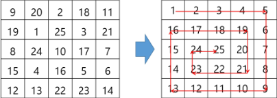

# 2_6

### 배열 2

### 2차원 배열

- 1차원 list를 묶어놓은 list

- 2차원 이상의 다차원 list는 차원에 따라 index를 선언

- 2차원 list의 선언 : row와 column을 필요로함

- Python에서는 데이터 초기화를 통해 변수 선언과 초기화가 가능함

- arr = [[0,1,2,3],[4,5,6,7]]

### 배열 순회

- n * m 배열의 n*m 개의 모든 원소를 빠짐없이 조사하는 방법

- 5*5 2차 배열에 25개의 숫자를 랜덤으로 넣고 동서남북 방향의 숫자에서 각각 본인을 뺀 절대값의 합의 최대값을 구하라
  
  ```python
  from random import randint
  arr = [[randint(0,25) for _ in range(5)] for _ in range(5) ]
  dxdy = [(0,1),(1,0),(0,-1),(-1,0)]
  print(arr)
  
  sum_abs = 0
  for idx, num in enumerate(arr):
      for idx_k, k in enumerate(num):
          sum_num = 0
          for i in dxdy:
              x = idx + i[0]
              y = idx_k + i[1]
              if -1<x<5 and -1<y<5:
                  sum_num += abs(arr[x][y] - k)
          if sum_abs < sum_num:
              sum_abs = sum_num
          print(sum_num)
  print(sum_abs)
  ```

### 부분집합 합(subset sum) 문제

- 유한 개의 정수로 이루어진 집합이 있을 때, 이 집합의 부분집합 중에서 그 집합의 원소를 모두 더한 값이 0이 되는 경우가 있는지를 알아내는 문제

- 예를 들어, [-7,-3,-2,5,8]라는 집합이 있을 때, [-3,-2,5]는 이 집합의 부분집합이면서 -3 -2 +5 = 0이므로 이 경우는 참이 된다.


### 비트 연산자

- & : 비트 단위로 and 연산을 한다.

- | : 비트 단위로 or 연산을 한다.

- << : 피연산자의 비트 열을 왼쪽으로 이동시킨다.

- '>>' : 피연산자의 비트 열을 오른쪽으로 이동시킨다.

- << 연산자
  
  - 1 << n : 2^n 즉, 연소가 n개일 경우 모든 부분 집합의 수를 의미한다.
  
  - 예를 들어 1 << 5의 경우 bin(1)은 0b1이고 1을 왼쪽으로 5칸 이동시키면 0b100000이 된다. 따라서 0b100000는 2^5이므로 32가 된다.
  
  - 또 다른 예로 2 << 5의 경우 bin(2)는 0b10이고 10을 왼쪽으로 5칸 이동시키면 0b1000000이된다. 이는 2^6이므로 64가 된다.

- & 연산자
  
  - i & (1<<j) : i의 j번째 비트가 1인지 아닌지를 검사한다.

- 예를들어 24 & (1 << 3)을 풀어보면 1<<3은 0b1000이고 24는 0b11000이므로 &는 둘 다 1인경우 1로 출력하기 때문에 24 & 8은 0b1000이므로 8이된다.

### 연습문제 2

- 부분집합 합 문제 구현하기
  
  - 실제로 10개의 정수를 입력 받아 부분집합의 합이 0이 되는 것이 존재하는 지를 계산하는 함수를 작성
    
    ```python
    from random import sample
    
    arr = sample(range(-25,26),10)
    result = []
    
    for i in range(1<<len(arr)): 
      subset = []
    
      for j in range(len(arr)): 
        if i & (1<<j): 
          subset.append(arr[j]) 
    
      result.append(sum(subset))
    
    print(0 in result)
    ```

### 검색

- 저장되어 있는 자료 중에서 원하는 항목을 찾는 작업

- 목적하는 탐색 키를 가진 항목을 찾는 것
  
  - 탐색 키 : 자료를 구별하여 인식할 수 있는 키

- 검색의 종류
  
  - 순차 검색(sequential search)
  
  - 이진 검색(binary search)
  
  - 해쉬(hash)

- 일렬로 되어 있는 자료를 순서대로 검색하는 방법
  
  - 가장 간단하고 직관적인 검색 방법
  
  - 배열이나 연결 리스트 등 순차구조로 구현된 자료구조에서 원하는 항목을 찾을 때 유용함
  
  - 알고리즘이 단순하여 구현이 쉽지만, 검색 대상의 수가 많은 경우에는 수행시간이 급격히 증가하여 비효율적임

- 2가지 경우
  
  - 정렬되어 있지 않은 경우
  
  - 정렬되어 있는 경우

- 정렬되어 있지 않은 경우
  
  - 검색 과정
    
    - 첫 번째 원소부터 순서대로 검색 대상과 키 값이 같은 원소가 있는지 비교하며 찾는다.
    
    - 키 값이 동일한 원소를 찾으면 그 원소의 인덱스를 반환한다.
    
    - 자료구조의 마지막에 이를 때까지 검색 대상을 찾지 못하면 검색 실패
  
  - 찾고자 하는 원소의 순서에 따라 비교 횟수가 결정됨
    
    - 첫 번째 원소를 찾을 때는 1번 비교, 두 번째 원소를 찾을 때는 2번 비교.
    
    - 정렬되지 않은 자료에서의 순차 검색의 평균 비교회수 : (1/n) *(sigma n) = (n+1)/2
    
    - 시간 복잡도 : O(n)

- 정렬되어 있는 경우
  
  - 검색 과정
    
    - 자료가 오름차순으로 정렬된 상태에서 검색을 실시한다고 가정하자.
    
    - 자료를 순차적으로 검색하면서 키 값을 비교하여, 원소의 키 값이 검색 대상의 키 값보다 크면 찾는 원소가 없다는 것이므로 더 이상 검색하지 않고 검색을 종료한다.
  
  - 찾고자 하는 원소의 순서에 따라 비교 횟수가 결정됨
    
    - 정렬이 되어있으므로, 검색 실패를 반환하는 경우 평균 비교횟수가 반으로 줄어든다
    
    - 시간 복잡도 : O(n)

- 이진 검색
  
  - 자료의 가운데에 있는 항목의 키 값과 비교하여 다음 검색의 위치를 결정하고 검색을 계속 진행하는 방법
    
    - 목적 키를 찾을 때까지 이진 검색을 순환적으로 반복 수행함으로써 검색 범위를 반으로 줄여가면서 보다 빠르게 검색을 수행함
  
  - 이진 검색을 하기 위해서는 자료가 정렬된 상태여야한다.
  
  - 검색 과정
    
    - 자료의 중앙에 있는 원소를 고른다.
    
    - 중앙 원소의 값과 찾고자 하는 목표 값을 비교한다.
    
    - 목표 값이 중앙 원소의 값보다 작으면 자료의 왼쪽 반에 대해서 새로 검색을 수행하고, 크다면 자료의 오른쪽 반에 대해서 새로 검색을 수행한다.
    
    - 찾고자 하는 값을 찾을 때까지 위의 과정을 반복한다.
  
  - 구현
    
    - 검색 범위의 시작점과 종료점을 이용하여 검색을 반복 수행한다.
    
    - 이진 검색의 경우, 자료에 삽입이나 삭제가 발생했을 때 배열의 상태를 항상 정렬 상태로 유지하는 추가 작업이 필요하다.
  
  - 재귀 함수의 이용
    
    - 아래와 같이 재귀 함수를 이용하여 이진 검색을 구현할 수도 있다.

### 

### 인덱스

- 인덱스라는 용어는 DB에서 유래했으며, 테이블에 대한 동작속도를 높여주는 자료구조를 일컫는다. DB분야가 아닌 곳에서는 Look up table등의 용어를 사용하기도 한다.

- 인덱스를 저장하는데 필요한 디스크 공간은 보통 테이블을 저장하는데 필요한 디스크 공간보다 작다. 왜냐하면 보통 인덱스는 키-필드만 갖고 있고, 테이블의 다른 세부 항목들은 갖고 있지 않기 때문이다.


### 선택 정렬

- 주어진 자료들 중 가장 작은 값의 원소부터 차례대로 선택하여 위치를 교환하는 방식
  
  - 앞서 살펴본 selection 알고리즘을 전체 자료에 적용한 것이다.

- 정렬 과정
  
  - 주어진 리스트 중에서 최소값을 찾는다.
  
  - 그 값을 리스트의 맨 앞에 위치한 값과 교환한다.
  
  - 맨 처음 위치를 제외한 나머지 리스트를 대상으로 위의 과정을 반복한다.

- 시간 복잡도
  
  - O(n^2)


### selection algorithm

- 저장되어 있는 자료로부터 k번째로 큰 혹은 작은 원소를 찾는 방법을 selection algorithm이라 한다.
  
  - 최소값, 최대값 혹은 중간값을 찾는 알고리즘을 의미하기도 한다.

- 선택 과정
  
  - selection은 아래와 같은 과정을 통해 이루어진다.
    
    - 정렬 알고리즘을 이용하여 자료 정렬하기
    
    - 원하는 순서에 있는 원소 가져오기


### 연습문제 3

- 다음 그림의 왼쪽과 같이 2차원 배열을 초기화 한 후 오른쪽 2차 배열과 같이 정렬하여 2차 배열 형태로 출력하시오
  
  

```python
arr = [[9,20,2,18,11],[19,1,25,3,21],[8,24,10,17,7],[15,4,16,5,6],[12,13,22,23,14]]
arr = sum(arr,[])
result = [[] for _ in range(5)]
i = 0
while arr:
    min_num = arr.pop(arr.index(min(arr)))
    if len(result[i])< 5:
        result[i].append(min_num)
    else:
        i += 1
        result[i].append(min_num)
print(result)
```


