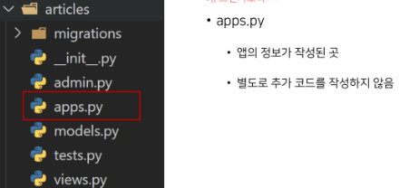

# 3_14

### Django

- ##### Framework 이해하기 (1/3)
  
  - 누군가 만들어 놓은 코드를 재사용 하는 것은 이미 익숙한 개발 문화
  
  - 그렇다면 '웹 서비스'도 누군가 개발해 놓은 코드를 재사용하면 된다.
  
  - 전 세계의 수많은 개발자들이 이미 수없이 많이 개발해 봤고, 그 과정에서 자주 사용되는 부분들을 재사용 할 수 있게 좋은 구조의 코드를 만들어 두었음.

- ##### Framework 이해하기 (2/3)
  
  - 그러한 코드들을 모아 놓은 것, 즉 서비스 개발에 필요한 기능들을 미리 구현해서 모아 놓은 것 = 프레임워크(Framework)
  
  - Frame(뼈대, 틀) + Work(일하다)
    
    - 일정한 뼈대, 틀을 가지고 일하다.
    
    - 제공받은 도구들과 뼈대, 규약을 가지고 무언가를 만드는 일
    
    - 특정 프로그램을 개발하기 위한 여러 도구들과 규약을 제공하는 것
  
  - "소프트웨어 프레임워크"는 복잡한 문제를 해결하거나 서술하는 데 사용되는 기본 개념 구조

- ##### Framework 이해하기 (3/3)
  
  - 따라서, Framework를 잘 사용하기만 하면 웹 서비스 개발에 있어서 모든 것들을 하나부터 열까지 직접 개발할 필요 없이, 내가 만들고자 하는 본질에 집중해 개발할 수 있음
  
  - 소프트웨어의 생산성과 품질을 높임

- ##### 여러가지 Web Framework
  
  - 웹 서비스를 만들 수 있는 다양한 프레임워크
  
  - 2020년 Github Star 수 기준 인기 프레임워크 순위

- ##### Django를 배워야하는 이유
  
  1. Python으로 작성된 프레임워크
     
     - Python이라는 언어의 강력함과 거대한 커뮤니티
  
  2- 수많은 여러 유용한 기능들
  
  3- 검증된 웹 프레임워크
     
     - 화해, Toss, 두나무, 당근 마켓, 요기요 등
     
     - 유명한 많은 서비스들이 사용한다는 것 == 안정적으로 서비스를 할 수 있다는 검증

- ##### 클라이언트 - 서버 구조
  
  - 오늘날 우리가 사용하는 대부분의 웹 서비스는 클라이언트 - 서버 구조를 기반으로 동작
  
  - 클라이언트와 서버 역시 하나의 컴퓨터이며 이들이 어떻게 상호작용하는지에 대한 간소화된 다이어그램은 다음과 같음
  
  
  
  - 클라이언트
    
    - 웹 사용자의 인터넷에 연결된 장치 (예를 들어 wi-fi에 연결된 컴퓨터 또는 모바일)
    
    - Chrome 또는 Firefox와 같은 웹 브라우저
    
    - 서비스를 요청하는 주체
  
  - 서버
    
    - 웹 페이지, 사이트 또는 앱을 저장하는 컴퓨터
    
    - 클라이언트가 웹 페이지에 접근하려고 할 때 서버에서 클라이언트 컴퓨터로 웹 페이지 데이터를 응답해 사용자의 웹 브라우저에 표시됨
    
    - 요청에 대해 서비스를 응답하는 주체
  
  - 상호작용 예시
    
    - 예를 들어, 우리가 Google 홈페이지에 접속한다는 것은 무엇을 뜻하는지 알아보자
      
      1. 결론적으로 인터넷에 연결된 전세계 어딘가에 있는 구글 컴퓨터에게 'Google 홈페이지.html' 파일을 달라고 요청하는 것
      
      2. 그러면 구글 컴퓨터는 우리의 요청을 받고 'Google 홈페이지.html' 파일을 인터넷을 통해서 우리 컴퓨터에게 응답해줌
      
      3. 그렇게 전달받은 Google 홈페이지.html 파일을 웹 브라우저가 우리가 볼 수 있도록 해석해주는 것
  
  - 여기서 'Google 홈페이지.html'을 달라고 요청한 컴퓨터, 웹 브라우저를 클라이언트라고 하고 제공한 컴퓨터, 프로그램을 서버라고 한다.
  
  - 어떠한 자원(resource)를 달라고 요청(request)하는 쪽을 클라이언트라고 하고 자원을 제공해주는 쪽을 서버(server)라고 함.
  
  - `정리`
    
    - 우리가 사용하는 웹은 클라이언트 - 서버 구조로 이루어져 있음
    
    - 앞으로 우리가 배우는 것도 이 클라이언트 - 서버 구조를 만드는 방법을 배우는 것
    
    - 이 중에서 Django는 서버를 구현하는 웹 프레임 워크

### Django 설치

- `pip install django== 3.2.18`

- 프로젝트 생성
  
  - `django-admin startproject firstpjt`

- 서버 실행
  
  - `python manage.py runserver`

### 가상환경 사용하기

- 가상환경 생성
  
  - `python -m venv venv`
  
  - anaconda의 가상환경 설정
    
    - `conda create -n 가상환경이름 python=버전`

- 가상환경 활성화(On)
  
  - `source venv/Scripts/activate`

- 가상환경 비활성화(Off)
  
  - `deactivate`

- 가상환경은 플젝별 패키지를 독립적으로 관리하기 위한 것

- 내 프로젝트를 다른 사람이 실행하려면?

- 모든 패키지를 다 설치해야 한다.

- 가상환경 패키지 목록 저장
  
  - pip freeze > requirements.txt

- 파일로부터 패키지 설치
  
  - pip install -r requirements.txt

### Django Application

- 애플리케이션(앱) 생성
  
  - `python manage.py startapp articles`
  
  - 일반적으로 애플리케이션 이름은 복수형으로 작성하는 것을 권장
  
  앱(App) == 하나의 큰 기능 단위
  
  정해진 규칙은 없으며 개발자가 판단해서 앱 생성
  
  여러 개의 앱이 아닌 단일 앱으로 개발해도 괜찮음

### 앱 구조

### 요청과 응답

- render()
  
  - `render(request, template_name, context)`
  
  - 주어진 템플릿을 주어진 컴텍스트 데이터와 결합하고 렌더링 된 텍스트와 함께 HttpResponse(응답) 객체를 반환하는 함수
  1. request
     
     - 응답을 생성하는 데 사용되는 요청 객체
  
  2- template_name
     
     - 템플릿의 전체 이름 또는 템플릿 이름의 경로
  
  3- context
     
     - 템플릿에서 사용할 데이터 (딕셔너리 타입으로 작성)

- 코드 작성 순서
  
  - 앞으로 Django에서의 코드 작성은 URL -> View -> Template 순으로 작성
  
  - `데이터의 흐름 순서`
  
  

URL : django에서 만든 pjt folder 안에 있음

view : articles folder 안에 있음

