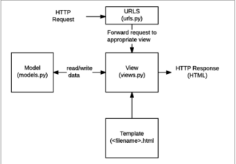
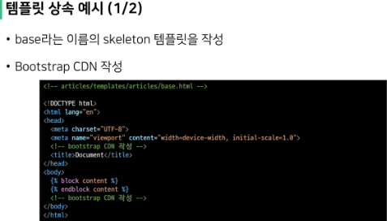
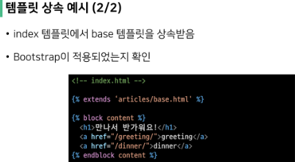
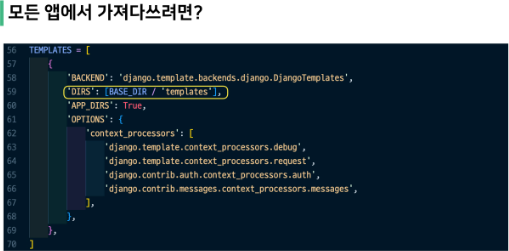

# 3_15

### Design Pattern

- 자주 사용되는 구조가 있다는 것

- 그 구조를 일반화해서 하나의 공법응로 만들어 둔 것

- 소프트웨어에서의 관점
  
  - 각기 다른 기능을 가진 다양한 응용 소프트웨어를 개발할 때 공통적인 설계문제가 존재하며, 이를 처리하는 해결책 사이에도 공통점이 있다는 것을 발견
  
  - 이러한 유사점을 패턴이라 함

- 소프트웨어 디자인 패턴
  
  - 소프트웨어도 수십년간 전 세계의 개발자들이 계속 만들다보니 자주 사용되는 구조와 해결책이 있다는 것을 알게 됨
  
  - 앞서 배웠던 클라이언트 - 서버 구조도 소프트웨어 디자인 패턴 중 하나
  
  - 자주 사용되는 소프트웨어의 구조를 소수의 뛰어난 엔지니어가 마치 건축의 공법처럼 일반적인 구조화를 해둔 것

- 소프트웨어 디자인 패턴의 목적
  
  - 특정 문맥에서 공통적으로 발생하는 문제에 대해 재사용 가능한 해결책을 제시
  
  - 프로그래머가 어플리케이션이나 시스템을 디자인할 때 발생하는 공통된 문제들을 해결하는데 형식화 된 가장 좋은 관행

- 소프트웨어 디자인 패턴의 장점
  
  - 디자인 패턴을 알고 있다면 서로 복잡한 커뮤니케이션이 매우 간단해짐
  
  - before
    
    - "무언가 서비스를 요청하는 쪽을 하나 만들고 둘 사이에 데이터를 주고 받는 방식을 정의한 후 요청을 처리하는 쪽을 따로 개발하여 다수의 요청을 처리하는 구조로 만들기"
  
  - after
    
    - "클라이언트 - 서버 구조로 구현"


### Django's Design Pattern

- Django에서의 디자인 패턴
  
  - MTV 패턴 
  
  - MVC 패턴

- MVC 소프트웨어 디자인 패턴
  
  - MVC는 Model - View - Controller의 준말
    데이터 및 논리 제어를 구현하는데 널리 사용되는 소프트웨어 디자인 패턴
  
  - 하나의 큰 프로그램을 세가지 역할로 구분한 개발 방법론
  1. Model : 데이터와 관련된 로직을 관리
  
  2. View : 레이아웃과 화면을 처리
  
  3. Controller  명령을 model과 View 부분으로 연결

- MVC 소프트웨어 디자인 목적

- `관심사 분리`

- 더 나은 업무의 분리와 향상된 관리를 제공

- 각 부분을 독립적으로 개발할 수 있어, 하나를 수정하고 싶을 때 모두 건들지 않아도 됨 - (개발 효율성 및 유지보수가 쉬워지고 다수의 멤버로 개발하기 용이함)

- MTV 디자인 패턴
  
  - Model
    
    - MVC 패턴에서 Model의 역할에 해당
    
    - 데이터와 관련된 로직을 관리
    
    - 응용 프로그램의 데이터 구조를 정의하고 데이터베이스의 기록을 관리
  
  - Template
    
    - 레이아웃과 화면을 처리
    
    - 화면상의 사용자 인터페이스 구조와 레이아웃을 정의
    
    - MVC 패턴에서 View의 역할에 해당
  
  - View
    
    - Model & Template과 관련한 로직을 처리해서 응답을 반환
    
    - 클라이언트의 요청에 대해 처리를 분기하는 역할
    
    - 동작 예시
      
      - 데이터가 필요하다면 model에 접근해서 데이터를 가져온 후 데이터를 template로 보내 화면을 구성하고 구성된 화면을 응답으로 만들어 클라이언트에게 반환
    
    - MVC 패턴에서 Controller의 역할에 해당
  
  - 

- 정리
  
  - Django는 MTV 디자인 패턴을 가지고 있음
    
    - Model : 데이터 관련
    
    - Template : 화면 관련
    
    - View : Model & Template 중간 처리 및 응답 반환


### Django Template

- 데이터 표현을 제어하는 도구이자 표현에 관련된 로직

- Django Template을 이용한 HTML 정적 부분과 동적 컨텐츠 삽입

- Template System의 기본 목표를 숙지


### Django Template Language (DTL)

- Django template에서 사용하는 built-in template system

- 조건, 반복, 변수 치환, 필터 등의 기능을 제공
  
  - python처럼 일부 프로그램이 구조(if, for 등)를 사용할 수 있지만 python 코드로 실행되는 것이 아님
  
  - Django 템플릿 시스템은 단순히 python이 html에 포함된 것이 아님에 주의

- 프로그래밍적 로직이 아니라 프리젠테이션을 표현하기 위한 것임을 명심할 것

- Syntax
  
  - Variable
    
    - `{{variable}}`
    
    - 변수명은 영어, 숫자와 밑줄의 조합으로 구성될 수 있으나 밑줄로는 시작할 수 없음
    
    - dot(.)을 사용하여 변수 속성에 접근할 수 있음
    
    - render()의 세번째 인자로 {'key' : value} 와 같이 딕셔너리 형태로 넘겨주며, 여기서 정의한 key에 해당하는 문자열이 template에서 사용 가능한 변수명이 됨.
  
  - Filters
    
    - `{{variable | filter}}`
    
    - 표시할 변수를 수정할 때 사용
    
    - 예를 들어 이름을 소문자로 출력하고싶다면 `{{name | lower}}`
    
    - 60개의 built-in template filters를 제공
    
    - chained가 가능하며 일부 필터는 인자를 받기도 함 `{{name | truncatewords : 30}}`
  
  - Tags
    
    - ``
    
    - 출력 텍스트를 만들거나, 반복 또는 논리를 수행하여 제어 흐름을 만드는 등 변수보다 복잡한 일들을 수행
    
    - 일부 태그는 시작과 종료 태그가 필요 ``
    
    - 약 24개의 built-in template tags를 제공
  
  - Comments
    
    - `{# #}`
    
    - Django template에서 라인의 주석을 표현하기 위해 사용
    
    - 한 줄 주석에만 사용할 수 있음 (줄 바꿈이 허용되지 않음)
    
    - 여러 줄 주석은 `` 사이에 입력


### 템플릿 상속

- 템플릿 상속은 기본적으로 코드의 재사용성에 초점을 맞춤

- 템플릿 상속을 사용하면 사이트의 모든 공통 요소를 포함하고, 하위 템플릿이 재정의(override) 할 수 있는 블록을 정의하는 기본 'skeleton' 템플릿을 만들 수 있음


### 템플릿 상속에 관련된 태그

- ``

- 자식(하위)템플릿이 부모 템플릿을 확장한다는 것을 알림
  
  - 반드시 최상단에 작성되어야함(즉, 2개 이상 사용불가)

- ``

- 하위 템플릿에서 재지정(overridden)할 수 있는 블록을 정의

- 즉, 하위 템플릿이 채울 수 있는 공간

- 가독성을 높이기 위해 선택적으로 endblock 태그에 이름을 지정할 수 있음








### Django URLs

- 'Dispatcher(운행 관리원)로서의 URL 이해하기'

- 웹 어플리케이션은 URL을 통한 클라이언트의 요청에서부터 시작함


### Trailing Slashes

- Django는 URL 끝에 /가 (Trailing slash) 없다면 자동으로 붙여주는 것이 기본 설정
  
  - 그래서 모든 주소가 '/'로 끝나도록 구성 되어있음
  
  - 그러나 모든 프레임워크가 이렇게 동작하는 것은 아님

- Django의 url 설계 철학을 통해 먼저 살펴보면 다음과 같이 설명함
  
  - "기술적인 측면에서, foo.com/bar와 foo.com/bar/는 서로 다른 URL이다."
  
  - 검색 엔진 로봇이나 웹 트래픽 분석 도구에서는 그 둘을 서로 다른 페이지로 봄
  
  - 그래서 Django는 URL을 정규화하여 검색 엔진 로봇이 혼동하지 않게 해야 함


### Variable routing의 필요성

- URL 주소를 변수로 사용하는 것을 의미

- URL의 일부를 변수로 지정하여 view 함수의 인자로 넘길 수 있음

- 즉, 변수 값에 따라 하나의 path()에 여러 페이지를 연결 시킬 수 있음


### Variable routing 작성

- 변수는 "<>"에 정의하며 view 함수의 인자로 할당됨

- 기본 타입은 string이며 5가지 타입으로 명시할 수 있음
1. str
   
   - '/' 를 제외하고 비어 있지 않은 모든 문자열
   
   - 작성하지 않을 경우 default 값

2. int
   
   - 0 또는 양의 정수와 매치

3. slug

4. uuid

5. path


### App URL mapping

- 앱이 많아졌을 때 urls.py를 각 app에 매핑하는 방법을 이해하기

- 두 번째 app인 pages를 생성 및 등록해보자

- urls.py를 쪼개기
  
  - 각각의 앱 안에서 urls.py를 만들고 프로젝트 urls.py에서 각 앱의 urls.py 파일로 URL 매핑을 위탁할 수 있음

- ```python
  from django.urls import path, include
  
  
  urlpatterns = [
      path('articles/', include('articles.urls')),
  ]
  ```

- urlpattern은 언제든지 다른 URLconf 모듈을 포함(include)할 수 있음

- include()
  
  - 다른 URLconf(app/urls.py)들을 참조할 수 있도록 돕는 함수
  
  - 함수 include()를 만나게 되면 URL의 그 시점까지 일치하는 부분을 잘라내고, 남는 문자열 부분을 후속 처리를 위해 include된 URLconf로 전달


### Naming URL patterns

- 


