# 3_20

### Admin site

##### 개요

- Django의 가장 강력한 기능 중 하나인 automatic admin interface

- "관리자 페이지"
  
  - 사용자가 아닌 서버의 관리자가 활용하기 위한 페이지
  
  - 모델 class를 admin.py에 등록하고 관리
  
  - 레코드 생성 여부 확인에 매우 유용하며 직접 레코드를 삽입할 수도 있음.

##### admin 계정 생성

`python manage.py createsuperuser`

- username과 password를 입력해 관리자 계정을 생성

- email은 선택사항으로 입력하지 않고 enter을 입력하는 것이 가능

- 비밀번호 생성 시 보안상 터미널에 입력되지 않으니 무시하고 입력을 이어가도록 함

##### admin site 로그인

- http://127.0.0.1:8000/admin/ 로 접속 후 로그인
- 계정만 만든 경우 Django 관리자 화면에서 모델 클래스는 보이지 않음

### admin에 모델 클래스 등록

- 모델의 record를 보기 위해서는 admin.py에 등록 필요

- ```python
  # articles/admin.py
  
  from django.contrib import admin
  from .models import Article
  
  admin.site.register(Article)
  ```

### 사전 기본 url 및 템플릿 작성하는 과정

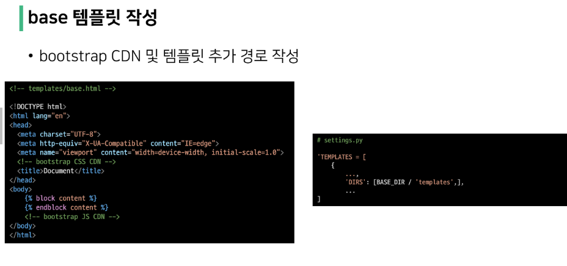

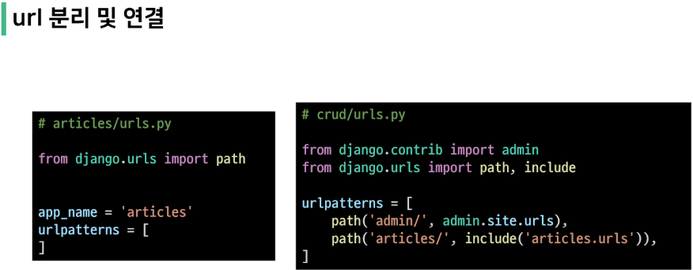

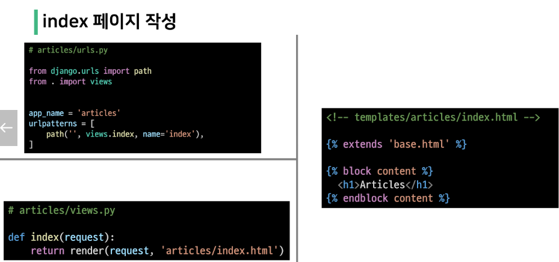

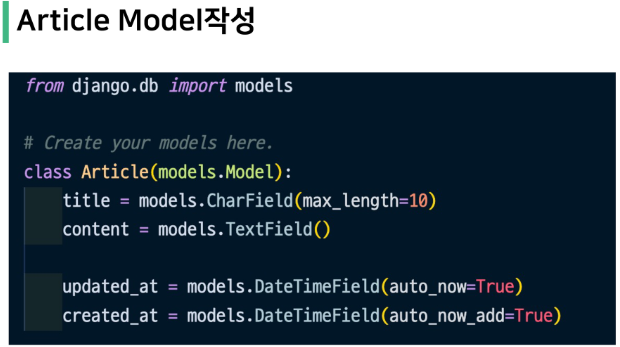

### index.html

- 글의 번호, 제목, 내용을 index.html에 보여주기 위한 코드

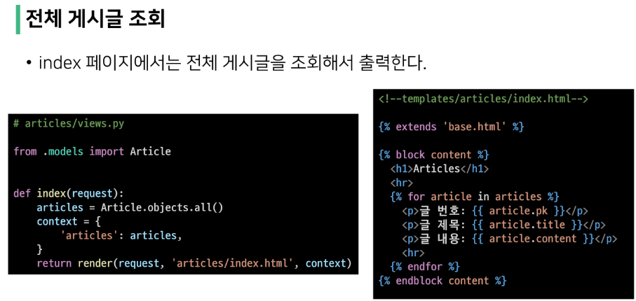

- 개요
  
  - 개별 게시글 상세 페이지 제작
  
  - 모든 게시글마다 뷰 함수와 템플릿 파일을 만들 수 없음
    
    - 글의 번호(pk)를 활용해서 하나의 뷰 함수와 템플릿 파일로 대응
  
  - Variable Routing을 활용

### urls

- URL로 특정 게시글을 조회할 수 있는 번호를 받음

- ```python
  # articles/urls.py
  
  urlpatterns = [
      ...,
      path('<int:pk>/', views.detail, name='detail'),
  ]
  ```

### views

- Article.objects.get(pk = pk)에서 오른쪽 pk는 variable routing을 통해 받은 pk, 왼쪽 pk는 DB에 저장된 레코드의 id column

```python
# articles/views.py

def detail(request, pk):
    article = Article.objects.get(pk = pk)
    context = {
        'article': article,
    }
    return render(request, 'articles/detail.html', context)
```

### templates

```html
# templates/articles/detail.html





    <h2>DETAIL</h2>
    <h3> {{article.pk}} 번째 글</h3>
    <hr>
    <p> 제목 : {{article.title}} </p>
    <p> 내용 : {{article.content}} </p>
    <p> 작성 시각 : {{article.created_at}} </p>
    <p> 수정 시각 : {{article.updated_at}} </p>
    <hr>
    <a href="">back</a>

```

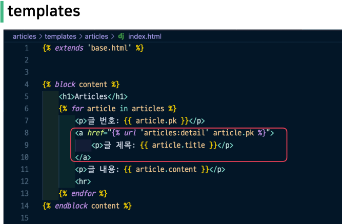


### Create

- Create 로직을 구현하기 위해서는 몇 개의 view 함수가 필요할까?
  
  - 사용자의 입력을 받을 페이지를 렌더링 하는 함수 1개
    
    - "new" view function
  
  - 사용자가 입력한 데이터를 전송받아 DB에 저장하는 함수 1개
    
    - "create" view function

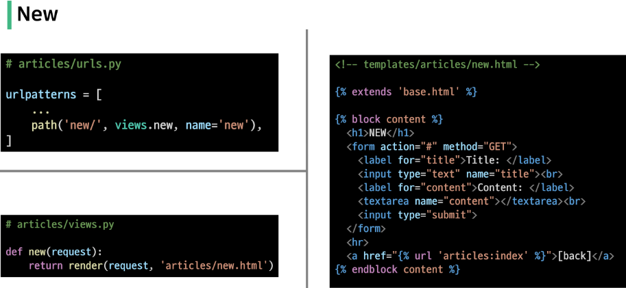

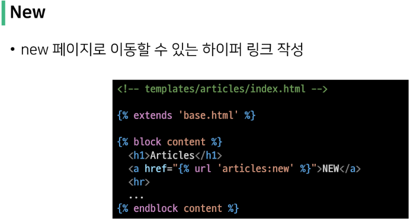

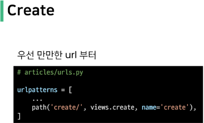

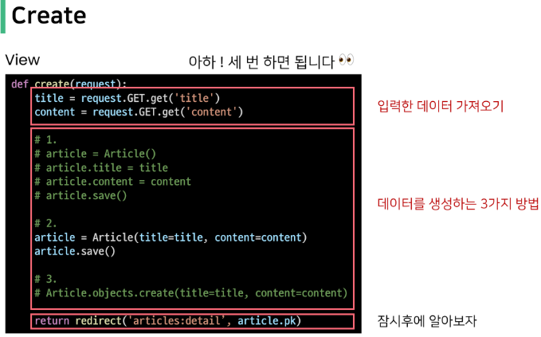

- 1 or 2번째 생성 방식을 사용하는 이유
  
  - create method가 더 간단해 보이지만 추후 데이터가 저장되기 전에 유효성 검사 과정을 거치게 될 예정
  
  - 유효성 검사가 진행된 후에 save method가 호출되는 구조를 택하기 위함
  
  - redirect()
    
    - 인자에 작성된 곳으로 다시 요청을 보냄
    
    - 사용 가능한 인자
      
      - view name (URL pattern name) `return redirect('articles:index')`
      
      - absolute or relative URL `return redirect('/articles/')`
  
  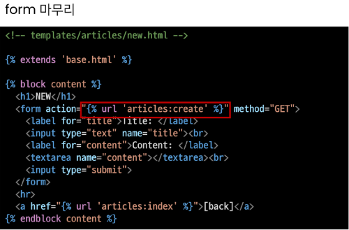


### HTTP request method

- GET
  
  - 특정 리소스를 가져오도록 요청할 때 사용
  
  - 반드시 데이터를 가져올 때만 사용해야 함
  
  - DB에 변화를 주지 않음
  
  - CRUD에서 R역할을 담당

- POST
  
  - 서버로 데이터를 전송할 때 사용
  
  - 서버에 변경사항을 만듦
  
  - 리소스를 생성/변경하기 위해 데이터를 HTTP body에 담아 전송
  
  - GET의 쿼리 스트링 파라미터와 다르게 URL로 데이터를 보내지 않음
  
  - CRUD에서 C/U/D 역할을 담당


- ##### 403 Forbidden
  
  - 서버에 요청이 전달되었지만, 권한 때문에 거절되었다는 것을 의미
  
  - 서버에 요청은 도달했으나 서버가 접근을 거부할 때 반환됨
  
  - 즉, 게시글을 작성할 권한이 없다 -> Django 입장에서는 "작성자가 누구인지 모르기 때문에 함부로 작성할 수 없다" 라는 의미
  
  - 모델(DB)을 조작하는 것은 단순 조회와 달리 최소한의 신원 확인이 필요하기 때문


- ##### CSRF
  
  - Cross-Site-Request-Forgery
  
  - "사이트 간 요청 위조"
  
  - 사용자가 자신의 의지와 무관하게 공격자가 의도한 행동을 하여 특정 웹 페이지를 보안에 취약하게 하거나 수정, 삭제 등의 작업을 하게 만드는 공격 방법
  
  - ``
  
  - 해당 태그가 없다면 Django 서버는 요청에 대해 403 forbidden으로 응답
  
  - 템플릿에서 내부 URL로 향하는 Post form을 사용하는 경우에 사용
    
    - 외부 URL로 향하는 POST form에 대해서는 CSRF token이 유출되어 취약성을 유발할 수 있기 때문에 사용해서는 안됨
  
  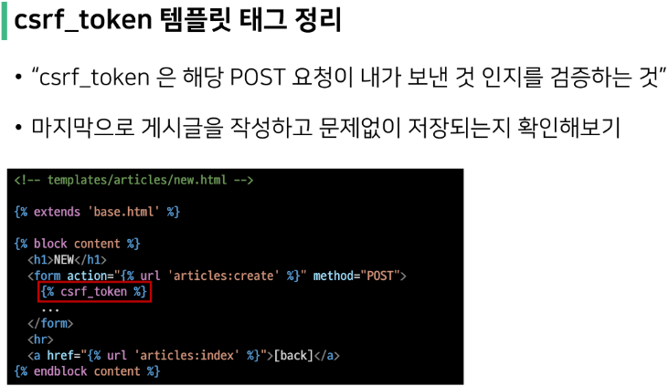


### Delete

- urls
  
  - 삭제하고자 하는 특정 글을 조회 후 삭제해야 함
  
  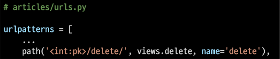

- views
  
  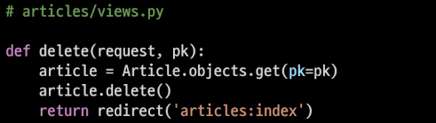

- templates
  
  - Detail 페이지에 작성하며 DB에 영향을 미치기 때문에 POST method를 사용
  
  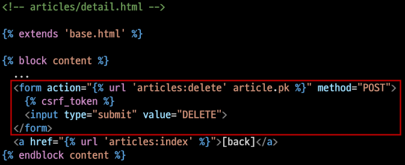


### Update

- 개요
  
  - 수정은 Create 로직과 마찬가지로 2개의 view 함수가 필요
  
  - 사용자의 입력을 받을 페이지는 렌더링하는 함수 1개
    
    - "edit" view function
  
  - 사용자가 입력한 데이터를 전송받아 DB에 저장하는 함수 1개
    
    - "update" view function
  
  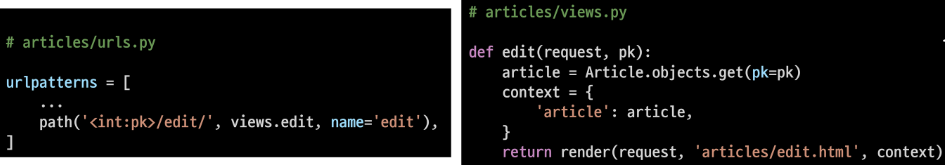

- Edit - templates
  
  - html tag의 value 속성을 사용해 기존에 입력 되어 있던 데이터를 출력
  
  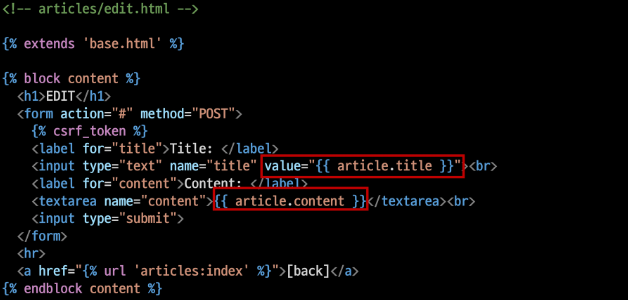
  
  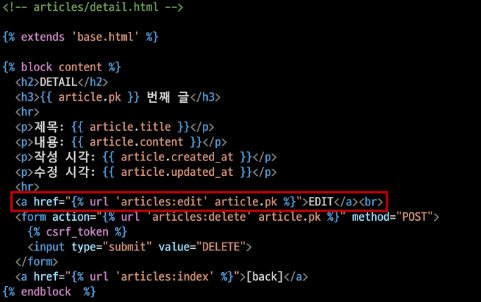
  
  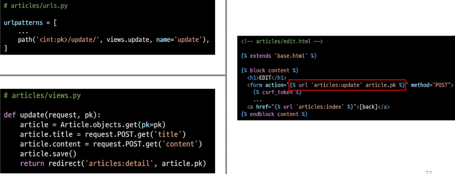


### Handling HTTP requests

- 개요
  
  - "HTTP requests 처리에 따른 view 함수 구조 변화"
  
  - new-create, edit-update의 view 함수 역할을 잘 살펴보면 하나의 공통점과 하나의 차이점이 있음
  
  - 공통점
    
    - new-create는 모두 create 로직을 구현하기 위한 공통 목적
    
    - edit-update는 모두 update 로직을 구현하기 위한 공통 목적
  
  - 차이점
    
    - new와 edit은 GET 요청에 대한 처리만을, create와 update는 POST요청에 대한 처리만을 진행
  
  - 이 공통점과 차이점을 기반으로, 하나의 view 함수에서 method에 따라 로직이 분리되도록 변경

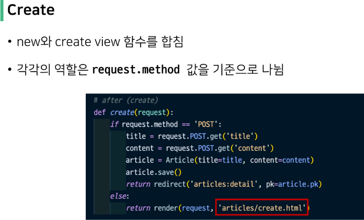

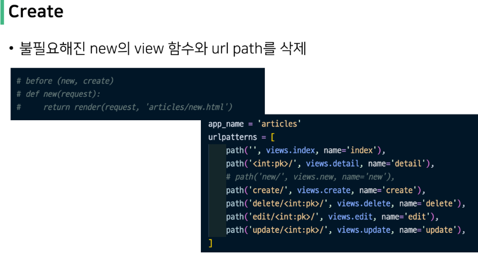

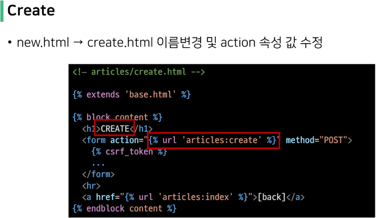

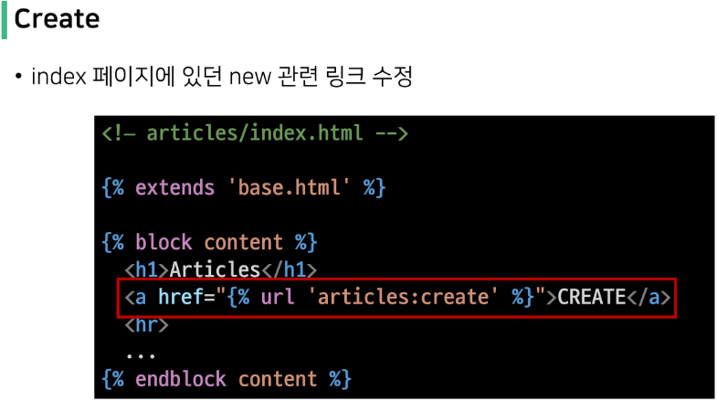

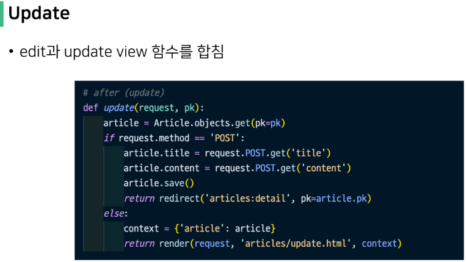

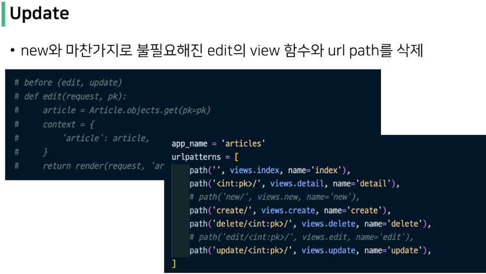

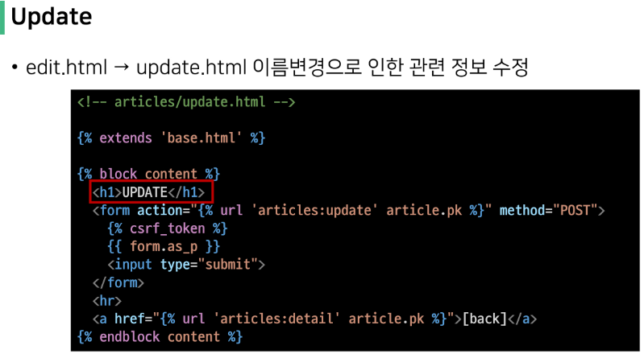

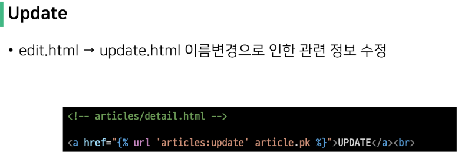

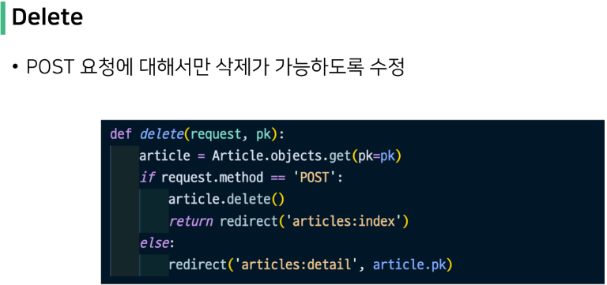
