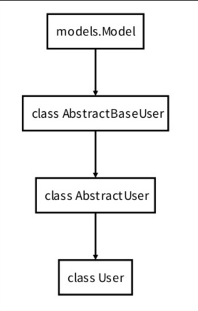

# 3_22

### 인증과 권한

- ##### 개요
  
  - Django authentication system(인증 시스템)은 인증(Authentication)과 권한(Authorization) 부여를 함께 제공(처리)하며, 이러한 기능을 일반적으로 인증 시스템이라고 함
  
  - 필수 구성은 settings.py에 이미 포함되어 있으며 INSTALLED_APPS에서 확인 가능
    
    - `django.contrib.auth`
  
  - Authentication (인증)
    
    - 신원 확인
    
    - 사용자가 자신이 누구인지 확인하는 것
  
  - Authorization (권한, 허가)
    
    - 권한 부여
    
    - 인증된 사용자가 수행할 수 있는 작업을 결정

### Custom User model

- ##### 개요
  
  - "Custim User Model로 대체하기"
  
  - 기본 User Model을 필수적으로 Custom User Model로 대체하는 이유 이해하기
  
  - Django는 기본적인 인증 시스템과 여러 가지 필드가 포함된 User Model을 제공, 대부분의 개발 환경에서 기본 User Model을 Custom User Model로 대체함
  
  - 개발자들이 작성하는 일부 프로젝트에서는 django에서 제공하는 built-in User model의 기본 인증 요구사항이 적절하지 않을 수 있음
    
    - 예를 들어, 내 서비스에서 회원가입 시 username 대신 email을 식별 값으로 사용하는 것이 더 적합한 사이트인 경우, Django의 User Model은 기본적으로 username를 식별 값으로 사용하기 때문에 적합하지 않음
  
  - Django는 현재 프로젝트에서 사용할 User Model을 결정하는 `AUTH_USER_MODEL` 설정 값으로 Default User Model을 재정의(override)할 수 있도록 함

- ##### AUTH_USER_MODEL
  
  - 프로젝트에서 User를 나타낼 때 사용하는 모델
  
  - 프로젝트가 진행되는 동안 (모델을 만들고 migration을 한 후) 변경할 수 없음
  
  - 프로젝트 시작 시 설정하기 위한 것이며, 참조하는 모델은 첫 번째 마이그레이션에서 사용할 수 있어야 함
    
    - 즉, 첫번째 마이그레이션 전에 확정지어야 하는 값
  
  - 다음과 같은 기본 값을 가지고 있음
    
    ```python
    # settings.py
    
    AUTH_USER_MODEL = 'auth.User'
    ```

### How to substituting a custom User model

- ##### 개요
  
  - "custom User model로 대체하기"
  
  - 기본 User Model을 필수적으로 Custom User Model로 대체하는 이유 이해하기
  
  - Django는 기본적인 인증 시스템과 여러 가지 필드가 포함된 User Model을 제공, 대부분의 개발 환경에서 기본 User Model을 Custom User Model로 대체함
  
  - 개발자들이 작성하는 일부 프로젝트에서는 django에서 제공하는 built-in User Model의 기본 인증 요구사항이 적절하지 않을 수 있음
    
    - 예를 들어, 내 서비스에서 회원가입 시 username 대신 email을 식별 값으로 사용하는 것이 더 적합한 사이트인 경우, django의 User Model은 기보적으로 username을 식별 값으로 사용하기 때문에 적합하지 않음
  
  - Django는 현재 프로젝트에서 사용할 User Model을 결정하는 AUTH_USER_MODEL 설정 값으로 Default User Model을 재정의(override)할 수 있도록 함

- ##### AUTH_USER_MODEL
  
  - 프로젝트에서 User을 나타낼 때 사용하는 모델
  
  - 프로젝트가 진행되는 동안 (모델을 만들고 migrations를 한 후) 변경할 수 없음
  
  - 프로젝트 시작 시 설정하기 위한 것이며, 참조하는 모델은 첫 번째 migrations에서 사용할 수 있어야 함
    
    - 즉, 첫 번째 migration전에 확정 지어야 하는 값
  
  - 다음과 같은 기본 값을 가지고 있음
  
  - ```python
    # settings.py
    
    AUTH_USER_MODEL = 'auth.User'
    ```

- ##### 대체하기
  
  - `AbstractUser`를 상속받는 custom User class 작성
  
  - 기존 User 클래스도 AbstractUser를 상속받기 때문에 custom user class도 완전히 같은 모습을 가지게 됨
  
  - ```python
    # accounts/models.py
    from django.contribauth.models import AbstractUser
    
    class User(AbstractUser):
        pass
    ```
  
  - Django PJT에서 User을 나타내는데 사용하는 모델을 방금 생성한 custom User model로 지정
  
  - ```python
    # settings.py
    
    AUTH_USER_MODEL = 'accounts.User'
    ```
  
  - `admin.py`에 custom User model을 등록
    
    - 기본 User model이 아니기 때문에 등록하지 않으면 admin sit에 출력되지 않음
    
    - ```python
      # accounts/admin.py
      
      from django.contrib import admin
      from django.contrib.auth.admin import UserAdmin
      from .models import User
      
      admin.site.register(User, UserAdmin)
      ```
  
  - User 모델 상속 관계
    
    - 
  
  - AbstractUser
    
    - 관리자의 권한과 함께 완전한 가능을 가지고 있는 User model을 구현하는 추상 기본 클래스
    
    - Abstract base classes (추상 기본 클래스)
      
      - 몇 가지 공통 정보를 여러 다른 모델에 넣을 때 사용하는 클래스
      
      - DB table을 만드는 데 사용되지 않으며, 대신 다른 모델의 기본 클래스로 사용되는 경우 해당 필드가 하위 클래스의 필드에 추가됨

- ##### HTTP
  
  - Hyper Text Transfer Protocol
  
  - HTML 문서와 같은 리소스들을 가져올 수 있도록 해주는 프로토콜(규칙, 규약)
  
  - 웹에서 이루어지는 모든 데이터 교환의 기초
  
  - 클라이언트 - 서버 프로토콜이라고도 부름

- ##### 요청과 응답
  
  - 요청(requests)
    
    - 클라이언트(브라우저)에 의해 전송되는 메시지
  
  - 응답(response)
    
    - 서버에서 응답으로 전송되는 메시지

- ##### HTTP의 특징
  
  1. 비 연결 지향(connectionless) 
     
     - 서버는 요청에 대한 응답을 보낸 후 연결을 끊음
     
     - 예를 들어 우리가 네이버 메인 페이지를 보고 있을 때 우리는 네이버 서버와 연결되어 있는 것이 아님
     
     - 네이버 서버는 우리에게 메인 페이지를 응답하고 연결을 끊은 것
  
  2- 무상태(stateless)
  
  - 연결을 끊는 순간 클라이언트와 서버 간의 통신이 끝나며 상태 정보가 유지되지 않음
  
  - 클라이언트와 서버가 주곱다는 메시지들은 서로 완전히 독립적
  
  3- 로그인 상태를 유지하는 방법
  
  - 서버와 클라이언트 간 지속적인 상태 유지를 위해 `쿠키와 세션`이 존재

- ##### 쿠키
  
  - HTTP 쿠키는 상태가 있는 세션을 만들도록 해줌
  
  - 개념
    
    - 서버가 사용자의 웹 브라우저에 전송하는 작은 데이터 조각이다.
    
    - 사용자가 웹사이트를 방문할 경우 해당 웹사이트의 서버를 통해 사용자의 컴퓨터에 설치되는 작은 기록 정보 파일
      
      1. 브라우저(클라이언트)는 쿠키를 로컬에 KEY-VALUE의 데이터 형식으로 저장
      
      2. 이렇게 쿠키를 저장해 놓았다가, 동일한 서버에 재요청 시 저장된 쿠키를 함께 전송
    
    . 쿠키는 두 요청이 동일한 브라우저에서 들어왔는지 아닌지를 판단할 때 주로 사용됨
    
      . 이를 이용해 사용자의 로그인 상태를 유지할 수 있음
    
      . 상태가 없는(stateless) HTTP 프로토콜에서 상태 정보를 기억시켜 주기 때문
    
    . 즉, 웹 페이지에 접속하면 웹 페이지를 응답한 서버로부터 쿠키를 받아 브라우저에 저장하고, 클라이언트가 같은 서버에 재요청 시 매번 요청과 함께 저장해두었던 쿠키도 함께 전송
  
  . 사용 목적
  
  1. 세션 관리 (Session management)
     
     - 로그인, 아이디 자동완성, 공지 하루 안 보기, 팝업 체크, 장바구니 등의 정보 관리
  
  2. 개인화 (Personalization)
     
     - 사용자 선호, 테마 등의 설정
  
  3. 트래킹 (Tracking)
     
     - 사용자 행동을 기록 및 분석
  
  . 세션 (Session)
  
    . 사이트와 특정 브라우저 사이의 'state(상태)'를 유지시키는 것
  
    . 클라이언트가 서버에 접속하면 서버가 특정 session id를 발급하고, 클라이언트는 session id를 쿠키에 저장
  
      . 클라이언트가 다시 동일한 서버에 접속하면 요청과 함께 쿠키(session id가 저장된)를 서버에 전달
      
      . 쿠키는 요청 때마다 서버에 함께 전송되므로 서버에서 session id를 확인해 알맞은 로직을 처리
  
    . session id는 세션을 구별하기 위해 필요하며, 쿠키에는 session id만 저장
  
  . 쿠키 수명
  
  1. Session cookie
     
     - 현재 세선(current session)이 종료되면 삭제됨\
     
     - 브라우저 종료와 함께 세션이 삭제됨
  
  2. Persistent cookies
     
     - Expires 속성에 지정된 날짜 혹은 Max-Age 속성에 지정된 기간이 지나면 삭제됨
  
  . Session in Django
  
    . Django는 DB-backed session 저장방식을 기본 값으로 사용
  
      . session 정보는 Django DB의 django_session table에 저장
  
    . Django는 특정 session id를 포함하는 쿠키를 사용해서 각각의 브라우저와 사이트가 연결된 session을 알아냄
  
    . Django는 우리가 session 매커니즘(복잡한 동작원리)에 대부분을 생각하지 않게끔 많은 도움을 줌

- ##### Login
  
  - 로그인은 Session을 Create하는 과정

- AuthenticationForm
  
  - 로그인을 위한 built-in form
    
    - 로그인 하고자하는 사용자 정보를 입력 받음
    
    - 기본적으로 username과 password를 받아 데이터가 유효한지 검증
  
  - request를 첫번째 인자로 취함

- 로그인 페이지 작성

- 

- login()
  
  - login(request, user, backend=None)
  
  - 인증된 사용자를 로그인 시키는 로직으로 view 함수에서 사용됨
  
  - 현재 세션에 연결하려는 인증된 사용자가 있는 경우 사용
  
  - HttpRequest 객체와 User 객체가 필요
  
  - 

- get_user()
  
  - AuthenticationForm의 인스턴스 메서드
  
  - 유효성검사를 통과했을 경우 로그인한 사용자 객체를 반환

- base.html에 인증관련 데이터를 출력하는 방법
  
  - 

- ##### Logout
  
  - 로그아웃은 Session을 Delete하는 과정
  
  - logout(request)
  
  - HttpRequest 객체를 인자로 받고 반환 값이 없음
  
  - 사용자가 로그인하지 않은 경우 오류를 발생시키지 않음
  
  - 현재 요청에 대한 session data를 DB에서 삭제
  
  - 클라이언트의 쿠키에서도 session id를 삭제
  
  - 다른 사람이 동일한 웹 브라우저를 사용하여 로그인하고, 이전 사용자의 세션 데이터에 엑세스하는 것을 방지하기 위함
  
  - 
  
  - 
