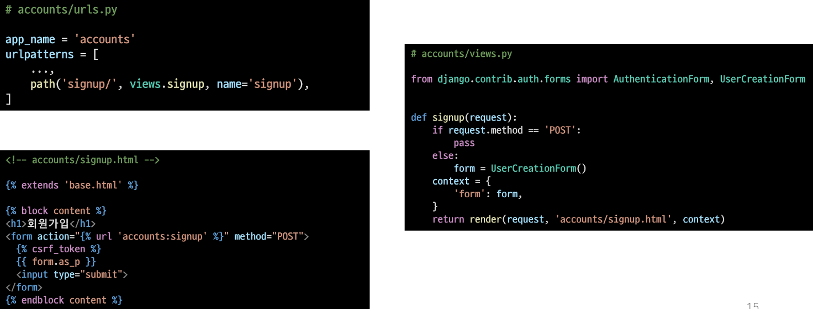

# 3_23

- ##### 회원가입 페이지 작성
  
  

- get_user_model()

- 현재 프로젝트에서 활성화된 사용자 모델(active user model)을 반환
  
  - 직접 참조하지 않는 이유 : 기존 User 모델이 아닌 User 모델을 커스텀한 상황에서는 커스텀 User 모델을 자동으로 반환해주기 때문
  
  - Django는 User 클래스를 직접 참조하는 대신 get_user_model()을 사용해 참조해야 한다고 강조하고 있음

- CustomUserCreationForm()으로 대체하기
  
  - 

- ##### 회원 탈퇴
  
  - 회원 탈퇴하는 것은 DB에서 유저를 Delete하는 것과 같음
  
  - 
  
  - 

- ##### 회원정보 수정
  
  - 회원정보 수정은 User을 Update하는 것이며 `UserChangeForm` built-in form을 사용

- UserChangeForm
  
  - 사용자의 정보 및 권한을 변경하기 위해 admin 인터페이스에서 사용되는 ModelForm
  
  - UserChangeForm 또한 ModelForm이기 때문에 instance 인자로 기존 user 데이터 정보를 받는 구조 또한 동일함
  
  - 이미 이전에 CustomUserChangeForm으로 확장했기 때문에 CustomUserChangeForm을 사용해야함
  
  - 
  
  - 사용시 문제점
    
    - 일반 사용자가 접근해서는 안될 정보들(fields)까지 모두 수정이 가능해짐
      
      - admin 인터페이스에서 사용되는 ModelForm이기 때문에 
    
    - 따라서 UserChangeForm을 상속받아 작성해두었던 서브클래스인 CustomUserChangeForm에서 접근 가능한 필드를 조정해야함
      
      - 
  
  - ##### 비밀번호 변경
  
  - PasswordChangeForm
  
  - 사용자가 비밀번호를 변경할 수 있도록 하는 Form
  
  - 이전 비밀번호를 입력하여 비밀번호를 변경할 수 있도록 함
  
  - 이전 비밀번호를 입력하지 않고 비밀번호를 설정할 수 있는 SetPasswordForm을 상속받는 서브 클래스
  
  - 
  
  - PasswordChangeForm은 SetPasswordForm의 하위 클래스이기 때문에 SetPasswordForm을 확인
  
  - 암호 변경 시 세션 무효화를 방지하기
    
    - 비밀번호가 변경되면 기존 세션과의 회우너 인증 정보가 일치하지 않게 되기 때문에 로그인 상태가 유지되지 못함
    
    - 비밀번호는 잘 변경되었으나 비밀번호가 변경되면서 기존 세션과의 회우너 인증정보가 일치하지 않기 때문
  
  - update_session_auth_hash()
    
    - update_session_auth_hash(request, user)
    
    - 현재 요청(current request)와 새 session data가 파생 될 업데이트 된 사용자 객체를 가져오고, session data를 적절하게 업데이트 해줌
    
    - 암호가 변경되어도 로그아웃 되지 않도록 새로운 password의 session data로 session을 업데이트
  
  - 비밀번호 변경 후 로그인까지
  
  - 

- #### View decorators
  
  - View decorators를 사용해 view 함수를 단단하게 만들기

- ##### Decorators
  
  - 기존에 작성된 함수에 기능을 추가하고 싶을 때, 해당 함수를 수정하지 않고 기능을 추가해주는 함수
  
  - Django는 다양한 HTTP 기능을 지원하기 위해 view 함수에 적용할 수 있는 여러 데코레이터를 제공
  
  - 예시
    
    - 

- ##### Allowed HTTP methods
  
  - django.views.decorators.http의 데코레이터를 사용하여 요청 메서드를 기반으로 접근을 제한할 수 있음
  
  - 일치하지 않는 메서드 요청이라면 405 Method Not Allowed를 반환
    
    - 요청 방법이 서버에게 전달되었으나 사용 불가능한 상태
  
  - 메서드 목록
    
    - require_http_methods()
    
    - require_POST()
    
    - require_safe()

- require_http_methods()
  
  - view 함수가 특정한 요청 method만 허용하도록 하는 데코레이터
  
  - 

- require_POST()
  
  - view 함수가 POST 요청 method만 허용하도록 하는 데코레이터
  
  - 
  
  - url로 delete 시도 후 서버 로그에서 405 http status code 확인 해보기
  
  - 

- require_safe()
  
  - require_GET이 있지만 Django에서는 require_safe를 사용하는 것을 권장
  
  - 

- ##### Limiting access to logged-in users
  
  - 로그인 사용자에 대한 접근 제한하기
    
    - is_authenticated attribute

- is_authenticated
  
  - User model의 속성(attributes) 중 하나
  
  - 사용자가 인증되었는지 여부를 알 수 있는 방법
  
  - 모든 User 인스턴스에 대해 항상 True인 읽기 전용 속성
    
    - AnonymousUser에 대해서는 항상 False
  
  - 일반적으로 request.user에서 이 속성을 사용(request.user.is_authenticated)
  
  - 권한(permission)과는 관련이 없으며, 사용자가 활성화 상태이거나 유효한 세션을 가지고 있는지도 확인하지 않음
  
  - 
  
  - 

- `from django.contrib.auth.decorators import login_required`
  
  - login을 했을 경우에만 views.py에 있는 함수를 통과할 수 있도록 해주는 데코레이터 
  - 사용하였을 경우 http를 통해 접근할 수 없어짐
  - 
