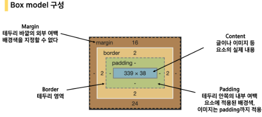
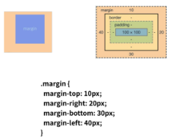
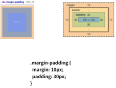
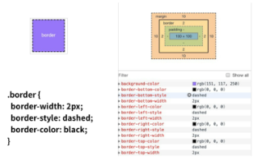
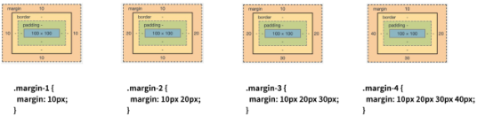

# 3_8

### CSS Box model

- CSS 원칙 1
  
  - 모든 요소는 네모(박스모델)이고, 위에서부터 아래로, 왼쪽에서 오른쪽으로 쌓인다.
  
  - 가로 : inline direction / 세로 : block direction

- 모든 HTML 요소는 box 형태로 되어있음

- 하나의 박스는 네 부분(영역)으로 이루어짐
  
  - content
  
  - padding
  
  - border
  
  - margin
  
  
  
  
  
  
  
  

