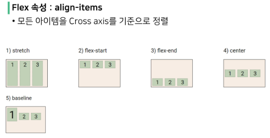

# 3_9

### CSS layout

##### float

- CSS 원칙 1
  
  - 모든 요소는 네모(박스모델)이고, 위에서부터 아래로, 왼쪽에서 오른쪽으로 쌓인다.

- float
  
  - 박스를 왼쪽 혹은 오른쪽으로 이동시켜 텍스트를 포함 인라인 요소들이 주변을 wrapping 하도록 함
  
  - 요소가 normal flow를 벗어나도록 함

- 속성
  
  - none : default
  
  - left : 요소를 왼쪽으로 띄움
  
  - right : 요소를 오른쪽으로 띄움
  
  

- 정리
  
  - float은 layout을 구성하기 위해 필수적으로 활용 되었으나, 최근 flexbox, grid 등장과 함께 사용도가 낮아짐
  
  - float 활용 전략 - normal flow에서 벗어난 layout 구성
    
    - 원하는 요소들을 float으로 지정하여 배치

##### flexbox

- CSS flexible box layout
  
  1. 수직 정렬
  
  2. 아이템의 너비와 높이 혹은 간격을 동일하게 배치
  - 행과 열 형태로 아이템들을 배치하는 1차원 layout model
  
  - 축
    
    - main axis
    
    - cross axis
  
  - 구성 요소
    
    - flex container (부모 요소)
    
    - flex item (자식 요소)

- 구성 요소
  
  - flex container
    
    - flexbox layout을 형성하는 가장 기본적인 모델
    
    - flex item들이 놓여있는 영역
    
    - display 속성을 flex 혹은 inline-flex로 지정
  
  - flex item
    
    - container에 속해 있는 컨텐츠(box)

- 속성
  
  - 배치 설정
    
    - flex-direction
    
    - flex-wrap
  
  - 공간 나누기
    
    - justify-content (main axis)
    
    - align-content (cross axis)
  
  - 정렬
    
    - align-items (모든 아이템을 cross axis 기준으로)
    
    - align-self (개별 아이템)
  
  - `flex-direction`
    
    - main axis 기준 방향 설정
    
    - 역방향의 경우 HTML 태그 선언 순서와 시각적으로 다르니 유의
  
  - `flex-wrap`
    
    - 아이템이 컨테이너를 벗어나는 경우 해당 영역 내에 배치되도록 설정
    
    - 즉, 기본적을 컨테이너 영역을 벗어나지 않도록 함
  
  - `flex-direction` `&` `flex-wrap`
    
    - flex-direction : main axis의 방향을 설정
    
    - flex-wrap : 요소들이 강제로 한 줄에 배치 되게 할 것인지 여부 설정
      
      - nowrap (기본 값) : 한 줄에 배치
      
      - wrap : 넘치면 그 다음 줄로 배치
    
    - flex-flow
      
      - flex-direction과 flex-wrap의 shorthand
      
      - flex-direction과 flex-wrap에 대한 설정 값을 차례로 작성
      
      - ex) `flex-flow: row nowrap;`
    
    
    
    
  
  - `justify-content & align-content`
    
    - 공간 배분
      
      - flex-start (default) : 아이템들을 axis 시작점으로
      
      - flex-end : 아이템들을 axis 끝 쪽으로
      
      - center : 아이템들을 axis 중앙으로
      
      - space-between : 아이템 사이의 간격을 균일하게 분배
      
      - space - around : 아이템을 둘러싼 영역을 균일하게 분배 (가질 수 있는 영역을 반으로 나눠서 양쪽에)
      
      - space-evenly : 전체 영역에서 아이템 간 간격을 균일하게 분배
    
    
    
    
  
  - `align-items & align-self`
    
    - cross axis를 중심으로
      
      - stretch (default) : 컨테이너를 가득 채움
      
      - flex-start : 위
      
      - flex-end : 아래
      
      - center : 가운데
      
      - baseline  text baseline에 기준 선을 맞춤

- 기타 속성
  
  - flex-grow : 남은 영역을 아이템에 분배
  
  - order : 배치 순서

