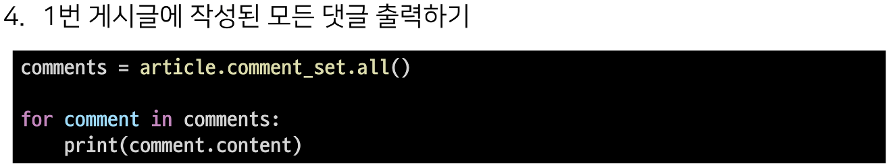
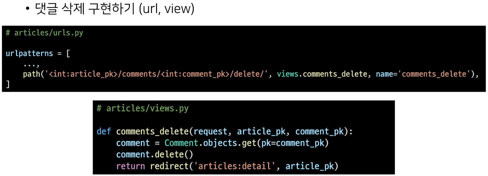
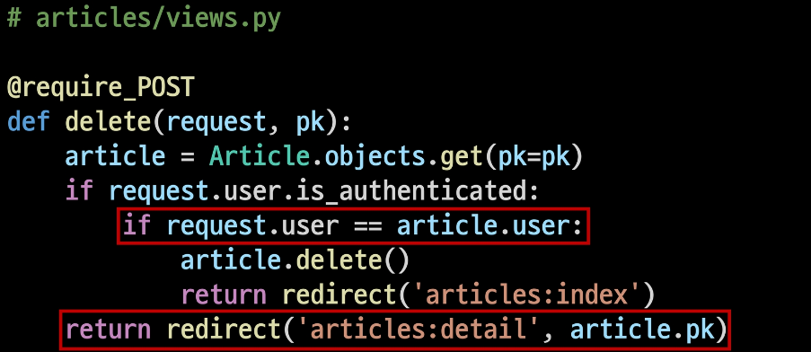

# 4_10

### A many-to-one relationship

> $개요$
> 
> - 관계형 DB에서의 외래 키 속성을 사용해 모델 간 N : 1 관계 설정하기

> ##### RDB에서의 관계
> 
> 1. 1:1
>    
>    - One-to-One relationships
>    
>    - 한 테이블의 레코드 하나가 다른 테이블의 레코드 단 한 개와 관련된 경우
> 
> 2- N:1
> 
> - Many-to-One relationships
> 
> - 한 테이블의 0개 이상의 레코드가 다른 테이블의 레코드 한 개와 관련된 경우
> 
> - 기준 테이블에 따라 (1:N, One-to-Many relationships)라고도 함
> 
> - 
> 
> 3- M:N
> 
> - Many-to-Many relationships
> 
> - 한 테이블의 0개 이상의 레코드가 다른 테이블의 0개 이상의 레코드와 관련된 경우
> 
> - 양쪽 모두에서 N:1 관계를 가짐

> ##### Foreign Key
> 
> - 외래 키 (외부 키)
> 
> - 관계형 DB에서 다른 테이블의 행을 식별할 수 있는 키
> 
> - 참조되는 테이블의 기본 키(PK)를 가리킴
> 
> - 참조하는 테이블의 행 1개의 값은, 참조되는 측 테이블의 행 값에 대응됨
>   
>   - 이 때문에 참조하는 테이블의 행에는, 참조되는 테이블에 나타나지 않는 값을 포함할 수 없음
> 
> - 참조하는 테이블 행 여러 개가, 참조되는 테이블의 동일한 행을 참조할 수 있음
> 
> - 키를 사용하여 부모 테이블의 유일한 값을 참조 (by 참조 무결성)
> 
> - 외래 키의 값이 반드시 부모 테이블의 PK일 필요는 없지만 유일한 값이어야 함
> 
> - 참조 무결성
>   
>   - DB 관계 모델에서 관련된 2개의 테이블 간의 일관성을 말함
>   
>   - FK가 선언된 테이블의 FK 속성(열)의 값은 그 테이블의 부모가 되는 테이블의 PK값으로 존재해야 함

### N:1 (Comment - Article)

- Comment(N) - Article(1)

- Comment 모델과 Article 모델 간 관계 설정

- ex) 0개 이상의 댓글은 1개의 게시글에 작성될 수 있음

### 모델 관계 설정

- 게시판의 게시글과 N:1 관계를 나타낼 수 있는 댓글 구현

- N:1 관계에서 댓글을 담당할 Comment 모델은 N, Article 모델은 1이 될 것

- 

- 

### Django Relationship fields 종류

1. OneToOneField()
   
   - A one-to-one relationship

2. ForeignKey()
   
   - A many-to-one relationship

3- ManyToManyField()

- A many-to-many relationship

> ##### ForeignKey(to, on_delete, **options)
> 
> - A many-to-one relationship을 담당하는 Django의 모델 필드 클래스
> 
> - Django 모델에서 관계형 DB의 FK 속성을 담당
> 
> - 2개의 필수 위치 인자가 필요
>   
>   - 참조하는 model class
>   
>   - on_delete 옵션

> ##### Comment 모델 정의
> 
> 
> 
> - 외래 키 필드는 ForeignKey 클래스를 작성하는 위치와 관계없이 필드의 마지막에 작성됨
> 
> - ForeignKey() 클래스의 인스턴스 이름은 참조하는 모델 클래스 이름의 단수형으로 작성하는 것을 권장

> ##### ForeignKey arguments - on_delete
> 
> - FK가 참조하는 객체가 사라졌을 때, FK를 가진 객체를 어떻게 처리할 지 정의
> 
> - 데이터 무결성을 위해서 매우 중요한 설정
> 
> - on_delete 옵션 값
>   
>   - CASCADE : 부모 객체(참조된 객체)가 삭제됐을 떄 이를 참조하는 객체도 삭제
>   
>   - PROTECT, SET_NULL, SET_DEFAULT 등 여러 옵션 값들이 존재

> ##### 댓글 생성 연습
> 
> - shell_plus 실행
>   
>   - 
>   
>   - 
>   
>   - 
>   
>   - 
>   
>   - 
>   
>   - 
>   
>   - 

> ##### Related manager
> 
> - Related manager은 N:1 혹은 M:N 관계에서 사용 가능한 문맥(context)
> 
> - Django는 모델 간 N:1 or M:N관계가 설정되면 역참조 할 때에 사용할 수 있는 manager를 생성
>   
>   - 이전에 모델 생성 시 objects라는 매니저를 통해 queryset api를 사용했던 것처럼 related manager를 통해 queryset api를 사용할 수 있게 됨
> 
> - 지금은 N:1 관계에서의 related manager 만을 학습할 것

> ##### 역참조
> 
> - 나를 참조하는 테이블(나를 FK로 지정한)을 참조하는 것
> 
> - 즉, 본인을 FK로 참조 중인 다른 테이블에 접근하는 것
> 
> - N:1 관계에서는 1이 N을 참조하는 상황
>   
>   - FK를 가지지 않은 1이 FK를 가진 N을 참조
> 
> - 
>   
>   - Article 모델이 Comment 모델을 참조(역참조)할 때 사용하는 매니저
>   
>   - article.comment 형식으로는 댓글 개체를 참조할 수 없음
>     
>     - 실제로 Article 클래스에는 Comment와의 어떠한 관계도 작성되어 있지 않음
>   
>   - 대신 Django가 역참조 할 수 있는 comment_set manager를 자동으로 생성해 article.comment_set 형태로 댓글 객체를 참조할 수 있음
>   
>   - 반면 참조 상황(Comment -> Article)에서는 실제 FK 클래스로 작성한 인스턴스가 Comment 클래스의 클래스 변수이기 때문에 comment.article 형태로 작성 가능

> ##### Related manager 연습
> 
> - shell_plus 실행
>   
>   - 
> 
> - 1번 게시글 조회
>   
>   - 
> 
> - 
> 
> - 
> 
> - 

> ##### admin site 등록
> 
> - 새로 작성한 Comment 모델을 admin site에 등록하기
> 
> - 

> ##### CREATE
> 
> 1. 사용자로부터 댓글 데이터를 입력받기 위한 CommentForm 작성
>    
>    1. 
> 
> 2. detail 페이지에서 CommentForm 출력 (views.py)
>    
>    1. 
> 
> 3. detail 페이지에서 CommentForm 출력 (템플릿)
>    
>    1. 
> 
> 4. 
> 
> 5. 
> 
> 6. 출력에서 제외된 FK 데이터를 받아오는 법
>    
>    1. detail 페이지의 url을 살펴보면 `path('<int:pk>/', views.detail, name = 'detail')` url에 해당 게시글의 pk 값이 사용되고 있음
>    
>    2. 댓글의 FK 데이터에 필요한 정보가 바로 게시글의 pk 값
>    
>    3. 이전에 학습했던 url을 통해 변수를 넘기는 variable routing을 사용
> 
> 7. 
>    
>    1. save() method
>       
>       - save(commit=False)
>       
>       - Create, but don't save the new instance
>       
>       - 아직 DB에 저장되지 않은 인스턴스를 반환
>       
>       - 저장하기 전에 객체에 대한 사용자 지정 처리를 수행할 때 유용하기 사용
> 
> 8. 
> 
> 9. 

> ##### READ
> 
> - 작성한 댓글 목록 출력하기
> 
> - 특정 article에 있는 모든 댓글을 가져온 후 context에 추가
> 
> - 
> 
> - 

> ##### DELETE
> 
> - 
> 
> - 

> ##### 댓글 개수 출력하기
> 
> - 

### Referencing the User model

> ##### Django에서 User 모델을 참조하는 방법
> 
> 1. settings.AUTH_USER_MODEL
>    
>    - return 값 : 'accounts.User' (string)
>    
>    - User 모델에 대한 FK 또는 M:N 관계를 정의 할 때 사용
>    
>    - models.py의 모델 필드에서 User 모델을 참조할 때 사용
> 
> 2. get_user_model()
>    
>    - return 값 : User Object (객체)
>    
>    - 현재 활성화된 User 모델을 반환
>    
>    - customizing User 모델이 있을 경우는 Custom User 모델, 그렇지 않으면 User을 반환
>    
>    - models.py가 아닌 다른 모든 곳에서 유저 모델을 참조할 때 사용

> ##### Article과 User간 모델 관계 설정
> 
> - Article 모델에 User 모델을 참조하는 FK 작성
>   
>   - 

### CREATE

- 인증된 회원의 게시글 작성 구현하기

- 작성하기 전 로그인을 먼저 진행한 상태로 진행

### FK 데이터 누락

- 
- 

### DELETE

- 게시글 삭제 시 작성자 확인
  
  - 본인의 글만 삭제할 수 있도록 해줌
  
  - 

### UPDATE

- 게시글을 쓴 사람만 수정할 수 있도록 한다.
  
  - 
  
  - 

> ##### 게시글 작성자 출력
> 
> - 
