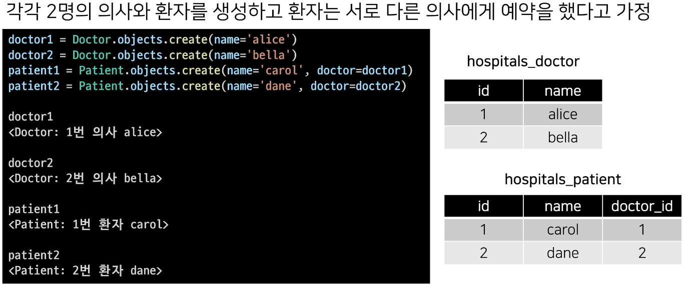
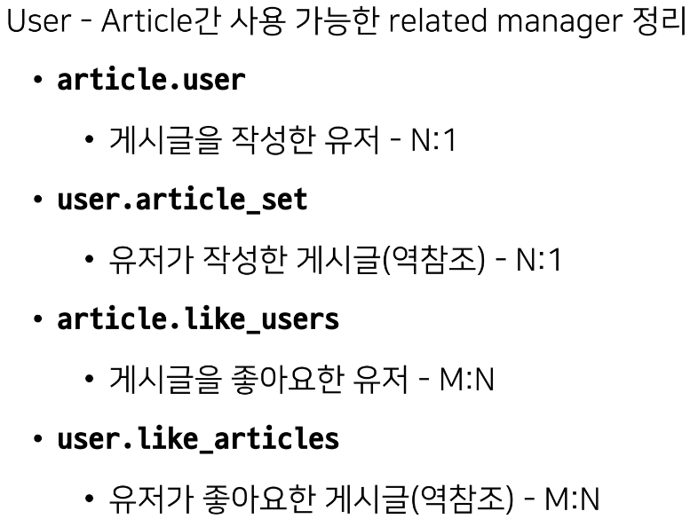

# 4_11

### DELETE

> 댓글 삭제 시 작성자 확인
> 
> - 
> 
> - 

### 인증된 사용자에 대한 접근 제한하기

- is_authenticated와 View decorator를 활용하여 코드 정리하기
  
  - 

- 비인증 사용자는 CommentForm을 볼 수 없도록 하기
  
  - 

target model : 관계 필드를 가지지 않은 모델

source model : 관계 필드를 가진 모델

> ##### N:1의 한계
> 
> - 의사와 환자간 예약 시스템을 구현시 한 명의 의사에게 여러 환자가 예약할 수 있다고 모델 관계를 설정
> 
> - 
> 
> - 
> 
> - 
> 
> - 
> 
> - 

> ##### 중개 모델
> 
> - 환자 모델의 외래 키를 삭제하고 별도의 예약 모델을 새로 작성
> 
> - 예약 모델은 의사와 환자에 각각 N:1 관계를 가짐
> 
> - 
> 
> - 
> 
> - 
> 
> - 
> 
> - 

> ##### Django ManyToManyField
> 
> - 환자 모델에 Django ManyToManyField 작성
> 
> - 
> 
> - 
> 
> - 
> 
> - 
> 
> - 
> 
> - Django는 ManyToManyField를 통해 중개 테이블을 자동으로 생성함

> ##### related_name argument
> 
> - target model이 source model을 참조할 때 사용할 manager name
> 
> - ForeignKey()의 related_name과 동일
> 
> - 
> 
> - 

> ##### Through argument
> 
> - 중개 테이블을 수동으로 지정하려는 경우 `through` 옵션을 사용하여 사용하려는 중개 테이블을 나타내는 Django 모델을 지정할 수 있음
> 
> - 가장 일반적인 용도는 중개테이블에 추가 데이터를 사용해 M:N 관계와 연결하려는 경우
> 
> - 
> 
> - 
> 
> - 
> 
> - 
> 
> - 

> ##### 정리
> 
> - M:N 관계로 맺어진 두 테이블에는 변화가 없음
> 
> - Django의 ManyToManyField는 중개 테이블을 자동으로 생성
> 
> - Django의 ManyToManyField는 M:N 관계를 맺는 두 모델 어디에 위치해도 상관 없음
>   
>   - 대신 필드 작성 위치에 따라 참조와 역참조 방향을 주의할 것
> 
> - N:1은 완전한 종속의 관계였지만 M:N은 의사에게 진찰받는 환자, 환자를 진찰하는 의사의 두 가지 형태로 모두 표현이 가능한 것

### ManyToManyField

> ##### ManyToManyField 란
> 
> - ManyToManyField(to, **options)
> 
> - M:N 관계 설정 시 사용하는 모델 필드
> 
> - 하나의 필수 위치인자가 필요
> 
> - 모델 필드의 RelatedManager을 사용하여 관련 개체를 추가, 제거 또는 만들 수 있음

> ##### DB에서의 표현
> 
> - Django는 M:N 관계를 나타내는 중개 테이블을 만듦
> 
> - 테이블 이름은 ManyToManyField 이름과 이를 포함하는 모델의 테이블 이름을 조합하여 생성됨
> 
> - `db_table` arguments를 사용하여 중개 테이블의 이름을 변경할 수 있음

> ##### Arguments
> 
> 1. related_name
>    
>    - target model이 source model을 참조할 때 사용할 manager name
>    
>    - ForeignKey의 related_name과 동일
> 
> 2- through
> 
> - 중개 테이블을 직접 작성하는 경우, through 옵션을 사용하여 중개 테이블을 나타내는 Django 모델을 지정
> 
> - 일반적으로 중개 테이블에 추가 데이터를 사용하는 M:N 관계와 연결하려는 경우에 사용됨
> 
> 3- symmetrical
> 
> - default : True
> 
> - ManyToManyField가 동일한 모델을 가리키는 정의에서만 사용
> 
> - 
> 
> - True일 경우
>   
>   - _set 매니저를 추가하지 않음
>   
>   - source 모델의 인스턴스가 target 모델의 인스턴스를 참조하면 자동으로 target 모델 인스턴스도 source 모델 인스턴스를 자동으로 참조하도록 함
>   
>   - 즉, 내가 당신의 친구라면 당신도 내 친구가 됨
> 
> - 대칭을 원하지 않는 경우 False로 설정
>   
>   - Follow 기능 구현에서 다시 확인

> ##### Related Manager
> 
> - N:1 or M:N 관계에서 사용 가능한 문맥
> 
> - Django는 모델 간 N:1 or M:N 관계가 설정되면 역참조시에 사용할 수 있는 manager을 생성
> 
> - 같은 이름의 매서드여도 각 관계에 따라 다르게 사용 및 동작됨
>   
>   - N:1에서는 target 모델 객체만 사용 가능
>   
>   - M:N 관계에서는 관련된 두 객체에서 모두 사용 가능
> 
> - 종류
>   
>   - add(), remove(), create(), clear(), set() 등 

### M:N

- Article과 User의 M:N 관계 설정을 통한 좋아요 기능 구현하기

- 

- 

### LIKE 구현

- url 및 view 함수 작성
  
  - 

- .exists()
  
  - QuerySet에 결과가 포함되어 있으면 True, 없으면 False를 return
  
  - 특히 큰 QuerySet에 있는 특정 개체의 존재와 관련된 검색에 유용함

- 

- 

