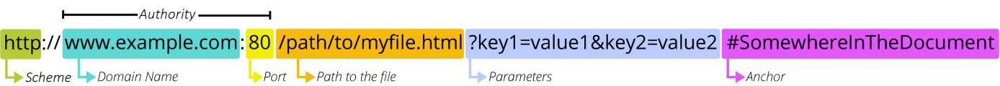

# 4_13

# REST API

### HTTP

> ##### HTTP
> 
> - HyperText Transfer Protocol
> 
> - HTML문서와 같은 리소스들을 가져올 수 있도록 하는 프로토콜
> 
> - 웹 상에서 컨텐츠를 전송하기 위한 약속
> 
> - 웹에서 이루어지는 모든 데이터 교환의 기초가 됨
> 
> - "클라이언트 - 서버 프로토콜"이라고도 부름
> 
> - 클라이언트와 서버는 다음과 같은 개별적인 메시지 교환에 의해 통신
>   
>   - 요청(request)
>     
>     - 클라이언트에 의해 전송되는 메시지
>   
>   - 응답(response)
>     
>     - 서버에서 응답으로 전송되는 메시지
> 
> - 실제로는 브라우저와 요청을 처리하는 서버 사이에는 더 많은 기술 및 컴퓨터들이 존재하지만 우리는 HTTP의 기본 명세에 대해서만 학습할 예정

> ##### HTTP 특징
> 
> - Stateless (무상태)
>   
>   - 동일한 연결(connection)에서 연속적으로 수행되는 두 요청 사이에 링크가 없음
>   
>   - 즉, 응답을 마치고 연결을 끊는 순간 클라이언트와 서버 간의 통신이 끝나며 상태 정보가 유지되지 않음
> 
> - 이는 특정 페이지와 일관되게 상호작용하려는 사용자에게 문제가 될 수 있으며, (예를 들어 e-commerce에서 장바구니를 사용하는 경우) 이를 해결하기 위해 쿠기와 세션을 사용해 서버 상태를 요청과 연결하도록 함

> ##### HTTP Request Methods
> 
> - 리소스에 대한 행위(수행하고자 하는 동작)를 정의
> 
> - 즉, 리소스에 대해 수행할 우너하는 작업을 나타내는 메서드 모음을 정의
> 
> - HTTP verbs라고도 함
> 
> - HTTP Method 예시로는 GET, POST, PUT, DELETE
> 
> - [참고] 리소스 (resource) - HTTP 요청의 대상을 리소스(resource, 자원)라고 함

> ##### 대표 HTTP Request Methods
> 
> 1. GET
>    
>    - 서버에 리소스의 표현을 요청
>    
>    - GET을 사용하는 요청은 데이터만 검색해야 함
> 
> 2. POST
>    
>    - 데이터를 지정된 리소스에 제출
>    
>    - 서버의 상태를 변경
> 
> 3. PUT
>    
>    - 요청한 주소의 리소스를 수정
> 
> 4. DELETE
>    
>    - 지정된 리소스를 삭제

> ##### HTTP response status codes
> 
> - 특정 HTTP 요청이 성공적으로 완료 되었는지 여부를 나타냄
> 
> - 응답은 5개의 그룹으로 나뉨
>   
>   1. Informational responses (100 - 199)
>   
>   2. Successful response (200 - 299)
>   
>   3. Redirection messages (300 - 399)
>   
>   4. Client error responses (400 - 499)
>   
>   5. Server error responses (500 - 599)

### Identifying resources on the Web

> ##### 개요
> 
> - 웹에서 리소스를 식별하는 방법에 대해 학습

> ##### 웹에서 리소스 식별
> 
> - HTTP 요청의 대상을 리소스라고함
> 
> - 리소스는 문서, 사진 또는 기타 어떤 것이든 될 수 있음
> 
> - 각 리소스는 식별을 위해 URI로 식별됨

### URI

> ##### URI
> 
> - Uniform Resource Identifier (통합 자원 식별자)
> 
> - 인터넷에서 리소스를 식별하는 문자열
> 
> - 가장 일반적인 URI는 웹 주소로 알려진 URL
>   
>   
> 
> - 특정 이름공간에서 이름으로 리소스를 식별하는 URI는 URN
>   
>   
>   
>   리소스를 찾아가는 경로를 제공하지 않음

> ##### URL
> 
> - Uniform Resource Locator (통합 자원 위치)
> 
> - 웹에서 주어진 리소스의 주소
> 
> - 네트워크 상에 리소스가 어디 있는지(주소)를 알려주기 위한 약속
>   
>   - 이러한 리소스는 HTML, CSS, 이미지 등이 될 수 있음
> 
> - URL은 다음과 같이 여러 부분으로 구성되며 일부는 필수이고 나머지는 선택사항
>   
>   - 

> ##### URL 구조
> 
> - Scheme (or protocol)
>   
>   - 브라우저가 리소스를 요청하는 데 사용해야 하는 프로토콜
>   
>   - URL의 첫 부분은 브라우저가 어떤 규약을 사용하는지를 나타냄
>   
>   - 기본적으로 웹은 HTTP(S)를 요구하며 메일을 열기 위한 mailto:, 파일을 열기 위한 ftp: 등 다른 프로토콜도 존재
>   
>   - 
> 
> - Authority
>   
>   - Scheme 다음은 문자 패턴 ://으로 구분된 Authority(권한)이 작성됨
>   
>   - Authority는 domain과 port를 모두 포함하며 둘은 :(콜론)으로 구분됨
>   
>   - 
>   1. Domain Name
>      
>      - 요청중인 웹 서버를 나타냄
>      
>      - 어떤 웹 서버가 요구되는 지를 가리키며 직접 IP 주소를 사용하는 것도 가능하지만, 사람이 외우기 어렵기 때문에 주로 Domain Name으로 사용
>      
>      - 예를 들어 도메인 google.com의 IP 주소는 142.251.42.142
>      
>      - 
>   
>   2. Port
>      
>      - 웹 서버의 리소스에 접근하는데 사용되는 기술적인 문(Gate)
>      
>      - HTTP 프로토콜의 표준 포트는 다음과 같고 생략이 가능 (나머지는 생략 불가능)
>        
>        - HTTP - 80
>        
>        - HTTP - 443
>      
>      - Django의 경우 8000(80 + 00)이 기본 포트로 설정되어 있음
>      
>      - 
>   
>   3. Path
>      
>      - 웹 서버의 리소스 경로
>      
>      - 초기에는 실제 파일이 위치한 물리적 위치를 나타냈지만, 오늘날은 실제 위치가 아닌 추상화된 형태의 구조를 표현
>      
>      - 예를 들어 /articles/create/가 실제 articles 폴더 안의 create 폴더 안을 나타내는 것은 아님
>      
>      - 
>   
>   4. Parameters
>      
>      - 웹 서버에 제공하는 추가적인 데이터
>      
>      - 파라미터는 `&` 기호로 구분되는 key-value 쌍 목록
>      
>      - 서버는 리소스를 응답하기 전에 이러한 파라미터를 사용하여 추가 작업을 수행할 수 있음
>      
>      - 
>   
>   5. Anchor
>      
>      - 리소스의 다른 부분에 대한 앵커
>      
>      - 리소스 내부 일종의 "북마크"를 나타내며 브라우저에 해당 북마크 지점에 있는 콘텐츠를 표시
>        
>        - 예를 들어 HTML 문서에서 브라우저는 앵커가 정의한 지점으로 스크롤 함
>      
>      - fragment identifier(부분 식별자)라고 부르는 `#` 이후 부분은 서버에 전송되지 않음
>        
>        - 
>      
>      - 
>      
>      - Anchor란 하이퍼링크와 비슷한 기능을 하는 인터넷상의 다른 문서와 연결된 문자 혹은 그림을 뜻함

> ##### [참고] URN
> 
> - Uniform Resource Name (통합 자원 이름)
> 
> - URL과 달리 자원의 위치에 영향을 받지 않는 유일한 이름 역할을 함 (독립적 이름)
> 
> - URL의 단점을 극복하기 위해 등장했으며 자원이 어디에 위치한지 여부와 관계없이 이름만으로 자원을 식별
> 
> - 하지만 이름만으로 실제 리소스를 찾는 방법은 보편화 되어있지 않아 현재는 URL을 대부분 사용
> 
> - 예시
>   
>   

> ##### 정리
> 
> - 웹에서의 리소스 식별
>   
>   - 자원의 식별자 (URI)
>     
>     - 자원의 위치로 자원을 식별 (URL)
>     
>     - 고유한 이름으로 자원을 식별 (URN)

### 클라이언트와 서버

> ##### 클라이언트-서버 구조
> 
> - 오늘날 우리가 사용하는 대부분의 웹 서비스는 클라이언트-서버 구조를 기반으로 동작
> 
> - 클라이언트와 서버 역시 하나의 컴퓨터이며 이들이 어떻게 상호작용하는지에 대한 간소화된 다이어그램은 다음과 같음
>   
>   - 
> 
> - 클라이언트
>   
>   - 웹 사용자의 인터넷에 연결된 장치 (예를 들어 wi-fi에 연결된 컴퓨터 또는 모바일)
>   
>   - Chrome 또는 Firefox와 같은 웹 브라우저
>   
>   - 서비스를 요청하는 주체
> 
> - 서버
>   
>   - 웹 페이지, 사이트 또는 앱을 저장하는 컴퓨터
>   
>   - 클라이언트가 웹 페이지에 접근하려고 할 때 서버에서 클라이언트 컴퓨터로 웹 페이지 데이터를 응답해 사용자의 웹 브라우저에 표시됨
>   
>   - 요청에 대해 서비스를 응답하는 주체
> 
> - 상호작용 예시
>   
>   - 예를 들어, 우리가 Google 홈페이지에 접속한다는 것은 무엇을 뜻하는지 알아보자
>   1. 결론적으로 인터넷에 연결된 전세계 어딘가에 있는 구글 컴퓨터에게 'Google 홈페이지.html' 파일을 달라고 요청하는 것
>   
>   2. 그러면 구글 컴퓨터는 우리의 요청을 받고 'Google 홈페이지.html' 파일을 인터넷을 통해서 우리 컴퓨터에게 응답해줌
>   
>   3. 그렇게 받은 구글 홈페이지.html 파일을 웹 브라우저가 우리가 볼 수 있도록 해석해주는 것
>   - 여기서 홈페이지.html을 요청한 컴퓨터, 웹 브라우저를 `클라이언트`라고하고 제공한 컴퓨터, 프로그램을 `서버`라고함
>   
>   - 어떠한 자원(resource)를 달라고 요청(request)하는 쪽을 `클라이언트`라고하고 자원을 제공해주는 쪽을 `서버`라고 함

> ##### 정리
> 
> - 우리가 사용하는 웹은 클라이언트-서버 구조로 이루어져 있음
> 
> - 앞으로 우리가 배우는 것도 이 클라이언트-서버 구조를 만드는 방법을 배우는 것
> 
> - 이 중에서 Django는 서버를 구현하는 웹 프레임 워크

# 다음 37/104 페이지부터

# 4_17

# Backend Framework

### Build RESTful API - Article

> ##### POST
> 
> - 게시글 데이터 생성하기
> 
> - 요청에 대한 데이터 생성이 성공했을 경우는 201 Created 상태 코드를 응답하고 실패했을 경우는 400 Bad request를 응답
>   
>   - 

> ##### Raising an exception on invalid data
> 
> - "유효하지 않은 데이터에 대해 예외 발생시키기"
> 
> - is_valid()는 유효성 검사 오류가 있는 경우 ValidationError 예외를 발생시키는 선택적 raise_exception 인자를 사용할 수 있음
> 
> - DRF에서 제공하는 기본 예외 처리기에 의해 자동으로 처리되며 기본적으로 HTTP 400 응답을 반환
>   
>   - 

> ##### DELETE
> 
> - 게시글 데이터 삭제하기
> 
> - 요청에 대한 데이터 삭제가 성공했을 경우는 204 No Content 상태 코드 응답 (명령을 수행했고 더 이상 제공할 정보가 없는 경우)
>   
>   - 

> ##### PUT
> 
> - 게시글 데이터 수정하기
> 
> - 요청에 대한 데이터 수정이 성공했을 경우는 200 OK 상태 코드 응답
>   
>   - 

### Django REST framework - N:1 Relation

> ##### 개요
> 
> - N:1 관계에서의 모델 data를 Serialization하여 JSON으로 변환하는 방법 학습
> 
> - 사전 준비
>   
>   - 
>   
>   - 

> ##### GET - List
> 
> - 댓글 데이터 목록 조회하기
> 
> - Article List와 비교하며 작성해보기
>   
>   - 
>   
>   - 

> ##### GET - Detail
> 
> - 단일 댓글 데이터 조회하기
> 
> - Article과 달리 같은 serializer 사용하기
>   
>   - 

> ##### POST
> 
> - 단일 댓글 데이터 생성하기
> 
> - 

> ##### Passing Additional attributes to `.save()`
> 
> - `save()` 메서드는 특정 Serializer 인스턴스를 저장하는 과정에서 추가적인 데이터를 받을 수 있음
> 
> - CommentSerializer를 통해 Serialize되는 과정에서 Parameter로 넘어온 article_pk에 해당하는 article 객체를 추가적인 데이터를 넘겨 저장
> 
> - 
> 
> > ##### 읽기 전용 필드 설정
> > 
> > - read_only_fields를 사용해 외래 키 필드를 `읽기 전용 필드`로 설정
> > 
> > - 읽기 전용 필드는 데이터를 전송하는 시점에 '해당 필드를 유효성 검사에서 제외시키고 데이터 조회 시에는 출력'하도록 함
> > 
> > - 

> ##### DELETE & PUT
> 
> - 댓글 데이터 삭제 및 수정 구현하기
> 
> - 

### N:1 - 역참조 데이터 조회

> ##### 개요
> 
> 1. 특정 게시글에 작성된 댓글 목록 출력하기
>    
>    - 기존 필드 override
> 
> 2. 특정 게시글에 작성된 댓글의 개수 출력하기
>    
>    - 새로운 필드 추가

> ##### 1. 특정 게시글에 작성된 댓글 목록 출력하기
> 
> - 기존 필드 override - Article Detail
>   
>   - 게시글 조회 시 해당 게시글의 댓글 목록까지 함께 출력하기
>   
>   - Serializer는 기존 필드를 override하거나 추가적인 필드를 구성할 수 있음
> 1. PrimaryKeyRelatedField()
>    
>    
>    
>    
> - models.py에서 related_name을 통해 이름 변경 가능
> 
> - 역참조 시 생성되는 comment_set을 override 할 수 있음
>   
>   
> 2. Nested relationships
>    
>    
>    
>    - 모델 관계 상으로 참조된 대상은 참조하는 대상의 표현에 포함되거나 중첩(nested)될 수 있음
>    
>    - 이러한 중첩된 관계는 serializers를 필드로 사용하여 표현할 수 있음
>    
>    - 두 클래스의 상/하 위치를 변경해야 함

> ##### 2. 특정 게시글에 작성된 댓글의 개수 출력하기
> 
> - 새로운 필드 추가 - Article Detail
>   
>   - "게시글 조회 시 해당 게시글의 댓글 개수까지 함께 출력하기"
> 
> - 
> 
> - `source`
>   
>   - serializers field's argument
>   
>   - 필드를 채우는 데 사용할 속성의 이름
>   
>   - 점 표기법(dotted notation)을 사용하여 속성을 탐색할 수 있음
> 
> - [주의]
>   
>   - 특정 필드를 override 혹은 추가한 경우 read_only_fields가 동작하지 않으니 주의해야 함
>     
>     

> ##### get_object_or_404()
> 
> - 모델 manager objects에서 get()을 호출하지만, 해당 객체가 없을 땐 기존 DoesNotExist 예외 대산 Http404를 raise함
>   
>   

> ##### get_list_or_404()
> 
> - 모델 manager objects에서 filter()의 결과를 반환하고 해당 객체 목록이 없을 땐 Http404를 raise 함
>   
>   
> 
> 
> 
> 사용하는 이유
> 
> - 클라이언트 입장에서 "서버에 오류가 발생하여 요청을 수행할 수 없다(500)"라는 원인이 정확하지 않은 에러를 마주하기보다는, 서버가 적절한 예외 처리를 하고 클라이언트에게 올바른 에러를 전달하는 것 또한 중요한 요소이기 때문이다.

