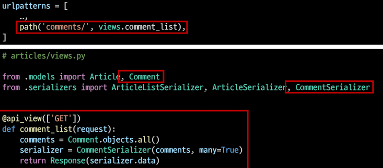
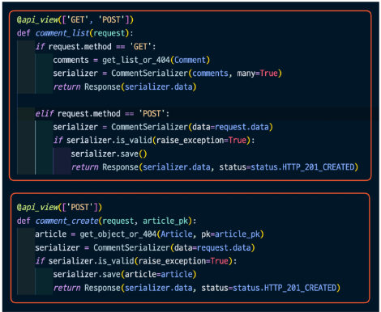
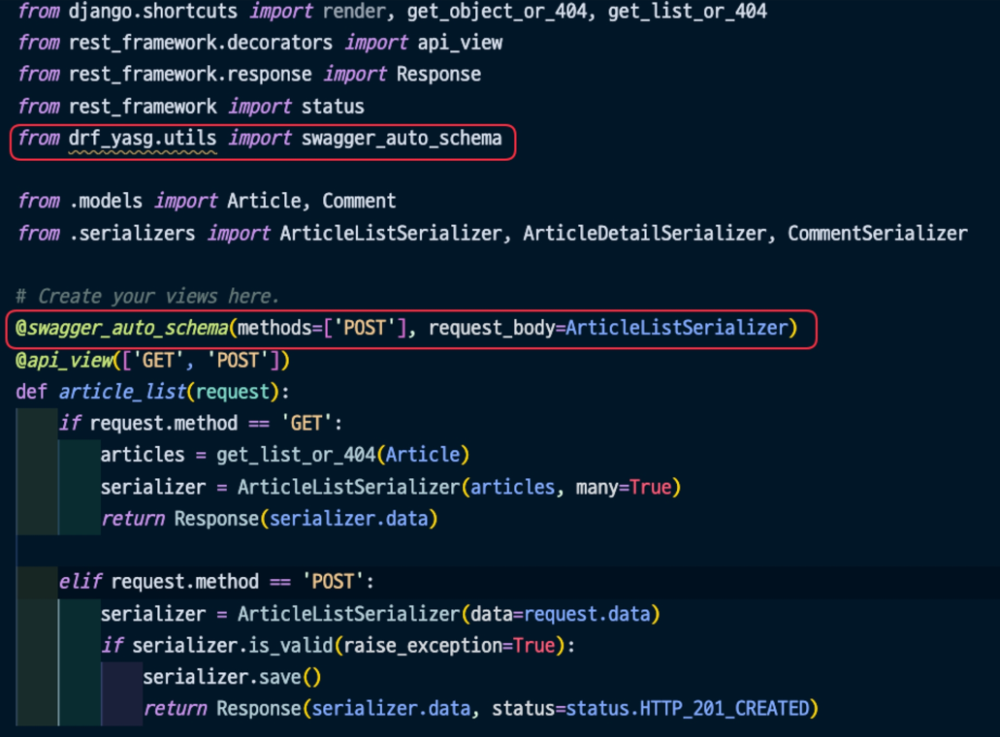

# Build RESTful API - Article

> POST
> 
> - 게시글 데이터 생성하기
> - 요청에 대한 데이터 생성이 성공했을 경우는 201 Created 상태 코드를 응답하고 실패 했을 경우는 400 Bad request를 응답
> - 
> - 
> - 
> 
> Raising an exception on invalid data
> 
> - 유효하지 않은 데이터에 대해 예외 발생시키기
> - is_valid()는 유효성 검사 오류가 있는 경우 ValidationError 예외를 발생시키는 선택적 raise_exception 인자를 사용할 수 있음
> - DRF에서 제공하는 기본 예외 처리기에 의해 자동으로 처리되며 기본적으로 HTTP 400 응답을 반환
> - 
> 
> DELETE
> 
> - 게시글 데이터 삭제하기
> - 요청에 대한 데이터 삭제가 성공했을 경우는 204 No Content 상태 코드 응답 (명령을 수행했고 더 이상 제공할 정보가 없는 경우)
> - 
> - 
> 
> PUT
> 
> - 게시글 데이터 수정하기
> - 요청에 대한 데이터 수정이 성공했을 경우는 200 OK 상태 코드 응답
> - 
> - 
> - 

# Django REST framework - N:1 Relation

- N:1 관계에서의 모델 data를 Serialization하여 JSON으로 변환하는 방법 학습
- 사전 준비 사항
  - 
  - 

> GET - List
> 
> - 댓글 데이터 목록 조회하기
> - Article List와 비교하며 작성해보기
> - 
> - 
> - 

> GET - Detail
> 
> - 단일 댓글 데이터 조회하기
> - Article과 달리 같은 serializer 사용하기
> - 
> - 

> POST
> 
> - 단일 댓글 데이터 생성하기
> - 
> - 
> - 
> - 
> - 

> DELETE & PUT
> 
> - 댓글 데이터 삭제 및 수정 구현하기
> - 
> - 
> - 

# N:1 - 역참조 데이터 조회

> 개요
> 
> 1. 특정 게시글에 작성된 댓글 목록 출력하기
>    - 기존 필드 override
> 2. 특성 게시글에 작성된 댓글의 개수 출력하기
>    - 새로운 필드 추가

> 1. 특정 게시글에 작성된 댓글 목록 출력하기
> - 기존 필드 override - Article Detail
>   - 게시글 조회 시 해당 게시글의 댓글 목록까지 함께 출력하기
>   - Serializer는 기존 필드를 override 하거나 추가적인 필드를 구성할 수 있음
> - 
> - 
> - 
> - 
> - 
> - 
> 2. 특정 게시글에 작성된 댓글의 개수 출력하기
> - 새로운 필드 추가 - Article Detail
>   - 게시글 조회 시 해당 게시글의 댓글 개수까지 함께 출력하기
>   - 
>   - 
>   - 
>   - 

# Django shorcuts functions
> 개요
> - django.shortcuts 패키지는 개발에 도움 될 수 있는 여러 함수와 클래스를 제공
> - 제공되는 shorcuts 목록
>   - render(), redirect(), get_object_or_404(), get_list_or_404()
> https://docs.djangoproject.com/en/3.2/topics/http/shortcuts/

> get_object_or_404()
> - 모델 manager objects에서 get()을 호출하지만, 해당 객체가 없을 땐 기존 DoesNotExist 예외 대신 Http404를 raise 함
> - 

> get_list_or_404()
> - 모델 manager objects에서 filter()의 결과를 반환하고 해당 객체 목록이 없을 땐 Http404를 raise 함
> - 
> - 

> 사용하는 이유
> - 클라이언트 입장에서 '서버에 오류가 발생하여 요청을 수행할 수 없다'라는 원인이 정확하지 않은 에러를 마주하기 보다는, 서버가 적절한 예외 처리를 하고 클라이언트에게 올바른 에러를 전달하는 것 또한 중요한 요소

# Serializer 활용하기
> 
> 
> 위의 2개를 합치면 아래로 감
> 
> 포스트 맨도 함께 수정
> 

> 필드명 수정 및 필드 삭제
> - 
> - 를 수정하기 위해
> - 
> - 
> - 
> - 필드 삭제
> - 

> 상속 이용하기
> - 
> - 

# 문서화

### 스웨거(Swagger)
- 스웨거는 개발자가 REST 웹 서비스를 설계, 빌드, 문서화 등을 도와주는 오픈 소스 소프트웨어 프레임워크

### DRF-YASG
- 스웨거를 기반으로 DRF API에 대한 문서를 쉽게 작성할 수 있도록 도와주는 도구
- 즉, DRF-YASG는 스웨거를 구현한 것 중 하나이다.
- 스키마를 자동으로 파악해 인터렉티브한 문서를 생성해줌
- 
- 
- 
- 
- 
- 
- 
- 
- 
- 

# 기타 도구
> django-debug-toolbar
> - 
> - https://django-debug-toolbar.readthedocs.io/en/latest/installation.html 체크
> - 
> - 
> - 
> - 
> - 
> - 
> 