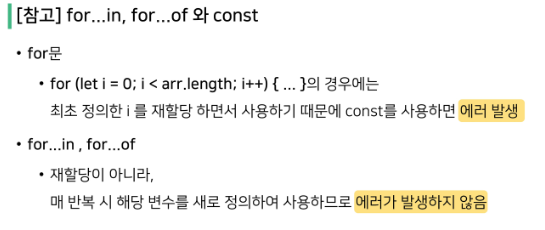

# 4_18

### JavaScript

> ### Web 기술의 기반이 되는 언어
> 
> - HTML 문서의 콘텐츠를 동적으로 변경할 수 있는 언어
> 
> - Web이라는 공간에서 채팅, 게임 등 다양한 동작을 할 수 있게 된 기반
> 
> - 

> ### JavaScript Engine
> 
> - JavaScript Engine은 자바스크립트 코드를 실행하는 프로그램 또는 인터프리터 여러 목적으로 자바스크립트 엔진을 사용하지만, 대체적으로 웹 브라우저에서 사용
> 
> > ##### 웹 브라우저의 역할
> > 
> > - URL을 통해 Web(WWW)을 탐색함
> > 
> > - HTML/CSS/JavaScript를 이해한 뒤 해석해서 사용자에게 하나의 화면으로 보여줌
> > 
> > - 웹 서비스 이용 시 클라이언트의 역할을 함
> > 
> > - 즉, 웹 페이지 코드를 이해하고, 보여주는 역할을 하는 것이 바로 웹 브라우저
> 
> 
> 
> > ##### JavaScript Engine
> > 
> > - HTML/CSS/JavaScript를 이해한 뒤 해석
> >   
> >   - JavaScript를 해석하는 것이 JavaScript Engine의 역할
> > 
> > - 각 브라우저마다 자체 JavaScript Engine을 개발, 사용하고 있음
> >   
> >   - V8 - Chrome
> >   
> >   - Chakra - Microsoft Edge
> >   
> >   - JSC (JavaScript Core) - Apple(safari)
> >   
> >   - SpiderMonkey - FireFox
> > 
> > - 대체적으로 웹 브라우저에서 사용
> > 
> > - 웹 브라우저 외에는 어떻게 활용될까?
> >   
> >   - Node.js
> >     
> >     - Node.js는 V8 엔진을 사용하여 서버 측에서 자바스크립트 코드를 실행 가능, 브라우저 조작 이외의 역할도 수행

> ### JavaScript 실행 환경 구성
> 
> - 
> 
> - 
> 
> - 
> 
> - 
> 
> - 
> 
> - 

> ### EcmaScript
> 
> - ECMAScript란, Ecma International(전자 정보 통신 시스템 표준화 기구)이 ECMA-262 규격에 따라 정의하고 있는 표준화된 스크립트 프로그래밍 언어를 뜻함
> 
> - 즉, JavaScript를 표준화하기 위해 만들어짐
> 
> - 정의
>   
>   - JavaScript의 기본적인 문법, 데이터 타입, 객체 모델, 함수, 연산자 등을 정의
>   
>   - 수업 시간에 작성하는 코드는 ES6+(2015년 이후) 정의된 내용을 토대로 진행

> ##### 주석
> 
> - 한 줄 주석(//)과 여러 줄(/**/)주석
> 
> - 

> ##### 들여쓰기와 코드 블럭
> 
> - python은 4칸 들여쓰기를 사용했으나, JavaScript는 2칸 들여쓰기를 사용
> 
> - block은 if, for, 함수에서 중괄호 {} 내부를 말함
>   
>   - python은 들여쓰기를 이용해서 코드 블럭을 구분
>   
>   - JavaScript는 중괄호 {}를 사용해 코드 블럭을 구분
>   
>   - 

> ##### 코드 스타일 가이드
> 
> 

> ##### 세미콜론 (semicolon)
> 
> - JS는 `;`을 선택적으로 사용 가능
> 
> - `;`이 없으면 ASI에 의해 자동으로 세미콜론이 삽입됨
>   
>   - ASI(Automatic Semicolon Insertion, 자동 세미콜론 삽입 규칙)
> 
> - 본 수업에서는 JS의 문법 및 개념적 측면에 집중하기 위해 `;`을 사용하지 않고 진행
> 
> - 회사/팀의 스타일 가이드에 맞춰서 사용하면 됨.
> 
> - 

### 변수와 식별자

> ##### 식별자 정의와 특징
> 
> - 식별자(identifier)는 변수를 구분할 수 있는 변수명을 말함
> 
> - 식별자는 반드시 문자, 달러($) 또는 밑줄(_)로 시작
> 
> - 대소문자를 구분하며, 클래스명 외에는 모두 소문자로 시작
> 
> - 예약어 사용 불가능 (예약어 : for, if function 등)
> 
> - 카멜 케이스(camelCase)
>   
>   - 변수, 객체, 함수에 사용
>   
>   - 
> 
> - 파스칼 케이스(PascalCase)
>   
>   - 클래스, 생성자에 사용
>   
>   - 
> 
> - 대문자 스네이크 케이스(SNAKE_CASE)
>   
>   - 상수(constants)에 사용
>   
>   - 상수 : 개발자의 의도와 상관없이 변경될 가능성이 없는 값을 의미
>   
>   - 
> 
> - 
> 
> - 
> 
> - 
> 
> - 
> 
> - 
> 
> - 
> 
> - 
> 
> - 
> 
> - 
> 
> - 
> 
> - 
> 
> - 

### 데이터 타입

> ##### 데이터 타입
> 
> - JavaScript의 모든 값은 특정한 데이터 타입을 가짐
> 
> - 크게 원시 타입(Primitive type)과 참조 타입(Reference type)으로 분류됨
> 
> - 

> ##### 원시 타입(Primitive type)
> 
> 1. Number - 정수 또는 실수형 숫자를 표현하는 자료형
>    
>    - 정수 또는 실수형 숫자를 표현하는 자료형
>    
>    - 
>    
>    - NaN을 반환하는 경우
>      
>      - 숫자로서 읽을 수 없음 (parseInt('어쩌구'), Number(undefined))
>      
>      - 결과가 허수인 수학 계산식 (Math.sqrt(-1))
>      
>      - 피연산자가 NaN (7 ** NaN)
>      
>      - 정의할 수 없는 계산식 (0 * Infinity)
>      
>      - 문자열을 포함하면서 덧셈이 아닌 계산식 ('가' / 3)
> 
> 2. String - 문자열을 표현하는 자료형
>    
>    - 문자열을 표현하는 자료형
>    
>    - 작은 따옴표 또는 큰 따옴표 모두 가능
>    
>    - 
>    
>    - 곱셈, 나눗셈, 뺼셈은 안되지만 덧셈을 통해 문자열끼리 붙일 수 있음
>    
>    - 
>    
>    - 따옴표를 사용하면 선언 시 줄 바꿈 불가능
>    
>    - 대신 escape sequence를 사용할 수 있기 때문에 \n을 사용
>    
>    - 
>    
>    - Template Literal을 사용하면 줄 바꿈이 가능, 문자열 사이에 변수도 삽입 가능
>    
>    - 
>    
>    - 
>    
>    - 
> 
> 3. null - 값이 없음을 나타냄
>    
>    - null 값을 나타내는 특별한 키워드
>    
>    - 변수의 값이 없음을 의도적으로 표현할 때 사용
>    
>    - 
> 
> 4. undefined - 값이 할당되지 않은 변수를 나타냄
>    
>    - 값이 정의되어 있지 않음을 표현하는 값
>    
>    - 변수 선언 이후 직접 값을 할당하지 않으면 자동으로 할당됨
>    
>    - 
>    
>    - 
> 
> 5. Boolean - 참과 거짓을 표현하는 자료형
>    
>    - True와 False
>    
>    - 참과 거짓을 표현하는 값
>    
>    - 조건문 또는 반복문에서 유용하게 사용
>      
>      - 조건문 또는 반복문에서 boolean이 아닌 데이터 타입은 자동 형변환 규칙에 따라 True or False로 변환됨
> 
> 6. Symbol - 유일한 값을 표현하는 자료형 / ES6에서 추가

> ##### Empty Value
> 
> - 값이 존재하지 않음을 표현하는 값으로 JS에서는 null과 undefined가 존재
> 
> - 동일한 역할을 하는 이 두 개의 키워드가 존재하는 이유는 단순한 JS의 설계 실수

> ### 참조 타입(Reference type)
> 
> 1. Object - 이름과 값을 가진 속성(property)들의 집합으로 이루어진 자료구조
> 
> 2. Array - 여러 개의 값을 순서대로 저장하는 자료구조
> 
> 3. function - function 키워드를 통해 생성하며, 호출 시 실행 될 코드를 정의

> ### 객체 (Object)
> 
> - 객체는 속성(property)의 집합이며, 중괄호 내부에 key와 value의 쌍으로 표현
> 
> - key
>   
>   - 문자열 타입만 가능
>   
>   - key 이름에 띄어쓰기 등의 구분자가 있으면 따옴표로 묶어서 표현
> 
> - value
>   
>   - 모든 타입(함수포함) 가능
> 
> - 객체 요소 접근
>   
>   - 점(.) 또는 대괄호([])로 가능
>   
>   - key 이름에 띄어쓰기 같은 구분자가 있으면 대괄호 접근만 가능
> 
> - 

> ### 배열 (Array)
> 
> - 키와 속성들을 담고 있는 참조 타입의 객체
> 
> - 순서를 보장하는 특징이 있음
> 
> - 주로 대괄호([])를 이용하여 생성하고, 0을 포함한 양의 정수 인덱스로 특정 값에 접근 가능
> 
> - 배열의 길이는 array.length 형태로 접근 가능
> 
> - 

> ### 함수 (Function)
> 
> - 참조 타입 중 하나로써 function 타입에 속함
> 
> - JavaScript에서 함수를 정의하는 방법은 주로 2가지로 구분됨
>   
>   - 함수 선언식 (function declaration)
>     
>     - 
>   
>   - 함수 표현식 (function expression)
>     
>     - 
>     
>     - 

### 연산자

### 조건문

- if statement
  
  - 조건 표현식의 결과값을 boolean 타입으로 변환 후 참/거짓을 판단
  
  - 

### 반복문

