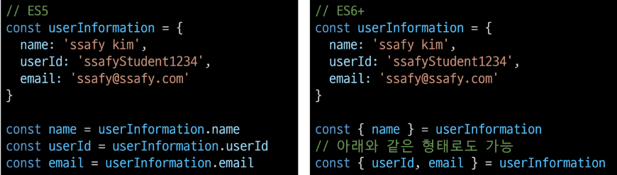

# 4_19

# JavaScript

> ##### 기본 인자(Default arguments)
> 
> - 인자 작성 시 `=` 문자 뒤 기본 인자 선언 가능
>   
>   - 

> ##### 매개변수와 인자의 개수 불일치 허용
> 
> - 매개변수보다 인자의 개수가 많을 경우
>   
>   - 
> 
> - 매개변수보다 인자의 개수가 적을 경우
>   
>   - 

> ##### Spread syntax
> 
> - 전개 구문
> 
> - 전개 구문을 사용하면 배열이나 문자열과 같이 반복 가능한 객체를 배열의 경우는 요소, 함수의 경우는 인자로 확장할 수 있음
>   
>   1. 배열과의 사용
>      
>      - 배열 복사
>      
>      - 
>   
>   2. 함수와의 사용 (Rest parameters)
>      
>      - 정해지지 않은 수의 매개변수를 배열로 받을 수 있음
>      
>      - 

### 선언식과 표현식

> ##### 함수의 타입
> 
> - 선언식 함수와 표현식 함수 모두 타입은 function으로 동일
> 
> - 

> ##### 호이스팅 - 선언식
> 
> - 함수 선언식으로 정의한 함수는 var로 정의한 변수처럼 호이스팅이 발생
> 
> - 즉, 함수 호출 이후에 선언해도 동작함
> 
> - 

> ##### 호이스팅 - 표현식
> 
> - 반면 함수 표현식으로 선언한 함수는 함수 정의 전에 호출 시 에러 발생
> 
> - 함수 표현식으로 정의된 함수는 변수로 평가되어 변수의 scope 규칙을 따름
> 
> - 

### Arrow Function

> ##### 화살표 함수(Arrow Function)
> 
> - 함수를 비교적 간결하게 정의할 수 있는 문법
> 
> - function 키워드와 중괄호를 이용한 구문을 짧게 사용하기 위해 탄생
>   
>   1. function 키워드 생략가능
>   
>   2. 함수의 매개변수가 하나 뿐이라면 매개변수의 `()` 생략 가능
>   
>   3. 함수의 내용이 한 줄이라면 `{}`와 `return`도 생략 가능
> 
> - 화살표 함수는 항상 익명 함수
>   
>   - `===` 함수 표현식에서만 사용 가능
> 
> - 예시
>   
>   - 
> 
> - 응용
>   
>   - 

### this

> ##### this
> 
> - 어떠한 object를 가리키는 키워드
>   
>   - 자바에서의 this와 파이썬에서의 self는 인스턴스 자기자신을 가리킴
> 
> - JavaScript의 함수는 호출될 때 this를 암묵적으로 전달받음
> 
> - JavaScript에서의 this는 일반적인 프로그래밍 언어에서의 this와 조금 다르게 동작
> 
> - JavaScript는 해당 함수 호출 방식에 따라 this에 바인딩 되는 객체가 달라짐
> 
> - 즉, 함수를 선언할 때 this에 객체가 결정되는 것이 아니고, 함수를 호출할 때 함수가 어떻게 호출 되었는지에 따라 동적으로 결정됨

> ##### this INDEX
> 
> 1. 전역 문맥에서의 this
>    
>    - 브라우저의 전역 객체인 window를 가리킴
>    
>    - 전역 객체는 모든 객체의 유일한 최상위 객체를 의미
>      
>      - 
> 
> 2. 함수 문맥에서의 this
>    
>    - 함수의 this 키워드는 다른 언어와 조금 다르게 동작
>      
>      - this의 값은 함수를 호출한 방법에 의해 결정됨
>      
>      - 함수 내부에서 this의 값은 함수를 호출한 방법에 의해 좌우됨
>    
>    - 단순 호출
>      
>      - 전역 객체를 가리킴
>      
>      - 브라우저에서 전역은 window를 의미함
>      
>      - 
>    
>    - Method (객체의 메서드로서)
>      
>      - 메서드로 선언하고 호출한다면, 객체의 메서드이므로 해당 객체가 바인딩
>      
>      - 
>    
>    - Nested (Function 키워드)
>      
>      - forEach의 콜백 함수에서의 this가 메서드의 객체를 가리키지 못하고 전역 객체 window를 가리킴
>      
>      - 단순호출방식으로 사용되었기 때문
>      
>      - 이를 해결하기 위해 등장한 함수 표현식이 `화살표 함수`
>      
>      - 
>    
>    - Nested (화살표 함수)
>      
>      - 이전에 일반 function 키워드와 달리 메서드의 객체를 잘 가리킴
>      
>      - 화살표 함수에서 this는 자신을 감싼 정적 범위
>      
>      - 자동으로 한 단계 상위의 scope의 context를 바인딩
>      
>      - 
>    
>    - Nested (function 키워드와 화살표 함수 비교)
>      
>      - 

> ##### 화살표 함수
> 
> - 화살표 함수는 호출의 위치와 상관없이 상위 스코프를 가리킴 (Lexical scope this)
> 
> - Lexical scope
>   
>   - 함수를 어디서 호출하는지가 아니라 어디에 선언하였는지에 따라 결정
>     
>     - 
>   
>   - Static scope라고도하며 대부분의 프로그래밍 언어에서 따르는 방식
> 
> - 따라서 함수 내의 함수 상황에서 화살표 함수를 쓰는 것을 권장

> ##### this 정리
> 
> - 이렇게 this가 런타임에 결정되면 장점도 있고 단점도 있음
> 
> - 함수(메서드)를 하나만 만들어 여러 객체에서 재사용할 수 있다는 것은 장점이지만, 이런 유연함이 실수로 이어질 수 있다는 것은 단점
> 
> - JavaScript가 this를 다루는 방식이 좋은지, 나쁜지는 우리가 판단할 문제가 아니며 중요한 것은 개발자는 this의 동작 방식을 충분히 이해하고 장점을 취하면서 실수를 피하는 데만 집중하면 됨

### Array와 Object

> ##### 개요
> 
> - JavaScript의 데이터 타입 중 참조 타입(reference)에 해당하는 타입은 Array와 Object이며, 객체라고도 말함
> 
> - 객체는 속성들의 모음(collection)

> ##### 배열(Array)
> 
> - 키와 속성들을 담고 있는 참조 타입의 객체
> 
> - 순서를 보장하는 특징이 있음
> 
> - 주로 대괄호([])를 이용하여 생성하고, 0을 포함한 양의 정수 인덱스로 특정 값에 접근 가능
> 
> - 배열의 길이는 array.length 형태로 접근 가능
> 
> - 

> ##### 배열 메서드 기초
> 
> 
> 
> - array.reverse()
>   
>   - 원본 배열 요소들의 순서를 반대로 정렬
>   
>   - 
> 
> - array.push()
>   
>   - 배열의 가장 뒤에 요소 추가
> 
> - array.pop()
>   
>   - 배열의 마지막 요소 제거
>   
>   - 
> 
> - array.includes(value)
>   
>   - 배열에 특정 값(value)이 존재하는지 판별 후 true 또는 false 반환
>   
>   - 
> 
> - array.indexOf(value)
>   
>   - 배열에 특정 값이 존재하는지 확인 후 가장 첫 번째로 찾은 요소의 인덱스 반환
>   
>   - 만약 해당 값이 없을 경우 -1 반환
>   
>   - 

### 배열 메서드 심화

> ##### Array Helper Methods
> 
> - 배열을 순회하며 특정 로직을 수행하는 메서드
> 
> - 메서드 호출 시 인자로 callback 함수를 받는 것이 특징
>   
>   - callback 함수 : 어떤 함수의 내부에서 실행될 목적으로 인자로 넘겨받는 함수. 즉, 다른 함수의 인자로 전달되는 함수를 콜백 함수라고함
>   
>   - 콜백함수 예시
>   
>   - 
>   
>   - 
> 
> - 

> ##### forEach
> 
> 
> 
> - array.forEach(callback(element[, index[,array]]))
> 
> - 인자로 주어지는 함수(콜백 함수)를 배열의 각 요소에 대해 한 번씩 실행
>   
>   - 콜백 함수는 3가지 매개변수로 구성
>     
>     1. element : 배열의 요소
>     
>     2. index : 배열 요소의 인덱스
>     
>     3. array : 배열 자체
> 
> - 반환 값(return) 없음
> 
> - 

> ##### map
> 
> 
> 
> - array.map(callback(element[, index[, array]]))
> 
> - 배열의 각 요소에 대해 콜백 함수를 한 번씩 실행
> 
> - 콜백 함수의 반환 값을 요소로 하는 새로운 배열 반환
> 
> - 기존 배열 전체를 다른 형태로 바꿀 때 유용
>   
>   - forEach + return 이라고 생각하기
> 
> - 

> ##### filter
> 
> 
> 
> - array.filter(callback(element[, index[, array]]))
> 
> - 배열의 각 요소에 대해 콜백 함수를 한 번씩 실행
> 
> - 콜백 함수의 반환 값이 true인 요소들만 모아서 새로운 배열 반환
> 
> - 기존 배열의 요소들을 필터링할 때 유용
> 
> - 

> ##### reduce
> 
> 
> 
> - array.reduce(callback(acc, element, [index[, array]])[, initialValue])
> 
> - 인자로 주어지는 함수(콜백 함수)를 배열의 각 요소에 대해 한 번씩 실행해서, 하나의 결과 값을 반환
> 
> - 즉, 배열을 하나의 값으로 계산하는 동작이 필요할 때 사용(총합, 평균 등)
> 
> - map, filter 등 여러 배열 메서드 동작을 대부분 대체할 수 있음
> 
> - 주요 매개변수
>   
>   - acc
>     
>     - 이전 callback 함수의 반환 값이 누적되는 변수
>   
>   - initialValue (optional)
>     
>     - 최초 callback 함수 호출 시 acc에 할당되는 값, default 값은 배열의 첫 번째 값
> 
> - reduce의 첫번째 매개변수인 콜백함수의 첫 번째 매개변수(acc)는 누적된 값(전 단계까지의 결과)
> 
> - reduce의 두번째 매개변수인 initialValue는 누적될 값의 초기값, 지정하지 않을 시 첫번째 요소의 값이 됨 (빈 배열의 경우 initialValue를 제공하지 않으면 에러)
> 
> - 
> 
> - 

> ##### find
> 
> 
> 
> - array.find(callback(element[, index[, array]]))
> 
> - 배열의 각 요소에 대해 콜백 함수를 한 번씩 실행
> 
> - 콜백 함수의 반환 값이 true면, 조건을 만족하는 첫번째 요소를 반환
> 
> - 찾는 값이 배열에 없으면 undefined를 반환
> 
> - 

> ##### some
> 
> 
> 
> - array.some(callback(element[, index[, array]]))
> 
> - 배열의 요소 중 하나라도 주어진 판별 함수를 통과하면 true를 반환
> 
> - 모든 요소가 통과하지 못하면 거짓 반환
> 
> - 빈 배열은 항상 false 반환
> 
> - 

> ##### every
> 
> 
> 
> - array.every(callback(element[, index[, array]]))
> 
> - 배열의 모든 요소가 주어진 판별 함수를 통과하면 true 반환
> 
> - 하나의 요소라도 통과하지 못하면 false 반환
> 
> - 빈 배열은 항상 true 반환
> 
> - 

> ##### 배열 순회 비교
> 
> 

### 객체 (Object)

> ##### 개요
> 
> - 객체는 속성(property)의 집합이며, 중괄호 내부에 key와 value의 쌍으로 표현
> 
> - key
>   
>   - 문자열 타입만 가능
>   
>   - key 이름에 띄어쓰기 등의 구분자가 있으면 따옴표로 묶어서 표현
> 
> - value
>   
>   - 모든 타입(함수 포함)가능
> 
> - 객체 요소 접근
>   
>   - 점(.) 또는 대괄호([])로 가능
>   
>   - key 이름에 띄어쓰기 같은 구분자가 있으면 대괄호 접근만 가능
> 
> - 객체는 속성으로 함수를 정의할 수 있음 (메서드)
>   
>   - 

### 객체 관련 문법

> ##### 객체 관련 ES6 문법 익히기
> 
> - ES6에 새로 도입된 문법들로 객체 생성 및 조작에 유용하게 사용 가능
>   
>   1. 속성명 축약
>      
>      - 객체를 정의할 때 key와 할당하는 변수의 이름이 같으면 예시와 같이 축약 가능
>      
>      - 
>   
>   2. 메서드명 축약
>      
>      - 메서드 선언 시 function 키워드 생략 가능
>      
>      - 
>   
>   3. 계산된 속성명 사용하기
>      
>      - 객체를 정의할 때 key의 이름을 표현식을 이용하여 동적으로 생성 가능
>      
>      - 
>   
>   4. 구조 분해 할당
>      
>      - 배열 또는 객체를 분해하여 속성을 변수에 쉽게 할당할 수 있는 문법
>      
>      - 
>   
>   5. 객체 전개 구문(Spread Operator)
>      
>      - 배열과 마찬가지로 전개구문을 사용해 객체 내부에서 객체 전개 가능
>      
>      - 얕은 복사에 활용 가능
>      
>      - 

> ##### JSON
> 
> - JavaScript Object Notation
> 
> - Key-Value 형태로 이루어진 자료 표기법
> 
> - JavaScript의 Object와 유사한 구조를 가지고 있지만 Object는 그 자체로 타입이고, JSON은 형식이 있는 '문자열'
> 
> - 즉, JSON을 Object로 사용하기 위해서는 변환 작업이 필요
> 
> - 변환
>   
>   - 

> ##### 배열은 객체다
> 
> - 배열은 키와 속성들을 담고 있는 참조 타입의 객체
> 
> - 배열은 인덱스를 키로 가지며 length 프로퍼티를 갖는 특수한 객체
> 
> - 

