# 4_25

# JavaScript

### 동기와 비동기

> ##### 개요
> 
> - JavaScript에서의 비동기 처리 학습

> ##### INTRO
> 
> - 주문 후 커피가 나올 때까지 기다려야 함 (동기)
>   
>   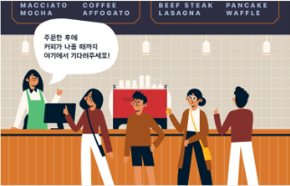
> 
> - 주문 후 진동벨이 울리면 커피를 가져옴 (비동기)
>   
>   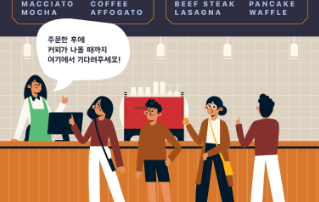

### 동기(synchronous)

- 모든 일을 순서대로 하나씩 처리하는 것

- 순서대로 처리한다 == 이전 작업이 끝나면 다음 작업을 시작한다

- 우리가 작성했던 Python 코드가 모두 동기식

- 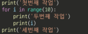

- 요청과 응답을 동기식으로 처리한다면?
  
  - 요청을 보내고 응답이 올때까지 기다렸다가 다음 로직을 처리

> ##### 웹에서의 동기 경험하기
> 
> 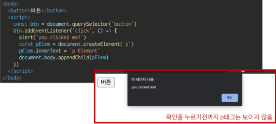

### 비동기(Asynchronous)

- 작업을 시작한 후 결과를 기다리지 않고 다음 작업을 처리하는 것 (병렬적 수행)

- 시간이 필요한 작업들은 요청을 보낸 뒤 응답이 빨리 오는 작업부터 처리

- 예시) Gmail에서 메일 전송을 누르면 목록 화면으로 전환되지만 실제로 메일을 보내는 작업은 병렬적으로 뒤에서 처리됨
  
  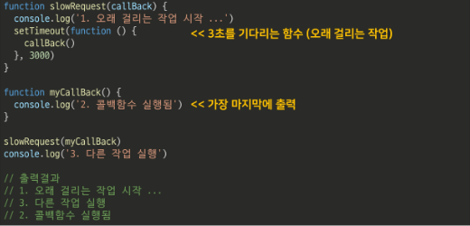

> ##### 비동기를 사용하는 이유
> 
> - 사용자 경험
>   
>   - 예를 들어 아주 큰 데이터를 불러온 뒤 실행되는 앱이 있을 때, 동기로 처리한다면 데이터를 모두 불러온 뒤에야 앱의 실행 로직이 수행되므로 사용자들은 마치 앱이 멈춘것과 같은 경험을 겪게 됨
>   
>   - 즉, 동기식 처리는 특정 로직이 실행되는 동안 다른 로직 실행을 차단하기 때문에 마치 프로그램이 응답하지 않는 듯한 사용자 경험을 만들게 됨
>   
>   - 비동기로 처리한다면 먼저 처리되는 부분부터 보여줄 수 있으므로, 사용자 경험에 긍정적인 효과를 볼 수 있음
>     이와 같은 이유로 많은 웹 기능은 비동기 로직을 사용해서 구현되어 있음

### JavaScript의 비동기 처리

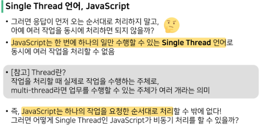

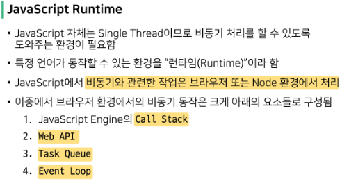

> ##### 비동기 처리 동작 방식
> 
> - 브라우저 환경에서의 JavaScript의 비동기는 아래와 같이 처리된다.
> 1. 모든 작업은 Call Stack(LIFO)으로 들어간 후 처리된다.
> 
> 2. 오래 거릴는 작업이 Call Stack으로 들어오면 Web API로 보내 별도로 처리하도록 한다.
> 
> 3. Web API에서 처리가 끝난 작업들은 곧바로 Call Stack으로 들어가지 못하고 Task Queue(FIFO)에 순서대로 들어간다.
> 
> 4. Event Loop가 Call Stack이 비어 있는 것을 계쏙 체크하고 Call Stack이 빈다면 Task Queue에서 가장 오래된 작업을 Call Stack으로 보낸다.

> ##### 비동기 처리 동작 요소
> 
> 1. Call Stack
>    
>    - 요청이 들어올 때 마다 순차적으로 처리하는 Stack(LIFO)
>    
>    - 기본적인 JavaScript Single Thread 작업 처리
> 
> 2. Web API
>    
>    - JavaScript 엔진이 아닌 브라우저에서 제공하는 runtime 환경
>    
>    - 시간이 소요되는 작업을 처리 (setTimeout, DOM Event, AJAX 요청 등)
> 
> 3. Task Queue
>    
>    - 비동기 처리된 Callback 함수가 대기하는 Queue(FIFO)
> 
> 4. Event Loop
>    
>    - Call Stack과 Task Queue를 지속적으로 모니터링
>    
>    - Call Stack이 비어 있는 지 확인 후 비어있다면 Task Queue에서 대기중인 오래된 작업을 Call Stack으로 Push

> ##### 그림으로 보는 비동기 처리(Runtime)
> 
> 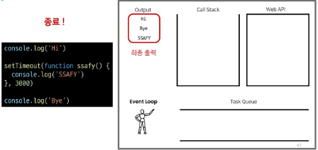

> ##### 정리
> 
> - JavaScript는 한 번에 하나의 작업을 수행하는 Single Thread 언어로 동기적 처리를 하지만, 브라우저 환경에서는 Web API에서 처리된 작업이 지속적으로 Task Queue를 거쳐 Event Loop에 의해 Call Stack에 들어와 순차적으로 실행됨으로써 비동기 작업이 가능한 환경이 됨

### Axios

- JavaScript의 HTTP 웹 통신을 위한 라이브러리

- 확장 가능한 인터페이스와 쉽게 사용할 수 있는 비동기 통신 기능을 제공

- node 환경은 npm을 이용해서 설치 후 사용할 수 있고, browser 환경은 CDN을 이용해서 사용할 수 있음

- Axios 공식 문서 및 github
  
  - 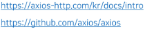

### Axios의 기본구조

> ##### Axios 사용해보기
> 
> 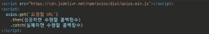
> 
> -  get, post 등 여러 method 사용 가능
> 
> - then을 이용해서 성공하면 수행할 로직을 작성
> 
> - catch를 이용해서 실패하면 수행할 로직을 작성

> ##### 고양이 사진 가져오기
> 
> - The Cat API (https://api.thecatapi.com/v1/images/search)
>   
>   - 이미지를 요청해서 가져오는 작업을 비동기로 처리
> 
> - response 구조
>   
>   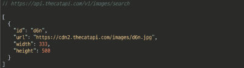
> 
> - Python으로 요청해보기 (동기)
>   
>   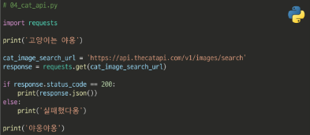
>   
>   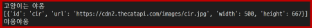
> 
> - Axios로 요청해보기 (비동기)
>   
>   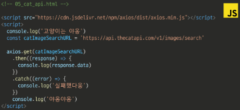
>   
>   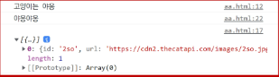
> 
> - ##### 결과 비교
>   
>   - 동기식 코드(python)는 위에서부터 순서대로 처리가 되기때문에 첫번째 print가 출력되고 이미지를 가져오는 처리를 기다렸다가 다음 print가 출력되는 반면
>   
>   - 비동기식 코드(JavaScript)는 바로 처리가 가능한 작업(console.log)은 바로 처리하고, 오래 걸리는 작업인 이미지를 요청하고 가져오는 일은 요청을 보내놓고 기다리지 않고 다음 코드로 진행 후 완료가 된 시점에 결과 출력이 진행됨

> ##### 고양이 사진 가져오기(완성하기)
> 
> - 작업 Flow
>   
>   - 버튼을 누르면
>   
>   - 고양이 이미지를 요청하고
>   
>   - 요청이 처리되어 응답이 오면
>   
>   - 처리된 response에 있는 url을 img태그에 넣어 보여주기
> 
> - 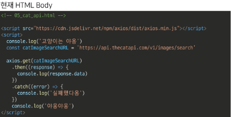
> 
> - 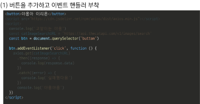
> 
> - 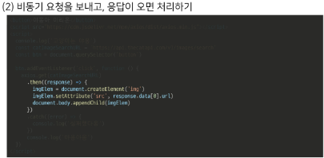
> 
> - 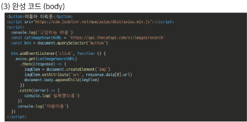

> ##### 고양이 사진 가져오기 (결과)
> 
> 

> ##### 정리
> 
> - axios는 비동기로 데이터 통신을 가능하게 하는 라이브러리
> 
> - 같은 방식으로 우리가 배운 Django REST API로 요청을 보내서 데이터를 받아온 후 처리할 수 있음

### Callback과 Promise

> ##### 비동기 처리의 단점
> 
> - 비동기 처리의 핵심은 Web API로 들어오는 순서가 아니라 작업이 완료되는 순서에 따라 처리한다는 것
> 
> - 그런데 이는 개발자 입장에서 코드의 실행순서가 불명확하다는 단점이 있음
> 
> - 이와같은 단점은 실행결과를 예상하면서 코드를 작성할 수 없게 함
> 
> - 따라서 콜백함수를 사용해야함

### Callback function(콜백 함수)

> ##### 콜백 지옥 (Callback Hell)
> 
> - 콜백함수는 연쇄적으로 발생하는 비동기 ㅈ가업을 순차적으로 동작할 수 있게 함
> 
> - 보통 어떤 기능의 실행결과를 받아서 다른 기능을 수행하기 위해 많이 사용하는데, 이 과정을 작성하다보면 비슷한 패턴이 계속 발생하게 됨
>   
>   - A를 처리해서 결과가 나오면, 첫 번째 calllback 함수를 실행하고, 첫 번째 callback 함수가 종료되면, 두 번째 callback 함수를 실행하고 --->> 무한루프
> 
> - 비동기 처리를 위한 콜백을 작성할 떄 마주하는 문제를 Callback Hell이라 하며, 그 떄의 코드 작성 형태가 마치 피라미드와 같다고 해서 Pyramid of doom(파멸의 피라미드)라고도 부름
> 
> 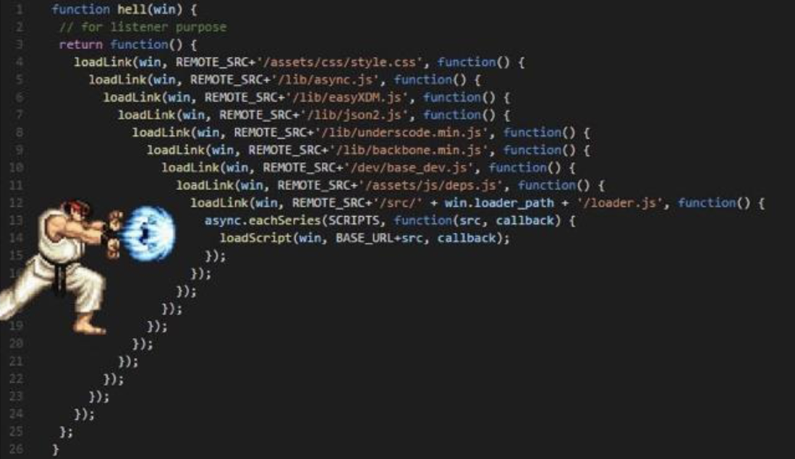

> ##### 정리
> 
> - 콜백 함수는 비동기 작업을 순차적으로 실행할 수 있게 하는 반드시 필요한 로직
> 
> - 비동기 코드를 작성하다 보면 콜백 함수로 인한 콜백 지옥은 반드시 나타나는 문제
>   
>   - 코드의 가독성을 해치고 유지 보수가 어려워짐

### Promise

> ##### 프로미스(Promise)
> 
> - Callback Hell 문제를 해결하기 위해 등장한 비동기 처리를 위한 객체
> 
> - `작업이 끝나면 실행 시켜줄게`라는 약속(promise)
> 
> - 비동기 작업의 완료 또는 실패를 나타내는 객체
> 
> - Promise 기반의 클라이언트가 바로 이전에 사용한 Axios 라이브러리
>   
>   - Promise based HTTP client for the browser and node.js
>   
>   - 성공에 대한 약속 then()
>   
>   - 실패에 대한 약속 catch()

> ##### then & catch
> 
> - then(callback)
>   
>   - 요청한 작업이 성공하면 callback 실행
>   
>   - callback은 이전 작업의 성공 결과를 인자로 전달 받음
> 
> - catch(callback)
>   
>   - then()이 하나라도 실패하면 callback 실행
>   
>   - callback은 이전 작업의 실패 객체를 인자로 전달받음
> 
> - then과 catch 모두 항상 promise 객체를 반환
> 
> - 즉, 계속해서 chaining을 할 수 있음
> 
> - axios로 처리한 비동기 로직이 항상 promise 객체를 반환
> 
> - 그러므로 then을 계속 이어나가면서 작성할 수 있던 것
> 
> - 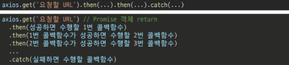

> ##### 비동기 콜백 vs Promise
> 
> 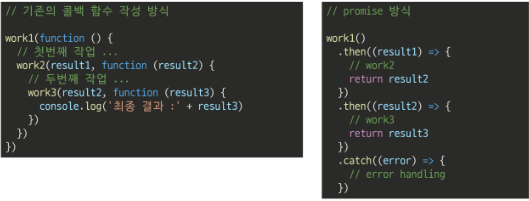
> 
> - promise 방식은 비동기 처리를 마치 우리가 일반적으로 위에서 아래로 적는 방식처럼 코드를 작성할 수 있음

> ##### Promise가 보장하는 것 (vs 비동기 콜백)
> 
> - 비동기 콜백 작성 스타일과 달리 Promise가 보장하는 특징
> 1. callback 함수는 JavaScript의 Event Loop가 현재 실행중인 Call Stack을 완료하기 이전에는 절대 호출되지 않음
>    
>    - Promise callback 함수는 Event Queue에 배치되는 엄격한 순서로 호출됨
> 
> 2. 비동기 작업이 성공하거나 실패한 뒤에 .then() 메서드를 이용하여 추가한 경우에도 1번과 똑같이 동작
> 
> 3. .then()을 여러 번 사용하여 여러 개의 callback 함수를 추가할 수 있음 (Chaining)
>    
>    - 각각의 callback은 주어진 순서대로 하나하나 실행하게 됨
>    
>    - Chaninig은 Promise의 가장 뛰어난 장점

