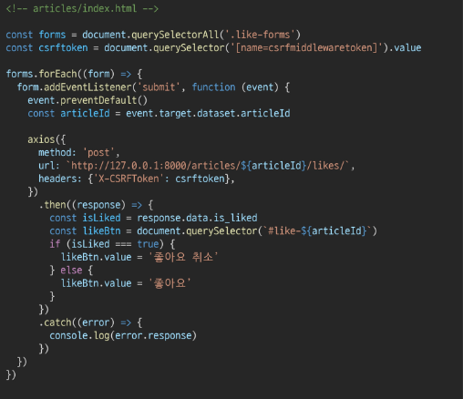

# 4_27

# 비동기 처리 with django

### AJAX

> ##### AJAX란?
> 
> - Asynchronous JavaScript And XML (비동기식 JavaScript와 XML)
> 
> - 비동기 통신을 이용하면 화면 전체를 새로고침 하지 않아도 서버로 요청을 보내고, 데이터를 받아 화면의 일부분만 업데이트 가능
> 
> - 이러한 '비동기 통신 웹 개발 기술'을 AJAX라 함
> 
> - 비동기 웹 통신을 위한 라이브러리 중 하나가 Axios

> ##### AJAX 특징
> 
> - 페이지 전체를 reload(새로 고침)를 하지 않고서도 수행되는 '비동기성'
> 
> - 서버의 응답에 따라 전체 페이지가 아닌 일부분만을 업데이트 할 수 있음
> 1. 페이지 새로고침 없이 서버에 요청
> 
> 2. 서버로부터 응답(데이터)을 받아 작업을 수행

### 비동기(Async) 적용하기

> ##### 팔로우 (follow)
> 
> - 각각의 템플릿에서 script 코드를 작성하기 위한 block tag 영역 작성
>   
>   
> 
> - axios CDN 작성
>   
>   
> 
> - form 요소 선택을 위해 id 속성 지정 및 선택
> 
> - 불필요해진 action과 method 속성은 삭제 (요청은 axios로 대체되기 때문)
>   
>   
> 
> - form 요소에 이벤트 핸들러 작성 및 submit 이벤트 취소
>   
>   
> 
> - axios 요청 준비
>   
>   
> 
> - 현재 axios로 POST 요청을 보내기 위해 필요한 것
>   
>   1. url에 작성할 user pk는 어떻게 작성해야 할까?
>      
>      - url에 작성할 user pk 가져오기
>        
>        
>      
>      > data-* attributes
>      > 
>      > - 사용자 지정 데이터 특성을 만들어 임의의 데이터를 HTML과 DOM사이에서 교환할 수 있는 방법
>      > 
>      > - 사용 예시
>      >   
>      >   
>      > 
>      > - 모든 사용자 지정 데이터는 dataset 속성을 통해 사용할 수 있음
>      > 
>      > https://developer.mozilla.org/ko/docs/Web/HTML/Global_attributes/data-*
>      > 
>      > - 예를 들어 data-test-value라는 이름의 특성을 지정했다면 JavaScript에서는 element.dataset.testValue로 접근할 수 있음
>      > 
>      > - 속성명 작성 시 주의사항
>      >   
>      >   - 대소문자 여부에 상관없이 xml로 시작하면 안됨
>      >   
>      >   - 세미콜론을 포함해서는 안됨
>      >   
>      >   - 대문자를 포함해서는 안됨
>      > 
>      > - url 작성 마치기
>      >   
>      >   
>   
>   2. csrftoken은 어떻게 보내야 할까?
>      
>      - 먼저 hidden 타입으로 숨겨져있는 csrf 값을 가진 input 태그를 선택해야 함
>        
>        https://docs.djangoproject.com/en/3.2/ref/csrf/
>      
>      - 
>      
>      - 
>      
>      - AJAX로 csrftoken을 보내는 방법
>        
>        https://docs.djangoproject.com/en/3.2/ref/csrf/#setting-the-token-on-the-ajax-request
>        
>        
> 
> - 팔로우 버튼을 토글하기 위해서는 현재 팔로우가 된 상태인지 여부 확인이 필요
> 
> - axios 요청을 통해 받는 response 객체를 활용해 view 함수를 통해서 팔로우 여부를 파악할 수 있는 변수를 담아 JSON 타입으로 응답하기
>   
>   - 
> 
> - view 함수에서 응답한 is_followed를 사용해 버튼 토글하기
>   
>   - 

> [참고] XHR
> 
> - 'XMLHttpRequest'
> 
> - AJAX 요청을 생성하는 JavaScript API
> 
> - XHR의 메서드로 브라우저와 서버 간 네트워크 요청을 전송할 수 있음
> 
> - Axios는 손쉽게 XHR을 보내고 응답 결과를 Promise 객체로 반환해주는 라이브러리

> ##### 팔로워 & 팔로잉 수 비동기 적용
> 
> - 해당 요소를 선택할 수 있도록 span 태그와 id 속성 작성
>   
>   
> 
> - 직전에 작성한 span 태그를 각각 선택
>   
>   
> 
> - 팔로워 및 팔로잉 인우너 수 연산을 view 함수에서 진행하여 결과를 응답으로 전달
>   
>   
> 
> - view 함수에서 응답한 연산 결과를 사용해 각 태그의 인원 수 값 변경하기
>   
>   

> ##### 최종 코드
> 
> - HTML
> 
> 
> 
> - python
> 
> 
> 
> - JavaScript
> 
> 

> ##### 좋아요 (like)
> 
> - 좋아요 비동기 적용은 '팔로우와 동일한 흐름 + forEach() & querySelectorAll()'
>   
>   - index 페이지 각 게시글에 좋아요 버튼이 있기 때문

> ##### 최종 코드
> 
> - HTML
> 
> 
> 
> - Python
> 
> 
> 
> - JavaScript
> 
> 

> ##### 왜 비동기(Asynchronous) 방식이 필요할까
> 
> - human-centered design with UX
>   
>   - 인간 중심으로 설계된 사용자 경험
>   
>   - 실제 Ajax라는 용어를 처음 논문에서 사용한 Jesse James Garrett이 Ajax를 소개하며 강조한 한마디

