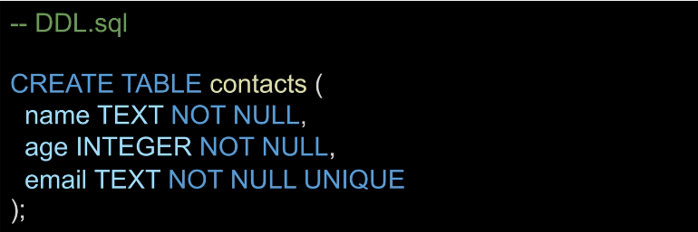

# 4_5

# DB

> ##### DBMS
> 
> - DB를 쉽게 조작할 수 있게 해주는 소프트웨어 (Mysql, Oracle 등)

> ##### 관계형 DB (RDB)
> 
> - 데이터를 테이블, 행, 열 등으로 나누어 구조화 하는 방식
> 
> - 구조화해서 저장하므로 보다 체계적으로 데이터를 저장하고 관리할 수 있음
> 
> - 자료를 여러 테이블로 나누어서 관리하고, 테이블간 관계를 설정해 여러 데이터를 조작할 수 있음
> 
> - 데이터의 무결성(정확성, 일관성) 유지에 장점이 있음
> 
> - SQL을 사용하여 데이터를 조회하고 조작

> ##### 관계형 DB의 구조
> 
> 1. 스키마
> 
> 2. 테이블
>    
>    - 필드
>    
>    - 레코드
>    
>    - 기본 키

> ##### 스키마(Schema)
> 
> - 테이블의 구조(Structure)
> 
> - DB에서 자료의 구조, 표현 방법, 관계 등 전반적인 명세를 기술한 것
> 
> 

> ##### 테이블(Table)
> 
> - 필드와 레코드를 사용해 조직된 데이터 요소들의 집합
> 
> - 관계(Relation)라고도 부름
> 
> 

> ##### 필드(Field)
> 
> - 속성 혹은 컬럼(column)
> 
> - 각 필드에는 고유한 데이터 형식(타입)이 지정됨

> ##### 레코드(Record)
> 
> - 튜플 혹은 행(row)
> 
> - 테이블의 데이터는 레코드에 저장됨

> ##### PK(Primary Key)
> 
> - 기본 키
> 
> - 각 레코드의 고유한 값
>   
>   - 각각의 데이터를 구분할 수 있는 고윳값
> 
> - 기술적으로 다른 항목과 절대로 중복될 수 없는 단일 값(unique)
> 
> - DB 관리 및 테이블 간 관계 설정 시 주요하게 활용
> 
> - 

> ##### FK(Foreign Key)
> 
> - 외래 키
> 
> - 한 테이블의 속성 중 다른 테이블의 레코드를 식별할 수 있는 키
> 
> - 다른 테이블의 기본 키를 참조
> 
> - 참조하는 테이블의 속성 1개의 값은, 참조되는 측 테이블의 레코드 값에 대응됨
> 
> - 각 레코드에서 서로 다른 테이블 간의 관계를 만드는 데 사용할 수 있음
> 
> - 

> ##### SQL
> 
> - Structured Query Language
> 
> - 관계형 DB에서 데이터를 관리하기 위해 사용하는 언어
> 
> - 명령어의 특성에 따라 세 그룹으로 분류
>   
>   1. DDL (Data Definition Language)
>   
>   2. DML (Data Manipulation Language)
>   
>   3. DCL (Data Control Language)
> 
> 

> ##### SQL Syntax
> 
> - 모든 SQL 문(statement)는 SELECT, INSERT, UPDATE 등과 같은 키워드로 시작하고, 하나의 statement는 `;`로 끝남
> 
> - 대소문자를 구분하지 않지만 대문자로 작성하는 것을 권장
> 
> - Statement (문)
>   
>   - 독립적으로 실행할 수 있는 완전한 코드 조각
>   
>   - statement는 clause로 구성됨
> 
> - Clause (절)
>   
>   - statement의 하위 단위

> ##### Table 생성
> 
> 

> ##### Data Types 종류
> 
> 1. NULL
>    
>    - NULL value
>    
>    - 정보가 없거나 알 수 없음을 의미 (missing information or unknown)
> 
> 2- INTEGER
> 
> - 정수
> 
> - 크기에 따라 0, 1, 2, 3, 4, 6 또는 8바이트와 같은 가변 크기를 가짐
> 
> 3- REAL
> 
> - 실수
> 
> - 8바이트 부동 소수점을 사용하는 10진수 값이 있는 실수
> 
> 4- TEXT
> 
> - 문자 데이터
> 
> 5- BLOB (Binary Large Object)
> 
> - 입력된 그대로 저장된 데이터 덩어리 (대용 타입 없음)
> 
> - 바이너리 등 멀티미디어 파일
> 
> - ex) 이미지 데이터

> ##### 타입 선호도 (Type Affinity)
> 
> 
> 
> - 타입 선호도 존재 이유
>   
>   - 다른 DB 엔진 간의 호환성을 최대화
>   
>   - 정적이고 엄격한 타입을 사용하는 DB의 SQL문을 SQLite에서도 작동하도록 하기 위함

> ##### Constraints
> 
> - "제약조건"
> 
> - 입력하는 자료에 대해 제약을 정함
> 
> - 제약에 맞지 않다면 입력이 거부됨
> 
> - 사용자가 우너하는 조건의 데이터만 유지하기 위한 즉, 데이터의 무결성을 유지하기 위한 보편적인 방법으로 테이블의 특정 컬럼에 설정하는 제약
> 
> ##### 데이터 무결성
> 
> - DB 내의 데이터에 대한 정확성, 일관성을 보장하기 위해 데이터 변경 혹은 수정 시 여러 제한을 두어 데이터의 정확성을 보증하는 것
>   
>   - 무결성이란 데이터의 정확성, 일관성을 나타냄
> 
> - DB에 저장된 데이터의 무결성을 보장하고 DB의 상태를 일관되게 유지하는 것이 목적
> 
> ##### 종류
> 
> 1. NOT NULL
>    
>    - 컬럼이 NULL 값을 허용하지 않도록 지정
>    
>    - 기본적으로 테이블의 모든 컬럼은 NOT NULL 제약 조건을 명시적으로 사용하는 경우를 제외하고는 NULL 값을 허용함
> 
> 2. UNIQUE
>    
>    - 컬럼의 모든 값이 서로 구별되거나 고유한 값이 되도록 함
> 
> 3. PRIMARY KEY (PK)
>    
>    - 테이블에서 행의 고유성을 식별하는 데 사용되는 컬럼
>    
>    - 각 테이블에는 하나의 기본 키만 있음
>    
>    - 암시적으로 NOT NULL 제약 조건이 포함되어 있음
>    
>    
> 
> 4. AUTOINCREMENT
>    
>    - 사용되지 않은 값이나 이전에 삭제된 행의 값을 재사용하는 것을 방지
>    
>    - INTEGER PRIMARY KEY 다음에 작성하면 해당 rowid를 다시 재사용하지 못하도록 함
>    
>    
>    
>    - Django에서 테이블 생성 시 id 컬럼에 기본적으로 사용하는 제약 조건

> ##### rowid의 특징
> 
> - 테이블을 생성할 때마다 rowid라는 암시적으로 자동 증가 컬럼이 자동으로 생성됨
> 
> - 테이블의 행을 고유하게 식별하는 64비트 부호 있는 정수 값
> 
> - 테이블에 새 행을 삽입할 때마다 정수 값을 자동으로 할당
>   
>   - 값은 1에서 시작
>   
>   - 데이터 삽입 시에 rowid 또는 INTEGER PRIMARY KEY 컬럼에 명시적으로 값이 지정되지 않은 경우, SQLite는 테이블에서 가장 큰 rowid보다 하나 큰 다음 순차 정수를 자동으로 할당 (AUTOINCREMENT와 관계없이)
> 
> - 만약 INTEGER PRIMARY KEY 키워드를 가진 컬럼을 직접 만들면 이 컬럼은 rowid 컬럼의 별칭(alias)이 됨
>   
>   - 즉, 새 컬럼 이름으로 rowid에 액세스 할 수 있으며 rowid 이름으로도 여전히 액세스 가능
> 
> - 데이터가 최대 값에 도달하고 새 행을 삽입하려고 하면 SQLite는 사용되지 않는 정수를 찾아 사용 (Limits in SQLite)
> 
> - 만약 SQLite가 사용되지 않은 정수를 찾을 수 없음녀 SQLITE_FULL 에러가 발생
>   
>   - 또한 일부 행을 삭제하고 새 행을 삽입하면 SQLite는 삭제된 행에서 rowid 값을 재사용하려고 시도

> ##### ALTER TABLE
> 
> - Modify the structure of an existing table
> 
> - 기존 테이블의 구조를 수정(변경)
> 
> - SQLite의 ALTER TABLE 문을 사용하면 기존 테이블을 다음과 같이 변경할 수 있음
>   
>   1. RENAME a table
>   
>   2. RENAME a column
>   
>   3. ADD a new column to a table
>   
>   4. Delete a column
> 
> 
> 
> - 새로운 column을 추가할 경우 기존 데이터들에 대하여 정보가 없으므로
>   
>   - 
>   
>   - DEFAULT '디폴트값으로 넣을 데이터'를 통해 빈 공간을 채워준다.
> 
> - 데이터를 삭제할 때 FK 제약 조건이 있는 경우 or PRIMARY KEY or UNIQUE 제약 조건이 있는 경우 삭제하지 못한다.

> ##### DROP TABLE
> 
> - Remove a table from the DB
> 
> - DB에서 테이블을 제거
>   
>   
> 
> - 한 번에 하나의 테이블만 삭제할 수 있음
> 
> - 여러 테이블을 제거하렴녀 여러 DROP TABLE 문을 실행해야 함
> 
> - DROP TABLE 문은 실행 취소하거나 복구할 수 없음
>   
>   - 따라서 각별히 주의하여 수행해야 한다.

# DML

- DML을 통해 데이터 조작하기 (CRUD)

- INSERT, SELECT, UPDATE, DELETE

> SELECT 문을 활용하여 데이터 불러오기
> 
> - 
> 
> - 특정 테이블에서 데이터를 조회하기 위해 사용
> 
> - 문법 규칙
>   
>   1. SELECT 절에서 컬럼 또는 쉼표로 구분된 컬럼 목록을 지정
>   
>   2. FROM 절(clause)에서 데이터를 가져올 테이블을 지정
> 
> - 절
>   
>   1.  ORDER BY
>   
>   2. DISTINCT
>   
>   3. WHERE
>   
>   4. LIMIT
>   
>   5. LIKE
>   
>   6. GROUP BY

> ##### ORDER BY clause
> 
> 
> 
> - SELECT 문에 추가하여 결과를 정렬
> 
> - ORDER BY 절은 FROM 절 뒤에 위치함
> 
> - 하나 이상의 컬럼을 기준으로 결과를 오름차순, 내림차순으로 정렬할 수 있음
> 
> - 이를 위해 ORDER BY 절 다음에 `ASC` or `DESC` 키워드 사용
> 
> - SQLite는 NULL을 다른 값보다 작은 것으로 간주함

> ##### SELECT DISTINCT clause
> 
> 
> 
> - 조회 결과에서 중복된 행을 제거
> 
> - DISTINCT 절은 SELECT에서 선택적으로 사용할 수 있는 절
> 
> - 문법 규칙
>   
>   1. DISTINCT 절은 SELECT 키워드 바로 뒤에 나타나야 함
>   
>   2. DISTINCT 키워드 뒤에 컬럼 또는 컬럼 목록을 작성
> 
> . SQLite는 NULL 값을 중복으로 간주

> ##### WHERE clause
> 
> 
> 
> - Specify the search condition for rows returned by the query
> 
> - 조회 시 특정 검색 조건을 지정
> 
> - WHERE 절은 SELECT 문에서 선택적으로 사용할 수 있는 절
>   
>   - SELECT 문 외에도 UPDATE 및 DELETE 문에서 WHERE 절을 사용할 수 있음
> 
> - FROM 절 뒤에 작성
> 
> 

> ##### LIKE operator
> 
> - Query data based on pattern matching
> 
> - 패턴 일치 기반으로 데이터를 조회
> 
> - SELECT, DELETE, UPDATE 문의 WHERE 절에서 사용
> 
> - 기본적으로 대소문자를 구분하지 않음
> 1. `%` 
>    
>    - 0개 이상의 문자가 올 수 있음을 의미
> 
> 2- `_`
>    
>    - 단일(1개) 문자가 있음을 의미
> 
> 

> ##### IN operator
> 
> - Determine whether a value matches any value in a list of values
> 
> - 값이 값 목록 결과에 있는 값과 일치하는지 확인
> 
> - 표현식이 값 목록의 값과 일치하는지 여부에 따라 true or false를 반환
> 
> - IN 연산자의 결과를 부정하려면 NOT IN 연산자를 사용

> ##### BETWEEN operator
> 
> - 값이 값 범위에 있는지 테스트
> 
> - 값이 지정된 범위에 있으면 True를 반환
> 
> - SELECT, DELETE, 및 UPDATE 문의 WHERE 절에서 사용할 수 있음
> 
> - BETWEEN 연산자의 결과를 부정하려면 NOT BETWEEN 연산자를 사용

> ##### LIMIT clause
> 
> 
> 
> - Constrain the number of rows returned by a query
> 
> - 쿼리에서 반환되는 행 수를 제한
> 
> - SELECT 문에서 선택적으로 사용할 수 있는 절
> 
> - row_count는 반환되는 행 수를 지정하는 양의 정수를 의미

> ##### OFFSET keyword
> 
> - LIMIT 절을 사용하면 첫 번째 데이터부터 지정한 수 만큼의 데이터를 받아올 수 있지만, OFFSET과 함께 사용하면 특정 지정된 위치에서부터 데이터를 조회할 수 있음
> 
> - 11번째부터 20번째 데이터의 rowid, first_name을 조회하기
> 
> - 
> 
> 

