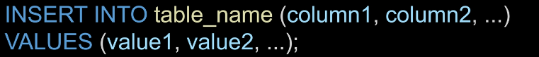
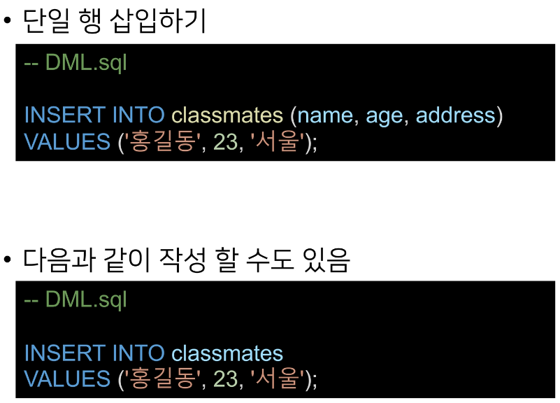
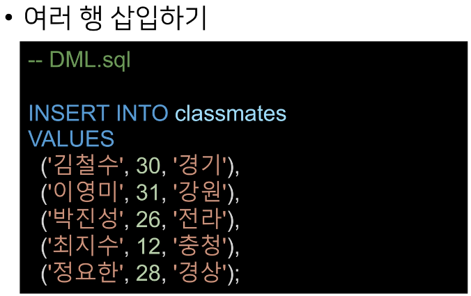
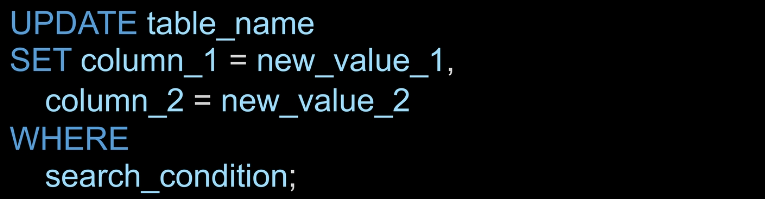
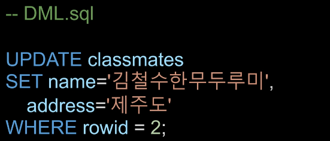
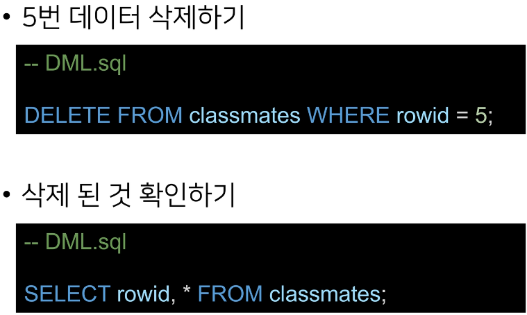
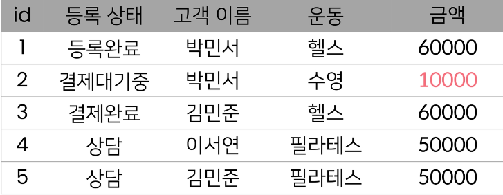
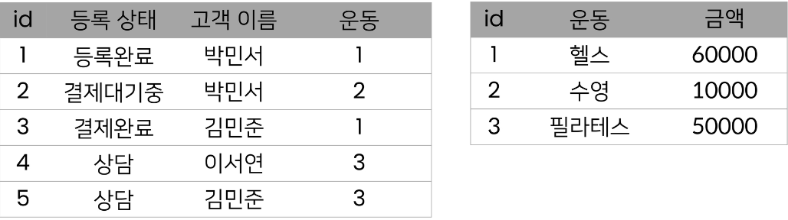

# 4_6

# Grouping data

> ##### Aggregate function
> 
> - 집계함수
> 
> - 값 집합의 최대값, 최소값, 평균, 합계 및 개수를 계산
> 
> - 값 집합에 대한 계산을 수행하고 단일 값을 반환
>   
>   - 여러 행으로부터 하나의 결과 값을 반환하는 함수
> 
> - SELECT 문의 GROUP BY 절과 함께 종종 사용됨
> 
> - 제공하는 함수 목록
>   
>   - AVG(), COUNT(), MAX(), MIN(), SUM()
> 
> - 타입이 숫자(INTEGER)일때만 사용 가능
> 
> - 예시
> 
> 

> ##### GROUP BY clause
> 
> 
> 
> - Make a set of summary rows from a set of rows
> 
> - 특정 그룹으로 묶인 결과를 생성
> 
> - 선택된 컬럼 값을 기준으로 데이터(행)들의 공통 값을 묶어서 결과로 나타냄
> 
> - SELECT 문에서 선택적으로 사용가능한 절
> 
> - SELECT 문의 FROM 절 뒤에 작성
>   
>   - WHERE 절이 포함된 경우 WHERE 절 뒤에 작성해야 함
> 
> - 각 그룹에 대해 MIN, MAX, SUM, COUNT 또는 AVG와 같은 집계 함수를 적용하여 각 그룹에 대한 추가적인 정보 제공가능

> ##### INSERT statement
> 
> 
> 
> - 새 행을 테이블에 삽입
> 
> - 문법 규칙
>   
>   1. 먼저 INSERT INTO 키워드 뒤에 데이터를 삽입할 테이블의 이름을 지정
>   
>   2. 테이블 이름 뒤에 쉼표로 구분된 컬럼 목록을 추가
>      
>      - 컬럼 목록은 선택사항이지만 컬럼 목록을 포함하는 것이 권장됨
>   
>   3- VALUES 키워드 뒤에 쉽표로 구분된 값 목록을 추가
>      
>      - 만약 컬럼 목록을 생략하는 경우 값 목록의 모든 컬럼에 대한 값을 지정해야 함
>      
>      - 값 목록의 값 개수는 컬럼 목록의 컬럼 개수와 같아야 함
> 
> 
> 
> 

> ##### UPDATE statement
> 
> 
> 
> 1. UPDATE 절 이후에 업데이트할 테이블을 지정
> 
> 2. SET 절에서 테이블의 각 컬럼에 대해 새 값을 설정
> 
> 3. WHERE 절의 조건을 사용하여 업데이트할 행을 지정
>    
>    - WHERE 절은 선택 사항이지만 생략하면 UPDATE 문은 테이블의 모든 행에 있는 데이터를 업데이트 함
> 
> 4- 선택적으로 ORDER BY 및 LIMIT 절을 사용하여 업데이트 할 행 수를 지정할 수도 있음
> - 예시
>   
>   - 

> ##### DELETE statement
> 
> 
> 
> - 테이블에서 행을 제거
> 
> - 테이블의 한 행, 여러 행 ㅁ치 모든 행을 삭제할 수 있음
> 
> - 문법 규칙
>   
>   1. DELETE FROM 키워드 뒤에 행을 제거하려는 테이블의 이름을 지정
>   
>   2. WHERE 절에 검색 조건을 추가하여 제거할 행을 식별
>      
>      - WHERE 절은 선택 사항이며, 생략하면 DELETE 문은 테이블의 모든 행을 삭제
>   
>   3- 선택적으로 ORDER BY 및 LIMIT 절을 사용하여 삭제할 행 수를 지정할 수도 있음
> 
> 

## 정규형

> #### 데이터베이스 정규형
> 
> - DB를 구조화하는 방법론
> 
> - 데이터의 중복을 최소화하고 일관성과 무결성을 보장하기 위함
> 
> - 데이터의 구조를 더 좋은 구조로 바꾸는 것을 정규화라고 함
> 
> - 관계형 DB의 경우 6개의 정규형이 있음

> ##### 제 1 정규형
> 
> - 하나의 속성값이 복수형을 가지면 안됨

> ##### 제 2 정규형
> 
> - 테이블의 PK에 종속되지 않는 컬럼은 테이블이 분리 되어야함
> 
> - 위 테이블에서 아래 테이블로 바뀌어야 함
> 
> - 
> 
> - 

> ##### 제 3 정규형
> 
> - 다른 속성에 의존(종속)하는 속성은 따로 분리할 것

## JOIN

### Table 합치기

- CROSS JOIN

- INNER JOIN

- OUTER JOIN
  
  - LEFT JOIN
  
  - RIGHT JOIN

