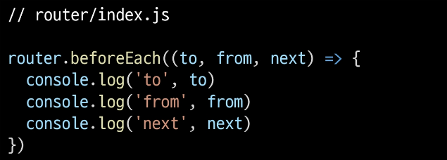
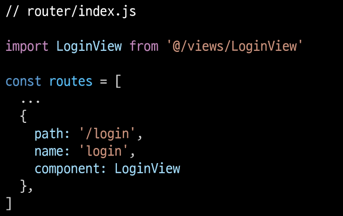

# 5_10

# Life Cycle Hook

### Navigation Guard

> ##### 네비게이션 가드
> 
> - Vue router를 통해 특정 URL에 접근할 때 다른 URL로 redirect를 하거나 해당 URL로의 접근을 막는 방법
>   
>   - ex) 사용자의 인증 정보가 없으면 특정 페이지에 접근하지 못하게 함
> 
> - https://v3.router.vuejs.org/guide/advanced/navigation-guards.html

> ##### 네비게이션 가드의 종류
> 
> - 전역 가드
>   
>   - 어플리케이션 전역에서 동작
> 
> - 라우터 가드
>   
>   - 특정 URL에서만 동작
> 
> - 컴포넌트 가드
>   
>   - 라우터 컴포넌트 안에 정의

### 전역 가드

> ##### Global Before Guard
> 
> - 다른 url 주소로 이동할 때 항상 실행
> 
> - router/index.js에 `router.beforeEach()`를 사용하여 설정
> 
> - 콜백 함수의 값으로 다음과 같이 3개의 인자를 받음
>   
>   - to : 이동할 URL 정보가 담긴 Route 객체
>   
>   - from : 현재 URL 정보가 담긴 Route 객체
>   
>   - next : 지정한 URL로 이동하기 위해 호출하는 함수
>     
>     - 콜백 함수 내부에서 반드시 한 번만 호출되어야 함
>     
>     - 기본적으로 to에 해당하는 URL로 이동
> 
> - URL이 변경되어 화면이 전환되기 전 router.beforeEach()가 호출됨
>   
>   - 화면이 전환되지 않고 대기 상태가 됨
> 
> - 변경된 URL로 라우팅하기 위해서는 next()를 호출해줘야 함
>   
>   - next()가 호출되기 전까지 화면이 전환되지 않음

> ##### Global Before Guard 실습
> 
> - '/home'으로 이동하더라도 라우팅이 되지 않고 아래와 같이 로그만 출력됨
> 
> - next()가 호출되지 않으면 화면이 전환되지 않음
>   
>   
>   
>   
> 
> - next()가 호출되어야 화면이 전환됨
>   
>   
>   
>   
> 
> - About으로 이동해보기
>   
>   - to에는 이동할 url인 about에 대한 정보가, from에는 현재 url인 home에 대한 정보가 들어있음
>     
>     

> ##### Login 여부에 따른 라우팅 처리
> 
> - Login이 되어있지 않다면 Login 페이지로 이동하는 기능 추가
>   
>   
>   
>   
> 
> - LoginView에 대한 라우터 링크 추가
>   
>   
> 
> - HelloView에 로그인을 해야만 접근할 수 있도록 만들어보기
> 
> - 로그인 여부에 대한 임시 변수 생성
> 
> - 로그인이 필요한 페이지를 저장
>   
>   - 로그인이 필요한 페이지들의 이름(라우터에 등록한 name)을 작성
> 
> - 앞으로 이동할 페이지(to)가 로그인이 필요한 사이트인지 확인
>   
>   
> 
> - isAuthRequired 값에 따라 로그인이 필요한 페이지이고 로그인이 되어있지 않으면 Login 페이지로 이동하고 그렇지 않다면 기존 루트로 이동한다
> 
> - next() 인자가 없을 경우 to로 이동한다. (`next()`가 한번만 호출되도록 유의)
>   
>   
> 
> - isLoggedIn이 true인 경우 (로그인 상태에서 로그인이 필요한 페이지로 접속)
>   
>   - /hello/harry에 해당하는 컴포넌트가 정상적으로 렌더링
> 
> - isLoggedIn이 false인 경우 (로그인 상태에서 로그인이 필요한 페이지로 접속)
>   
>   - /hello/harry를 렌더링하지 않고 Login 페이지로 이동됨
> 
> - Home => Login으로 이동했는데 console창에 log가 2개가 찍힌 이유
>   
>   - 첫번째 출력은 /hello/harry로 접속 시도 후 (전역 가드에 막힘) 전역 가드에서 login으로 이동 요청할 때 출력
>   
>   - 두번째 출력은 /login으로 이동 요청할 때 출력
> 
> - /hello/:userName 페이지를 제외하고는 전역 가드에서 기존 주소로 이동하기 때문에 정상적으로 작동
> 
> - 로그인이 필요한 페이지에 추가하면 비로그인 시 해당 페이지에 접근 불가
>   
>   
> 
> - 반대로 Login하지 않아도 되는 페이지들을 모아 둘 수도 있음
>   
>   

### 라우터 가드

> ##### 라우터 가드
> 
> - 전체 route가 아닌 특정 route에 대해서만 가드를 설정하고 싶을 때 사용
> 
> - beforeEnter()
>   
>   - route에 진입했을 때 실행됨
>   
>   - 라우터를 등록한 위치에 추가
>   
>   - 단 매개변수, 쿼리, 해시 값이 변경될 때는 실행되지 않고 다른 경로에서 탐색할 때만 실행됨
>   
>   - 콜백 함수는 to, from, next를 인자로 받음

> ##### Login 여부에 따른 라우팅 처리
> 
> - 이미 로그인 되어있는 경우 HomeView로 이동하기
> 
> - 라우터 가드 실습을 위해 전역 가드는 실습코드는 주석처리
> 
> - 로그인 여부에 대한 임시변수 생성
> 
> - 로그인이 되어있는 경우 home으로 이동
> 
> - 로그인이 되어있지 않은 경우 login으로 이동
>   
>   
> 
> - isLoggedIn === true인 경우 (로그인 상태인 경우)
>   
>   - /login으로 접속을 시도하면 Home으로 이동
> 
> - Login을 제외한 다른 페이지로 이동하면 라우터 가드를 따로 설정해주지 않았기 때문에 라우터 가드가 동작하지 않음
> 
> - 이런식으로 특정 라우트만 따로 가드를 하고싶은 경우에는 라우터 가드를 사용
> 
> - isLoggedIn === false로 변경하면 Login페이지로 정상 이동 가능

### 컴포넌트 가드

> ##### 컴포넌트 가드
> 
> - 특정 컴포넌트 내에서 가드를 지정하고 싶을 때 사용
> 
> - beforeRouteUpdate()
>   
>   - 해당 컴포넌트를 렌더링하는경로가 변경될 때 실행

> ##### Params 변화 감지
> 
> - about에서 jun에게 인사하는 페이지로 이동
>   
>   
> 
> - navbar에 있는 Hello를 눌러 harry에게 인사하는 페이지로 이동
>   
>   - URL은 변하지만 페이지는 변화하지 않음
> 
> - 변화하지 않는 이유
>   
>   - 컴포넌트가 재사용되었기 때문
>   
>   - 기존 컴포넌트를 지우고 새로 만드는 것보다 효율적
>     
>     - 단, lifecycle hook이 호출되지 않음
>     
>     - 따라서 $route.params에 있는 데이터를 새로 가져오지 않음

> ##### Params 변화 감지
> 
> - beforeRouteUpdate()를 사용해서 처리
>   
>   - userName을 이동할 params에 있는 userName으로 재할당
>   
>   

### 404 Not Found

> ##### 404 Not Found
> 
> - 사용자가 요청한 리소스가 존재하지 않을 때 응답
>   
>   
>   
>   
> 
> - http://localhost:8080/404 확인
> 
> - 직접 요청이 아닌 요청한 리소스가 없을 때 404로 이동하기 위한 방법 찾기

> ##### 요청한 리소스가 존재하지 않는 경우
> 
> - 모든 경로에 대해서 404 page로 redirect 시키기
>   
>   - 기존에 명시한 경로가 아닌 모든 경로가 404 page로 redirect 됨
>   
>   - 이때, routes에 최하단부에 작성해야 함
>     
>     

> ##### 형식은 유효하지만 특정 리소스를 찾을 수 없는 경우
> 
> - 예시)  Django에게 articles/1/로 요청을 보냈지만, 1번 게시글이 삭제된 상태
>   
>   - 이때는 path: '*'를 만나 404 page가 렌더링 되는 것이 아니라 기존에 명시한 articles/:id/에 대한 components가 렌더링됨
>   
>   - 하지만 데이터가 존재하지 않기 때문에 정상적으로 렌더링이 되지 않음
> 
> - 해결책
>   
>   - 데이터가 없음을 명시
>   
>   - 404 page로 이동해야 함
> 
> - Dog API 문서( https://dog.ceo/dog-api )를 참고하여 동적 인자로 강아지 품종을 전달해 품종에 대한 랜덤 이미지를 출력하는 페이지를 만들어보기
> 1. Axios 설치
> 
> 2. DogView components 작성
> 
> 3. routes에 등록
>    
>    - '*'보다 상단에 등록
>    
>    
> - Dog API 문서를 참고하여 axios 로직을 작성
>   
>   
>   
>   
> 
> - /dog/hound에 접속하면 hound 품종에 대한 랜덤 사진이 출력
> 
> - axios 요청이 오는 중 동작하고 있음을 표현하기 위한 로딩 메시지 정의
>   
>   
>   
>   
> 
> - 결과 화면
>   
>   
> 
> - axios 요청이 실패할 경우 자료가 없음을 표현하기
>   
>   
> 
> - /dog/abc에 접속
>   
>   

> ##### 404 Not Found
> 
> - 이전처럼 메시지를 바꿀수도 있지만 axios 요청이 실패할 경우 404페이지로 이동시킬 수도 있음
>   
>   

