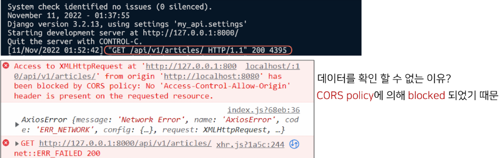
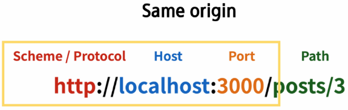
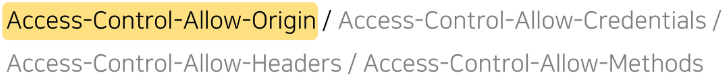

# 5_11

# Vue with DRF

### Vue with DRF

> ##### 개요
> 
> - Server와 Client의 통신 방법 이해하기
> 
> - CORS 이슈 이해하고 해결하기
> 
> - Vue와 API server 통신하기

### Server & Client

> ##### Server
> 
> - 서버(Server)란
>   
>   - 클라이언트에게 정보와 서비스를 제공하는 컴퓨터 시스템
>   
>   - 서비스 전체를 제공 == Django Web Service
>   
>   - 정보를 제공 == DRF API Service
> 
> - 서비스 전체를 제공 == Django Web Service
>   
>   - Django를 통해 전달받은 HTML에는 하나의 웹 페이지를 구성할 수 있는 모든 데이터가 포함
>   
>   - 즉, 서버에서 모든 내용을 렌더링. 하나의 HTML 파일로 제공
>   
>   - 정보를 포함한 web 서버를 구성하는 모든 내용을 서버 측에서 제공
> 
> - 정보를 제공 == DRF API Service
>   
>   - Django를 통해 관리하는 정보만을 클라이언트에게 제공
>   
>   - DRF를 사용하여 JSON으로 변환
>     
>     

> ##### Client
> 
> - 클라이언트(Client)란
>   
>   - Server가 제공하는 서비스에 적절한 요청을 통해 Server로부터 반환받은 응답을 사용자에게 표현하는 기능을 가진 프로그램 혹은 시스템
> 
> - Server가 제공하는 서비스에 적절한 요청
>   
>   - Server가 정의한 방식대로 요청인자를 넘겨 요청
>   
>   - Server는 정상ㅇ적인 요청에 적합한 응답 제공
> 
> - 잘못된 요청의 예
>   
>   
> 
> - Server로부터 반환받은 응답을 사용자에게 표현
>   
>   - 사용자의 요청에 적합한 data를 server에 요청하여 응답받은 결과로 적절한 화면을 구성
>     
>     

> ##### 정리
> 
> - Server는 정보와 서비스를 제공
>   
>   - DB와 통신하며 데이터를 생성, 조회, 수정, 삭제를 담당
>   
>   - 요청을 보낸 Client에게 정상적인 요청이었다면 처리한 결과를 응답
> 
> - Client는 사용자의 정보 요청을 처리, server에게 응답받은 정보를 표현
>   
>   - Server에게 정보(데이터)를 요청
>   
>   - 응답받은 정보를 가공하여 화면에 표현

### Again DRF

> ##### 시작하기 전 backend code 확인
> 
> - Models
>   
>   
> 
> - urls
>   
>   
> 
> - Dummy data
>   
>   
> 
> - 데이터 삽입
>   
>   
> 
> - 서버 실행 후, 전체 게시글 조회
>   
>   - Browser에서 serve에 전체 게시글 조회 요청 -> 데이터 반환 확인
>     
>     
>   
>   - Postman에서 올바른 방법으로 요청 -> 데이터 반환 확인
>     
>     

### Back to Vue

> ##### 시작하기 전 front-server code 확인
> 
> - front-server 폴더 구조 확인 및 서버 구동 준비
> 
> - `npm install / npm run serve`
> 
> - 

> ##### 메인 페이지 구성
> 
> - `views/ArticleView.vue ` component 확인 및 route 등록
>   
>   
> 
> - `src/App.vue` router-link 주석 해제 및 결과 확인
>   
>   
> 
> - `components/ArticleList.vue` 확인
>   
>   - 전체 게시물을 표현할 컴포넌트
>   
>   - 화면 구성을 위한 최소한의 style 포함
>     
>     
> 
> - `views/ArticleView.vue` 주석 해제
>   
>   - 'ArticleList' 하위 컴포넌트 등록
>     
>     1. 불러오기
>     
>     2. 등록하기
>     
>     3. 보여주기
>     
>     
> 
> - `components/ArticleListItem.vue` 확인
>   
>   - 각 게시글들의 정보를 표현할 컴포넌트
>   
>   - 데이터 없이 최소한의 기본 구조만 확인
>     
>     
> 
> - components/ArticleList.vue
>   
>   - ArticleListItem 컴포넌트를 하위로 등록
>     
>     
> 
> - `store/index.js`
>   
>   - state에 articles 배열 정의
>   
>   - 화면 표현 체크용 데이터 생성
>     
>     
> 
> - `components/ArticleList.vue`
>   
>   - state에서 articles 데이터 가져오기
>   
>   - v-for 디렉티브를 활용하여 하위 컴포넌트에서 사용할 article 단일 객체 정보를 pass props
>     
>     
> 
> - `components/ArticleListItem.vue`
>   
>   - 내려받은 props 데이터로 화면 구성
>   
>   - props 데이터의 타입은 명확하게 표기할 것
>     
>     

### Vue with DRF

> ##### AJAX 요청
> 
> - store/index.js에서 axios 불러오기
>   
>   - 요청 보낼 API server 도메인 변수에 담기
>     
>     
>   
>   - 'getArticles' methods 정의
>   
>   - 요청 보낼 경로 확인 필수
>   
>   - 성공시 .then / 실패시 .catch
> 
> - `views/ArticleView.vue`
>   
>   - 'getArticles' actions 호출
>   
>   - 인스턴스가 생성된 직후 요청을 보내기 위해 created() hook 사용
>     
>     

> ##### 요청 결과 확인
> 
> - Vue와 Django 서버를 모두 켠 후 메인 페이지 접속
> 
> - Server에서는 200을 반환하였으나 Client Console에서는 Error를 확인

# CORS

### Cross-Origin Resource Sharing

> ##### What Happened?
> 
> - 브라우저가 요청을 보내고 서버의 응답이 브라우저에 도착
>   
>   - Server의 log는 200(정상) 반환
>   
>   - 즉, Server는 정상적으로 응답했지만 브라우저가 막은 것
> 
> - 보안상의 이유로 브라우저는 동일 출처 정책(SOP)에 의해 다른 출처의 리소스와 상호작용 하는 것을 제한함

> ##### SOP (Same - Origin Policy)
> 
> - 동일 출처 정책
> 
> - 불러온 문서나 스크립트가 다른 출처에서 가져온 리소스와 상호작용하는 것을 제한하는 보안 방식
> 
> - 잠재적으로 해로울 수 있는 문서를 분리함으로써 공격받을 수 있는 경로를 줄임
> 
> - https://developer.mozilla.org/en-US/docs/Web/Security/Same-origin_policy

> ##### Origin - 출처
> 
> - URL의 Protocol, Host, Port를 모두 포함하여 출처라고 부름
> 
> - Same Origin 예시
>   
>   - 아래 세 영역이 일치하는 경우에만 동일 출처로 인정
>     
>     
>   
>   - `http://localhost:3000/posts/3/` 을 기준으로 출처를 비교
>     
>     

> ##### CORS - 교차 출처 리소스 공유
> 
> - 추가 HTTP Header를 사용하여, 특정 출처에서 실행중인 웹 어플리케이션이 다른 출처의 자원에 접근할 수 있는 권한을 부여하도록 브라우저에 알려주는 체제
>   
>   - 어떤 출처에서 자신의 컨텐츠를 불러갈 수 있는지 서버에 지정할 수 있는 방법
> 
> - 리소스가 자신의 출처와 다를 때 교차 출처 HTTP 요청을 실행
>   
>   - 만약 다른 출처의 리소스를 가져오기 위해서는 이를 제공하는 서버가 브라우저에게 다른 출처지만 접근해도 된다는 사실을 알려야 함
>   
>   - 교차 출처 리소스 공유 정책 (CORS policy)
>     
>     - 다른 출처에서 온 리소스를 공유하는 것에 대한 정책
>     
>     - CORS policy에 위배되는 경우 브라우저에서 해당 응답 결과를 사용하지 않음
>       
>       - Server에서 응답을 주더라도 브라우저에서 거절
>     
>     - 다른 출처의 리소스를 불러오려면 그 출처에서 올바른 CORS header를 포함한 응답을 반환해야함
>     
>     - https://developer.mozilla.org/ko/docs/Web/HTTP/CORS

### How to set CORS

> ##### How to set CORS
> 
> - CORS 표준에 의해 추가된 HTTP Response Header를 통해 이를 통제 가능
> 
> - HTTP Response Header 예시
>   
>   - 
> 
> - Access-Control-Allow-Origin
>   
>   - 단일 출처를 지정하여 브라우저가 해당 출처가 리소스에 접근하도록 허용

> ##### django-cors-headers library 사용
> 
> - django-cors-headers github에서 내용 확인
>   
>   - https://github.com/adamchainz/django-cors-headers
> 
> - 응답에 CORS header를 추가해주는 라이브러리
> 
> - 다른 출처에서 Django 어플리케이션에 대한 브라우저 내 요청을 허용함
> 
> - 라이브러리 설치 및 `requirements.txt` 업데이트
>   
>   
> 
> - App 추가 및 MIDDLEWARE 추가 주석 해제
>   
>   
> 
> - CORS_ALLOWED_ORIGINS에 교차 출처 자원 공유를 허용할 Domain 등록
>   
>   
> 
> - 만약 모든 Origin을 허용하고자 한다면
>   
>   

> ##### 결과 확인
> 
> - console 창에 정상적으로 출력되는 데이터 확인
> 
> - 응답에 Access-Control-Allow-Origin 헤더가 있는 것을 확인
>   
>   

# Vue with DRF(feat.CORS)

### Article Read

> ##### Article Read
> 
> - 응답 받은 데이터 구조 확인
>   
>   - data Array에 각 게시글 객체
>   
>   - 각 게시글 객체는 다음으로 구성 (예시)
>     
>     1. id
>     
>     2. title
>     
>     3. content
>        
>        
> 
> - `store/index.js` 
>   
>   - 기존 articles 데이터 삭제
>   
>   - Mutations 정의
>     
>     - 응답 받아온 데이터를 state에 저장
>       
>       
> 
> - 결과
>   
>   - 사전에 ArticleList.vue에서 state로 화면을 구성하도록 설정
>   
>   - 정상적으로 데이터 출력 확인
>     
>     

### Article Create

> ##### Article Create
> 
> - views/CreateView.vue 코드
>   
>   - 게시글 생성을 위한 form을 제공
>   
>   - v-model.trim을 활용해 사용자 입력 데이터에서 공백 제거
>   
>   - .prevent를 활용해 form의 기본 이벤트 동작 막기
>     
>     
>   
>   - title, content가 비었다면 alert을 통해 경고창을 띄우고 AJAX 요청을 보내지 않도록 return을 통해 함수를 종료시킴
>     
>     
>   
>   - axios를 사용해 server에 게시글 생성 요청
> 
> - actions을 사용하지 않는 이유
>   
>   - state를 변화시키는 것이 아닌 DB에 게시글 생성 후, ArticleView로 이동할 것이므로 methods에서 직접 처리
>     
>     
> 
> - router/index.js
>   
>   
> 
> - views/ArticleView.vue
>   
>   - router-link를 통해 CreateView로 이동
>     
>     
> 
> - 게시글 작성 요청 결과 확인
>   
>   - 정상 작동 확인
>     
>     
> 
> - views/CreateView.vue
>   
>   - createArticle method - 게시글 생성 완료 후, ArticleView로 이동
>   
>   - 응답 확인을 위해 정의한 인자 res 제거
>     
>     
> 
> - 게시글 작성 요청 결과 재확인
>   
>   - 게시글 생성 후, ArticleView로 이동
>   
>   - 새로 생성된 게시글 확인 가능
> 
> - router로만 이동했는데 보이는 이유
>   
>   - ArticleView가 create될 때 마다 Server에 게시글 전체 데이터를 요청하고 있기 때문

> ##### 앞선 방식이 효율적인가
> 
> - 비효율적인 부분이 존재
>   
>   - 전체 게시글 정보를 요청해야 새로 생성된 게시글을 확인할 수 있음
>   
>   - 만약 vuex state를 통해 전체 게시글 정보를 관리하도록 구성한다면 다른 User들이 생성한 게시글은 언제 어떻게 불러와야할지 구성방식에 따라 Data 관리 방식을 바꿔야 함

### Article Detail

> ##### Article Detail
> 
> - views/DetailView.vue
>   
>   - 게시글 상세 정보를 표현할 컴포넌트
>   
>   - AJAX 요청으로 응답받아올 article의 상세 정보들을 표현
>     
>     
> 
> - router/index.js
>   
>   - id를 동적 인자로 입력받아 특정 게시글에 대한 요청
>     
>     
> 
> - components/ArticleListItem.vue
>   
>   - router-link를 통해 특정 게시글의 id 값을 동적 인자로 전달
>   
>   - 게시글 상세 정보를 Server에 요청
>     
>     
> 
> - views/DetailView.vue
>   
>   - this.$route.params를 활용해 컴포넌트가 create될 때, 넘겨받은 id로 상세 정보 AJAX 요청
>     
>     
> 
> - 게시글 상세 정보 요청 결과 확인
>   
>   - 정상 작동 확인
>   
>   - 넘겨 받은 데이터 구조 확인 후, 적절하게 화면 구성
>     
>     
> 
> - views/DetailView.vue
>   
>   - 응답받은 정보를 data에 저장
>   
>   - data에 담기까지 시간이 걸리므로 optional chaining을 활용해 데이터 표기
>     
>     
> 
> - 결과
>   
>   

