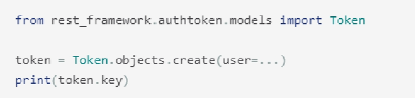
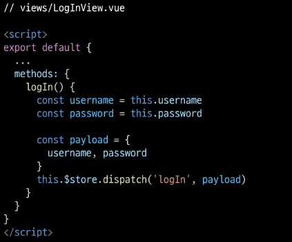

# 5_15

# Vue with Auth

## DRF Auth System

### Authentication & Authorization

> ##### Authentication - 인증, 입증
> 
> - 자신이라고 주장하는 사용자가 누구인지 확인하는 행위
> 
> - 모든 보안 프로세스의 첫 번째 단계 (가장 기본 요소)
> 
> - 즉, 내가 누구인지를 확인하는 과정
> 
> - 401 Unauthorized
>   
>   - 비록 HTTP 표준에서는 "미승인(unauthorized)"을 명확히 하고 있지만, 의미상 이 응답은 "비인증(unauthenticated)"을 의미

> ##### Authorization - 권한 부여, 허가
> 
> - 사용자에게 특정 리소스 또는 기능에 대한 액세스 권한을 부여하는 과정 (절차)
> 
> - 보안 환경에서 권한 부여는 항상 인증이 먼저 필요함
>   
>   - 사용자는 조직에 대한 액세스 권한을 부여 받기 전에 먼저 자신의 ID가 진짜인지 먼저 확인해야 함
> 
> - 서류의 등급, 웹 페이지에서 글을 조회 & 삭제 & 수정할 수 있는 방법, 제한 구역
>   
>   - 인증이 되었어도 모든 권한을 부여받은 것은 아님
> 
> - 403 Forbidden
>   
>   - 401과 다른 점은 서버는 클라이언트가 누구인지 알고 있음

> ##### Authentication and authorization work together
> 
> - 회원가입 후, 로그인 시 서비스를 이용할 수 있는 권한 생성
>   
>   - 인증 이후에 권한이 따라오는 경우가 많음
> 
> - 단, 모든 인증을 거쳐도 권한이 동일하게 부여되는 것은 아님
>   
>   - Django에서 로그인을 했더라도 다른 사람의 글까지 수정 / 삭제가 가능하진 않음
> 
> - 세션, 토큰, 제 3자를 활용하는 등의 다양한 인증 방식이 존재

### authentication determined

> ##### 인증 여부 확인 방법
> 
> - DRF 공식문서에서 제안하는 인증 절차 방법
>   
>   - https://www.django-rest-framework.org/api-guide/authentication/
> 
> - settings.py에 작성해야 할 설정
>   
>   - "기본적인 인증 절차를 어떠한 방식으로 둘 것이냐"를 설정하는 것
>   
>   - 예시의 2가지 방법 외에도 각 framework마다 다양한 인증 방식이 있음
> 
> - 우리가 사용할 방법은 DRF가 기본으로 제공해주는 인증 방식 중 하나인 `TokenAuthentication`
> 
> - 모든 상황에 대한 인증 방식을 정의하는 것이므로, 각 요청에 따라 다른 인증 방식을 거치고자 한다면 다른 방식이 필요
> 
> - view 함수마다 (각 요청마다) 다른 인증 방식을 설정하고자 한다면 decorator 활용
> 
> - [참고] permission_classes
>   
>   - 권한 관련 설정
>   
>   - 권한 역시 특정 view 함수마다 다른 접근 권한을 요구할 수 있음

> ##### 다양한 인증 방식
> 
> - BasicAuthentication
>   
>   - 가장 기본적인 수준의 인증 방식
>   
>   - 테스트에 적합
> 
> - SessionAuthentication
>   
>   - Django에서 사용하였던 Session 기반의 인증 시스템
>   
>   - DRF와 Django의 Session 인증 방식은 보안적 측면을 구성하는 방법에 차이가 있음
> 
> - RemoteUserAuthentication
>   
>   - Django의 Remote User 방식을 사용할 때 활용하는 인증 방식
> 
> - TokenAuthentication
>   
>   - 매우 간단하게 구현할 수 있음
>   
>   - 기본적인 보안 기능 제공
>   
>   - 다양한 외부 패키지가 있음
> 
> - (중요) settings.py에서 DEFAULT_AUTHENTICATION_CLASSES를 정의
>   
>   - TokenAuthentication 인증 방식을 사용할 것임을 명시

> ##### TokenAuthentication 사용 방법
> 
> - INSTALLED_APPS에 rest_framework.authtoken 등록
>   
>   - 
> 
> - 각 User마다 고유 Token 생성
>   
>   - 
> 
> - 생성한 Token을 각 User에게 발급
>   
>   - User은 발급받은 Token을 요청과 함께 전송
>   
>   - Token을 통해 User 인증 및 권한 확인
> 
> - Token 발급 방법
>   
>   
> 
> - User은 발급받은 Token을 headers에 담아 요청과 함께 전송
>   
>   - 단, 반드시 Token 문자열 함께 삽입
>     
>     - 삽입해야 할 문자열은 각 인증방식마다 다른
>   
>   - (주의사항) Token 문자열과 발급받은 실제 token 사이를 `' '(공백)`으로 구분
> 
> - Authorization HTTP headers 작성 방법
>   
>   

> ##### 토큰 생성 및 관리 문제점
> 
> - 기본 제공 방식에서 고려하여야 할 사항들
>   
>   1. Token 생성 시점
>   
>   2. 생성한 Token 관리 방법
>   
>   3. User와 관련된 각종 기능 관리 바업ㅂ
>      
>      - 회원가입
>      
>      - 로그인
>      
>      - 회원 정보 수정
>      
>      - 비밀번호 변경 등

### dj-rest-auth

> ##### DJ-Rest-Auth
> 
> - 회원가입, 인증(소셜미디어 인증 포함), 비밀번호 재설정, 사용자 세부 정보 검색, 회원정보수정 등을 위한 REST API end point 제공
> 
> - (주의사항) django-rest-auth는 더 이상 업데이트를 지원하지 않음 `dj-rest-auth` 사용
> 
> - https://github.com/iMerica/dj-rest-auth

> ##### dj-rest-auth 사용 방법
> 
> 1. 패키지 설치
> 
> 2. APP 등록
> 
> 3. url 등록
>    
>    

> ##### 시작하기 전 필수사항
> 
> - auth.User을 accounts.User로 변경 필요
> 
> - auth.User로 설정된 DB 제거
> 
> - my_api/settings.py 주석 해제
> 
> - db.sqlite3 파일 삭제
> 
> - migrations 파일 삭제
>   
>   

> ##### dj-rest-auth 사용하기
> 
> - dj-rest-auth 설치
>   
>   `pip install dj-rest-auth`
> 
> - my_api/settings.py 주석 해제
>   
>   
> 
> - makemigrations & migrate
>   
>   - `python manage.py makemigrations`
>   
>   - `python manage.py migrate`
> 
> - my_api/urls.py 주석 해제
>   
>   
> 
> - 결과 확인
>   
>   - /accounts/로 이동하면 회원 가입 기능이 없음
> 
> 

> ##### Registration
> 
> - Registration 기능을 사용하기 위해 추가 기능 등록 및 설치 필요
>   
>   - dj-rest-auth는 소셜 회원가입을 지원한다
>   
>   - dj-rest-auth의 회원가입 기능을 사용하기 위해서는 django-allauth 필요
> 
> - django-allauth 설치
>   
>   `pip install 'dj-rest-auth[with_social]'`
> 
> - my_api/settings.py 주석 해제
>   
>   - App 등록 및 SITE_ID 설정
>     
>     
>   
>   - SITE_ID란
>     
>     - Django는 하나의 컨텐츠를 기반으로 여러 도메인에 컴텐츠를 게시 가능하도록 설계됨
>     
>     - 다수의 도메인이 하나의 DB에 등록
>     
>     - 현재 프로젝트가 첫 번째 사이트임을 나타냄
> 
> - my_api/urls.py 주석 해제
>   
>   
> 
> - migrate 하기
> 
> - /accounts/signup/ 페이지 확인
> 
> - Get method는 접근 불가
> 
> - 회원가입 POST 요청 양식 제공
>   
>   - email은 생략 가능

> ##### Sign up & Login
> 
> - 회원 가입 요청 후 결과 확인
>   
>   - 요처에 대한 응답으로 Token 발급
> 
> - 로그인 시에도 동일한 토큰 발급
>   
>   - 정상적인 로그인 가능
> 
> - 발급받은 토큰은 테스트를 위해 기록
>   
>   예시)
>   
>   

> ##### Password change
> 
> - /accounts/password/change/ 기능 확인
>   
>   - 로그인 되어 있거나, 인증이 필요한 기능
>   
>   - DRF 자체 제공 HTML form에서는 토큰을 입력할 수 있는 공간이 없음
>   
>   - Postman에서 진행
> 
> - [참고] Raw data에서 직접 headers 추가 가능
>   
>   
> 
> - Postman으로 양식에 맞춰 POST 요청
>   
>   - body/form-data에 값 입력
>     
>     
>   
>   - headers에 Token 입력
>     
>     - `Authorization: Token { your token }` 형식에 맞춰 입력
>       
>       
>   
>   - 인증 방법이 입증되지 않아 실패함. 따라서 my_api/settings.py를 변경해줘야 함
>     
>     

### Permission setting

> ##### Permission setting
> 
> - 권한 설정 방법 확인
>   
>   - DRF 공식 문서 > API Guide > Permissions 확인
> 
> - https://www.django-rest-framework.org/api-guide/permissions/
> 
> - 권한 세부 설정
>   
>   1. 모든 요청에 대해 인증을 요구하는 설정
>   
>   2. 모든 요청에 대해 인증이 없어서 허용하는 설정
> 
> . 설정 위치 == 인증 방법을 설정한 곳과 동일
>   
>   . 우선 모든 요청에 대해 허용 설정
>     
>     
> 
> . my_api/settings.py 변경
>   
>   . 모두 허용에 대한 내용만 변경
>     
>     

> ##### Article List Read
> 
> - articles/views.py 변경
> 
> - 게시글 조회 및 생성 요청시 인증된 경우만 허용하도록 권한 부여
>   
>   - decorator를 활용
>     
>     
> 
> - /articles/ 조회 요청 확인
> 
> - 게시글 조회 시 로그인 필요

> ##### 정리
> 
> 1. 인증 방법 설정
>    
>    - DEFAULT_AUTHENTICATION_CLASSES
> 
> 2. 권한 설정하기
>    
>    - DEFAULT_PERMISSION_CLASSES
> 
> 3. 인증 방법, 권한 세부 설정도 가능
>    
>    - @authentication_classes
>    
>    - @permission_classes
> 
> 4. 인증 방법은 다양한 방법이 있으므로 내 서비스에 적합한 방식을 선택

### DRF Auth with Vue

> ##### Vue Server 요청 정상 작동 여부 확인
> 
> - 정상 작동하던 게시글 전체 조회 요청이 작동하지 않음
>   
>   - 401 status code 확인
>   
>   - 인증되지 않은 사용자이므로 조회 요청이 불가능해진 것

### SignUp Request

> ##### SignUp Page
> 
> - views/SignUpView.vue 코드 확인
>   
>   - Server에서 정의한 field명 확인
>     
>     1. username
>     
>     2. password1
>     
>     3. password2
>     
>     
> 
> - router/index.js
>   
>   
> 
> - src/App.vue
>   
>   - 파이프 라인 등을 활용하여 링크 간 공간 확보
>     
>     
> 
> - views/SignUpView.vue 결과 확인
>   
>   

> ##### SignUp Request
> 
> - 회원가입을 완료 시 응답 받을 정보 Token을 store에서 관리할 수 있도록 actions를 활용하여 요청 후, state에 저장할 로직 작성
>   
>   - 회원가입이나 로그인 후 얻을 수 있는 Token은 server를 구성 방식에 따라 매 요청마다 요구할 수 있으므로, 다양한 컴포넌트에서 쉽게 접근할 수 있도록 중앙 상태 저장소인 vuex에서 관리
> 
> - views/SignUpView.vue
>   
>   - 사용자 입력 값을 하나의 객체 payload에 담아 전달
>     
>     
> 
> - store/index.js
>   
>   - payload가 가진 값을 각각 할당
>   
>   - AJAX 요청으로 응답받은 데이터는 다수의 컴포넌트에서 사용해야 함
>   
>   - state에 저장할 것
>     
>     
> 
> - store/index.js
>   
>   - token을 저장할 위치 확인
>   
>   - mutations를 통해 state 변화
>     
>     
> 
> - 요청 결과 확인
>   
>   

> ##### 토큰 관리
> 
> - 게시물 전체 조회와 달리, 인증 요청의 응답으로 받은 Token은 매번 요청하기 힘듦
>   
>   - 비밀번호를 항상 보관하고 있을 수도 없음
>   
>   - localStorage에 token 저장을 위해 vuex-persistedstate 활용
> 
> - 설치
>   
>   `npm install vuex-persistedstate`
> 
> - store/index.js
>   
>   
> 
> - 결과 확인
>   
>   - localStorage에 저장
>     
>     

> ##### [참고] User 인증 정보를 localStorage에 저장해도 되는가?
> 
> - 안전한 방법으로 볼 수는 없음
> 
> - 따라서, vuex-persistedstate는 아래의 2가지 방법을 제공
>   
>   1. 쿠키를 사용하여 관리
>   
>   2. 로컬 저장소를 난독화하여 관리

### Login Request

> ##### Login Page
> 
> - views/LogInView.vue 코드 확인
>   
>   - 회원가입 로직과 동일
>   
>   - Server에서 정의한 field명 확인
>     
>     1. username
>     
>     2. password
>     
>     
> 
> - router/index.js
>   
>   
> 
> - src/App.vue
>   
>   - 파이프 라인등을 활용하여 링크 간 공간 확보
>     
>     
> 
> - views/LoginView.vue 결과 확인
>   
>   

> ##### Login Request
> 
> - signUp과 다른 점은 password1, password2가 password로 바뀐 것 뿐
> 
> - 요청을 보내고 응답을 받은 Token을 state에 저장하는 것까지도 동일
>   
>   - mutations가 처리해야 하는 업무가 동일
>   
>   - SIGN_UP mutations를 SAVE_TOKEN mutations로 대체 가능
> 
> - views/LogInView.vue
>   
>   - 사용자 입력 값을 하나의 객체 payload에 담아 전달
>     
>     
> 
> - store/index.js
>   
>   - payload가 가진 값을 각각 할당
>   
>   - AJAX 요청으로 응답받은 데이터는 다수의 컴포넌트에서 사용해야 함
>   
>   - state에 저장할 것
>     
>     - 이 때, mutations는 SAVE_TOKEN 호출 확인
>     
>     
>     
>     - SignUp이 호출할 mutations도 함께 변경
>     
>     
> 
> - 최종 결과 확인
>   
>   - 정확한 결과 확인을 위해 기존 토큰 삭제 추천
>   
>   - 정상 작동 확인
>     
>     

### IsAuthenticated in Vue

> ##### IsAuthenticated in Vue
> 
> - 회원가입, 로그인 요청에 대한 처리 후 state에 저장된 Token을 직접 확인하기 전까지 인증 여부 확인 불가
> 
> - 인증되지 않았을 시 게시글 정보를 확인할 수 없으나 이유를 알 수 없음
>   
>   - 로그인 여부를 확인할 수 있는 수단이 없음
> 
> - store/index.js
>   
>   - 로그인 여부 판별 코드 확인
>   
>   - Token이 있으면 true, 없으면 false
>     
>     
> 
> - views/ArticleView.vue
>   
>   - isLogin 정보를 토대로 게시글 정보를 요청할 것인지, LogInView로 이동시킬 것인지 결정
>     
>     
> 
> - store/index.js
>   
>   - 단, store/index.js에서는 $router에 접근할 수 없음
>     
>     - router을 import해야 함
>       
>       
> 
> - 결과 확인
>   
>   1. localStorage에서 token 삭제 후, 새로 고침
>   
>   2. Articles 링크 클릭 시 LogInPage로 이동
>      
>      - 인증되지 않은 사용자를 LogInPage로 이동시키는데 성공

> ##### 로그인 후, Articles에서는
> 
> - 인증은 받았지만 게시글 조회 시 인증 정보를 담아 보내고 있지 않음
> 
> - 로그인은 했으나 Django에서는 로그인한 것으로 인식하지 못하기 때문
>   
>   - 발급받은 token을 요청으로 보내지 않았기 때문

### Request with Token

> ##### 시작하기 전
> 
> - 인증 여부를 확인하기 위한 Token을 발급받았으므로 headers HTTP에 Token을 담아 요청을 보내면 됨

> ##### Article List Read with Token
> 
> - store/index.js
>   
>   - headers에 Authorizations와 token 추가
>   
>   
> 
> - 결과 확인
>   
>   - 404 발생 원인은 view 함수가 그렇게 처리하기로 했기 때문이다.
>   
>   - 게시글 생성 기능 완성 후, 다시 결과 확인
>     
>     

> ##### Article Create with Token
> 
> - views/CreateView.vue
>   
>   - headers에 Authorization과 token 추가
>     
>     
> 
> - 결과 확인
>   
>   

> ##### Create Article with User
> 
> - articles/models.py
>   
>   - 게시글을 작성시 User 정보를 포함하여 작성하도록 수정
>     
>     - User 정보를 Vue에서도 확인가능하도록 정보를 제공하는 것
>     
>     
> 
> - makemigrations & migrate하기
>   
>   - 기존 게시글에 대한 User 정보 default 값 설정
> 
> - articles/serializers.py
>   
>   - ArticleListSerializer에서 user는 사용자가 작성하지 않음 -> fields에 추가
>   
>   - ArticleSerializer에서 user는 읽기 전용으로 제공
>   
>   - username을 확인할 수 있도록 username field 정의 필요
>     
>     - comment_count field 정의 방법 참고
>     
>     
> 
> - articles/views.py
>   
>   - 게시글 생성시 user 정보 저장
>     
>     
> 
> - components/ArticleListItem.vue
>   
>   - article이 가지고 있을 user 정보 표현
>     
>     
> 
> - 결과 확인
>   
>   

