# 5_3

# Vue - 컴포넌트간 데이터 통신

## Vue Data Management

### Data in components

> ##### Data in components
> 
> - 우리는 정적 웹페이지가 아닌, 동적 웹 페이지를 만들고 있음
>   
>   - 즉, 웹페이지에서 다뤄야 할 데이터가 등장
>   
>   - User data, 게시글 data 등
> 
> - 한 페이지 내에서 같은 데이터를 공유 해야 함
>   
>   - 페이지들은 component로 구분되어 있음
> 
> - MyComponent에 정의된 data를 MyChild에서 사용하는 방법
>   
>   - MyChild에도 똑같은 data를 정의
>     
>     - MyComponent의 data와 MyChild의 데이터가 동일한 data가 맞는가?
>     
>     - MyComponent의 data가 변경된다면 MyChild도 같이 변경이 될까?
>     
>     - 위의 질문에 대한 답은 각 Component는 독립적이므로 서로 다른 data를 갖게 된다.
>     
>     - 필요한 component끼리 data를 주고받는다면
>       
>       - 데이터의 흐름을 파악하기 힘듦
>       
>       - 개발 속도 저하
>       
>       - 유지보수 난이도 증가
>   
>   - 위의 문제를 해결하기 위해 부모 - 자식 관계만 데이터를 주고받게한다.
>     
>     - 데이터의 흐름을 파악하기 용이하며 유지보수가 쉬워짐

> ##### pass props & emit event
> 
> - 부모 => 자식으로의 데이터의 흐름
>   
>   - pass props의 방식
> 
> - 자식 => 부모로의 데이터의 흐름
>   
>   - emit event의 방식

### Pass Props

> ##### Pass Props
> 
> - 요소의 속성(property)을 사용하여 data 전달
> 
> - props는 부모(상위) Component의 정보를 전달하기 위한 사용자 지정 특성
> 
> - 자식(하위) component는 props 옵션을 사용하여 수신하는 props를 명시적으로 선언해야 함

> ##### props in HelloWorld
> 
> - 새로운 Vue파일을 만들면 App.vue와 HelloWorld Component간 property가 작성되어 있음 즉, props를 사용하고 있음
>   
>   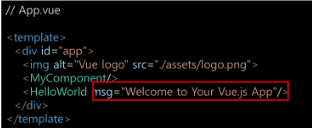
>   
>   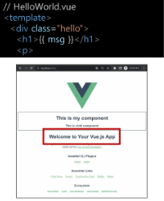

> ##### Props in HelloWorld 정리
> 
> - 정리
>   
>   - App.vue의 `<HelloWorld/>` 요소에 `msg=""`라는 property를 설정했으며, 하위 component인 HelloWorld.vue는 자신에게 부여된 msg property를 template에서 `{{msg}}`의 형태로 사용함

> ##### Props in HelloWorld 실습
> 
> - msg property의 value를 바꾸면 화면에 보이는 문장이 달라짐
>   
>   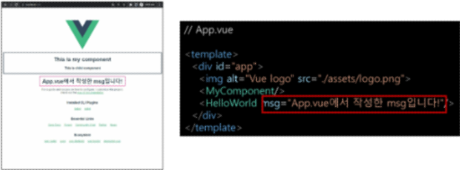

> ##### Pass Props
> 
> - 앞선 과정처럼 부모 => 자식으로의 data 전달 방식을 pass props라고 함
> 
> - 정적인 데이터를 전달하는 경우 static props라고 명시하기도 함
> 
> - 요소에 속성을 작성하듯이 사용 가능하여, `prop-data-name="value"`의 형태로 데이터를 전달
>   
>   - 이때 속성의 키 값은 kebab-case를 사용
> 
> - 정리
>   
>   - Props 명시
>   
>   - data를 받는 쪽, 즉 Child Component에서도 props에 대해 명시적으로 작성 해주어야 함
>   
>   - 전달받은 props를 type과 함께 명시
>   
>   - 컴포넌트를 문서화할 뿐만 아니라, 잘못된 타입이 전달하는 경우 브라우저의 자바스크립트 콘솔에서 사용자에게 경고
> 
> - https://v2.vuejs.org/v2/guide/components-props.html#Prop-Validation

> ##### MyComponent to MyChild
> 
> 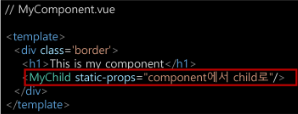
> 
> 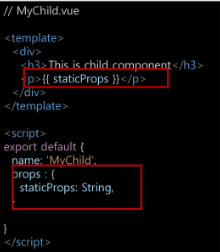

> ##### Pass Props convention
> 
> - 부모에서 넘겨주는 props
>   
>   - kebab-case (HTML 속성 명은 대소문자를 구분하지 않기 때문)
> 
> - 자식에서 받는 props
>   
>   - camelCase
> 
> - 부모 템플릿(html)에서 kebab-case로 넘긴 변수를 자식의 스크립트(vue)에서 자동으로 camelCase로 변환하여 인식함

> ##### Dynamic Props
> 
> - 변수를 props로 전달받을 수 있음
> 
> - v-bind directive를 사용해 데이터를 동적으로 바인딩
> 
> - Parent Component의 data가 업데이트 되면 Child Component로 전달되는 data 또한 업데이트 됨
> 
> 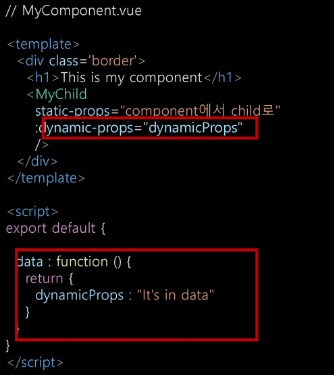
> 
> 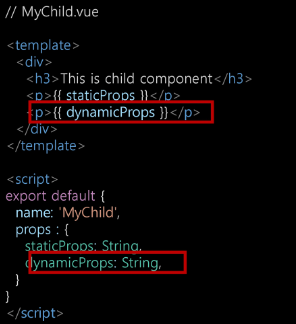

> ##### Component data 함수
> 
> - 각 vue instance는 같은 data 객체를 공유하므로 새로운 data 객체를 반환(return)하여 사용해야 함
>   
>   
> 
> - https://v2.vuejs.org/v2/guide/components.html#data-Must-Be-a-Function

> ##### Pass Props
> 
> - :dynamic-props="dynamicProps"는 앞의 key값 (dynamic-props)이란 이름으로 뒤의 `" "`안에 오는 데이터(dynamicProps)를 전달하겠다는 뜻
> 
> - 즉, :my-props="dynamicProps"로 데이터를 넘긴다면, Child Component에서 myProps로 데이터를 받아야 함
>   
>   
>   
>   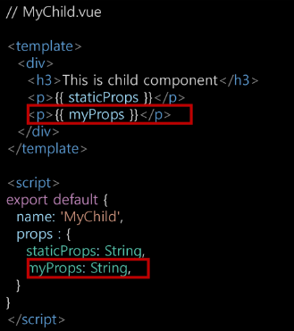
> 
> - v-bind로 묶여있는 `" "`안의 구문은 JavaScript의 구문으로 볼 수 있음
>   
>   - 따라서 dynamicProps라고 하는 변수에 대한 data를 전달할 수 있는 것

> ##### 단방향 데이터 흐름
> 
> - 모든 Props는 부모에서 자식으로 즉 아래로 단방향 바인딩을 형성
> 
> - 부모 속성이 업데이트되면 자식으로 흐르지만 반대 방향은 아님
>   
>   - Parent Component가 업데이트될 때마다 Child Component의 모든 prop들이 최신 값으로 새로고침 됨
> 
> - 목적
>   
>   - Child Component가 실수로 Parent Component 상태를 변경하여 앱의 데이터 흐름을 이해하기 힘들게 만드는 것을 방지
> 
> - Child Component에서 prop을 변경하려고 시도해서는 안되며 그렇게 하면 Vue는 콘솔에서 경고를 출력함

### Emit Event

> ##### Emit Event
> 
> - Parent Component에서 Child Component로 data를 전달할 때는 이벤트를 발생 시킴
>   
>   - 데이터를 이벤트 리스너의 콜백함수의 인자로 전달
>   
>   - Parent Component는 해당 이벤트를 통해 데이터를 받음
>   
>   - 즉, 이벤트를 발생시키는 것 == 데이터를 전달하는 것

> ##### $emit
> 
> - $emit method를 통해 Parent Component에 이벤트를 발생
>   
>   - `$emit('event-name')` 형식으로 사용하며 Parent Component에 event-name이라는 이벤트가 발생했다는 것을 알림
>   
>   - 마치 사용자가 마우스 클릭을 하면 click 이벤트가 발생하는 것처럼 `$emit('event-name')`가 실행되면 event-name 이벤트가 발생하는 것

> ##### Emit Event
> 
> 1. Child Component에 버튼을 만들고 클릭 이벤트를 추가
> 
> 2. $emit을 통해 Parent Component에게 child-to-parent 이벤트를 트리거
>    
>    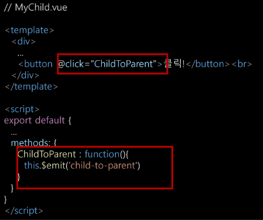
> 
> 3. emit된 이벤트를 Parent Component에서 청취 후 핸들러 함수 실행
>    
>    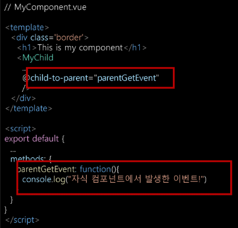

> ##### Emit Event 흐름 정리
> 
> 1. Child Component에 있는 버튼 클릭 이벤트를 청취하여 연결된 핸들러 함수(ChildToParent) 호출
> 
> 2. 호출된 함수에서 $emit을 통해 Parent Component에 이벤트(child-to-parent) 발생
> 
> 3. Parent Component는 Child Component가 발생시킨 이벤트(child-to-parent)를 청취하여 연결된 핸들러 함수(parentGetEvent) 호출

> ##### emit with data
> 
> - 이벤트를 발생(emit)시킬 때 인자로 데이터를 전달 가능
>   
>   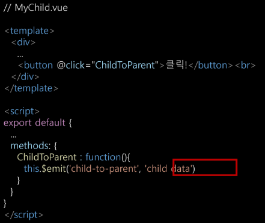
> 
> - 전달한 데이터는 이벤트와 연결된 Parent Component의 핸들러 함수의 인자로 사용 가능
>   
>   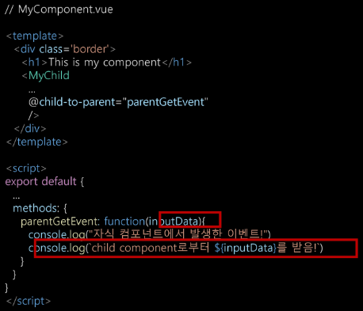

> ##### emit with data 흐름 정리
> 
> 1. Child Component에 있는 버튼 클릭 이벤트를 청취하여 연결된 핸들러 함수(ChildToParent) 호출
> 
> 2. 호출된 함수에서 $emit을 통해 Parent Component에 이벤트(child-to-parent)를 발생
>    
>    - 이벤트에 데이터(child data)를 함께 전달
> 
> 3. Parent Component는 Child Component의 이벤트 (child-to-parent)를 청취하여 연결된 핸들러 함수(parentGetEvent) 호출, 함수의 인자로 전달된 데이터(child data)가 포함되어 있음
> 
> 4. 호출된 함수에서 console.log('~child data~') 실행

> ##### emit with dynamic data
> 
> - pass props와 마찬가지로 동적인 데이터도 전달 가능
> 
> - 목표 : 
>   
>   - Child Component에서 입력받은 데이터를 Parent Component에게 전달하여 출력
>   
>   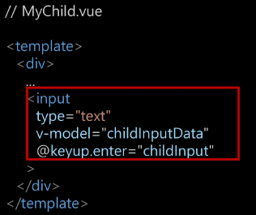
>   
>   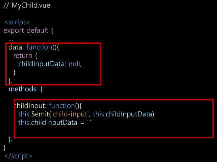
>   
>   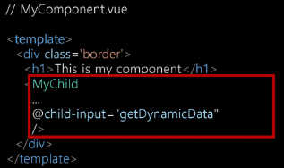
>   
>   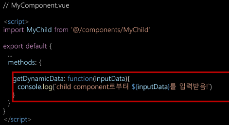

> ##### emit with dynamic data 흐름 정리
> 
> 1. Child Component에 있는 keyup.enter 이벤트를 청취하여 연결된 핸들러 함수(ChildInput) 호출
> 
> 2. 호출된 함수에서 $emit을 통해 Parent Component에 이벤트(child-input)를 발생
>    
>    - 이벤트에 v-model로 바인딩 된 input data를 전달
> 
> 3. Parent Component는 Child Component의 이벤트(child-input)를 청취하여 연결된 핸들러 함수(getDynamicData) 호출, 함수의 인자로 전달된 데이터가 포함되어 있음
> 
> 4. 호출된 함수에서 console.log(~입력받은 데이터~)

> ##### 정리
> 
> - Child Component에서 Parent Component로 이벤트를 발생시킴
>   
>   - 이벤트에 데이터를 담아 전달 가능
> 
> - Parent Component에서는 Child Component의 이벤트를 청취
>   
>   - 전달받은 데이터는 이벤트 핸들러 함수의 인자로 사용

> ##### pass props / emit event 컨벤션
> 
> - HTML 요소에서 사용할 때는 kebab-case / JavaScript에서 사용할 때는 camelCase
> 
> - props
>   
>   - 상위 => 하위 흐름에서 HTML 요소로 내려줌 : kebab-case
>   
>   - 하위에서 받을 때 JavaScript에서 받음 : camelCase
> 
> - emit
>   
>   - emit 이벤트를 발생시키면 HTML 요소가 이벤트를 청취함 : kebab-case
>   
>   - 메서드, 변수명 등은 JavaScript에서 사용함 : camelCase

### Lifecycle Hooks

> ##### Lifecycle Hooks
> 
> - 각 Vue 인스턴스는 생성과 소멸의 과정 중 단계별 초기화 과정을 거침
>   
>   - Vue 인스턴스가 생성된 경우, 인스턴스를 DOM에 마운트하는 경우, 데이터가 변경되어 DOM을 업데이트 하는 경우 등
> 
> - 각 단계가 트리거가 되어 특정 로직을 실행할 수 있음
> 
> - 이를 Lifecycle Hooks라고 함
>   
>   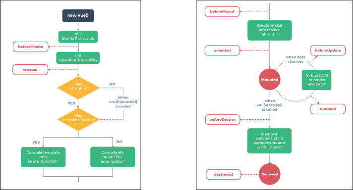
>   
>   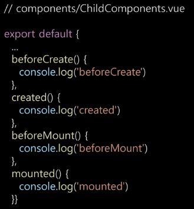
>   
>   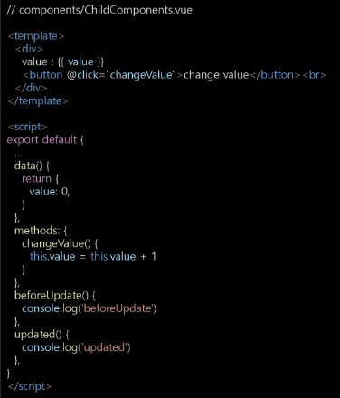
>   
>   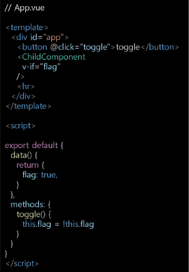
>   
>   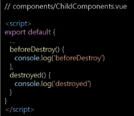

> ##### created
> 
> - Vue instance가 생성된 후 호출됨
> 
> - data, computed등의 설정이 완료된 상태
> 
> - 서버에서 받은 데이터를 vue instance의 data에 할당하는 로직을 구현하기 적합
> 
> - 단, mount되지 않아 요소에 접근할 수 없음
> 
> - 예시
>   
>   - 버튼을 누르면 API를 통해 강아지 사진을 보여주는 경우
>   
>   - 첫 실행시 기본 사진이 자동으로 출력되도록 하고 싶다면 created 함수에 강아지 사진을 가져오는 함수를 추가
>     
>     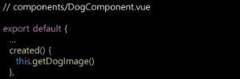

> ##### mounted
> 
> - Vue instance가 요소에 mount된 후 호출됨
> 
> - mount된 요소를 조작할 수 있음
>   
>   
> 
> - created의 경우, mount되기 전이기 때문에 DOM에 접근할 수 없으므로 동작하지 않음
> 
> - mounted는 주석처리
>   
>   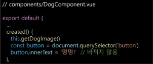

> ##### updated
> 
> - 데이터가 변경되어 DOM에 변화를 줄 때 호출됨
>   
>   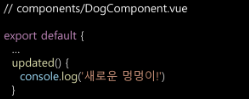

> ##### Lifecycle Hooks 특징
> 
> - instance마다 각각의 Lifecycle을 가지고 있음
>   
>   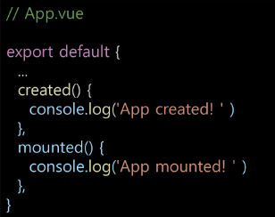
>   
>   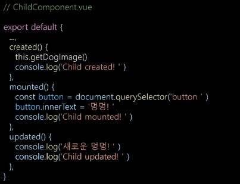
> 
> - Lifecycle Hooks는 Component별로 정의할 수 있음
> 
> - 현재 해당 프로젝트는 App.vue 생성 => ChildComponent 생성 => ChildComponent 부착 => App.vue 부착 => ChildComponent 업데이트 순으로 동작
> 
> - Parent Component의 mounted hook이 실행되어다고 해서 자식이 mount된 것이 아니고, Parent Component가 updated hook이 실행되었다고 해서 자식이 updated된 것이 아님
>   
>   - 부착 여부가 부모-자식 관계에 따라 순서를 가지고 있지 않은 것
> 
> - instance마다 각각의 Lifecycle을 가지고 있기 때문

