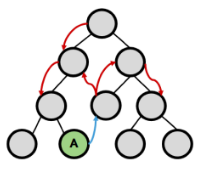
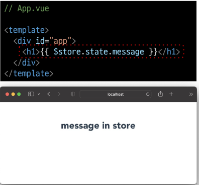

# 5_4

# Vue

# 상태 관리 패턴

### Vue State Management

> ##### 개요
> 
> - 상태 관리(State Management)가 무엇인지 이해하기
> 
> - Vuex가 무엇인지, 왜 필요한지 이해하기
> 
> - Vuex 기본 문법 알아보기

### State Management

> ##### 상태관리
> 
> - 상태(State)란?
>   
>   - 현재에 대한 정보(data)
>   
>   - 현재 App이 가지고 있는 Data로 표현할 수 있음
> 
> - 여러 개의 component를 조합하여 하나의 App을 만듦
> 
> - 각 component는 독립적이기 때문에 각각의 상태(data)를 가짐
> 
> - 하지만 독립적인 component가 모여 하나의 App을 구성하기 때문에 여러 개의 component가 같은 상태(data)를 유지할 필요가 있음
> 
> - 이를 위해 상태 관리(State Management)가 필요함

> ##### Pass Props & Emit Event
> 
> - 지금까지 우리는 props와 event를 이용해서 상태 관리를 하고 있음
> 
> - 각 컴포넌트는 독립적으로 데이터를 관리함
> 
> - 같은 데이터를 공유하고 있으므로, 각 컴포넌트가 동일한 상태를 유지하고 있음
> 
> - 데이터의 흐름을 직관적으로 파악 가능
>   
>   
> 
> - Tree가 깊어진다면, 즉 component의 중첩이 깊어지면 데이터 전달이 쉽지 않음
> 
> - 공통의 상태를 유지해야 하는 component가 많으지면 데이터 전달 구조가 매우 복잡해짐

> ##### Centralized Store
> 
> - 중앙 저장소(Store)에 데이터를 모아서 상태 관리
> 
> - 각 component는 중앙 저장소의 데이터를 사용
> 
> - component의 계층에 상관없이 중앙 저장소에 접근하여 데이터를 얻거나 변경할 수 있음
> 
> - 중앙 저장소의 데이터가 변경되면 각각의 component는 해당 데이터의 변화에 반응하여 새로 변경된 데이터를 반영함
> 
> - 규모가 크거나 컴포넌트 중첩이 깊은 프로젝트의 관리가 매우 편리함

> ##### Vuex
> 
> - "state management pattern + Library" for vue.js (상태 관리 패턴 + 라이브러리)
> 
> - 중앙 저장소를 통해 상태 관리를 할 수 있도록 하는 라이브러리
> 
> - 데이터가 예측 가능한 방식으로만 변경될 수 있도록 하는 규칙을 설정하며, Vue의 반응성을 효율적으로 사용하는 상태 관리 기능을 제공
> 
> - Vue의 공식 도구로써 다양한 기능을 제공

### Vuex 시작하기

> ##### 프로젝트 with vuex
> 
> 
> 
> - src / store / index.js가 자동생성
> 
> - vuex의 핵심 컨셉 4가지
>   
>   1. state
>   
>   2. getters
>   
>   3. mutations
>   
>   4. actions
>   
>   

> ##### Vue와 Vuex 인스턴스 비교
> 
> 

> ##### 1. State
> 
> - vue instance의 data에 해당
> 
> - 중앙에서 관리하는 모든 상태 정보
> 
> - 개별 component는 state에서 데이터를 가져와서 사용
>   
>   - 개별 component가 관리하던 data를 중앙 저장소(Vuex Store의 state)에서 관리하게 됨
> 
> - state의 데이터가 변화하면 해당 데이터를 사용(공유)하는 component도 자동으로 다시 렌더링
> 
> - `$store.state`로 state data에 접근

> ##### 2. Mutations
> 
> - state를 변경하는 유일한 방법
> 
> - vue instance의 methods에 해당하지만 Mutations에서 호출되는 핸들러(handler) 함수는 반드시 동기적이어야 함
>   
>   - 비동기 로직으로 mutations를 사용해서 state를 변경하는 경우, state의 변화의 시기를 특정할 수 없기 때문
> 
> - 첫 번째 인자로 state를 받으며, component 혹은 Actions에서 commit() method로 호출됨
> 
> - mutation, action에서 호출되는 함수를 handler 함수라고 함

> ##### 3. Actions
> 
> - mutations와 비슷하지만 비동기 작업을 포함할 수 있다는 차이가 있음
> 
> - state를 직접 변경하지 않고 commit() method로 mutations를 호출해서 state를 변경함
> 
> - context 객체를 인자로 받으며, 이 객체를 통해 store.js의 모든 요소와 메서드에 접근할 수 있음 (즉 state를 직접 변경할 수 있지만 하지 말아야 함)
> 
> - component에서 dispatch() method에 의해 호출됨

> ##### Mutations & Actions
> 
> - Vue component의 methods 역할이 Vuex에서는 아래와 같이 분화됨
> 
> - Mutations
>   
>   - state를 변경
> 
> - Actions
>   
>   - state 변경을 제외한 나머지 로직
>   
>   

> ##### Getters
> 
> - Vue instance의 computed에 해당
> 
> - state를 활용하여 계산된 값을 얻고자 할 때 사용하며 state의 원본 데이터를 건들지 않고 계산된 값을 얻을 수 있음
> 
> - computed와 마찬가지로 getters의 결과는 캐시(cache) 되며, 종속된 값이 변경된 경우에만 다시 계산됨
> 
> - getters에서 계산된 값은 state에 영향을 미치지 않음
> 
> - 첫번째 인자로 state, 두번째 인자로 getter를 받음

> ##### Vuex 관리하는 방법
> 
> - Vuex를 사용한다고 해서 모든 데이터를 state에 넣어야 하는 것은 아님
> 
> - Vuex에서도 여전히 pass props, emit event를 사용하여 상태를 관리할 수 있음
> 
> - 개발 환경에 따라 적절하게 사용하는 것이 필요함

> ##### 정리
> 
> - state
>   
>   - 중앙에서 관리하는 모든 상태 정보
> 
> - mutations
>   
>   - state를 변경하기 위한 methods
> 
> - actions
>   
>   - 비동기 작업이 포함될 수 있는(외부 API와의 소통 등) methods
>   
>   - staste를 변경하는 것 외의 모든 로직 진행
> 
> - getters
>   
>   - state를 활용해 계산한 새로운 변수 값
> 
> - component에서 data를 조작하기 위한 data의 흐름
>   
>   - component => (actions) => mutations => state
> 
> - component에서 데이터를 사용하기 위한 데이터의 흐름
>   
>   - state => (getters) => component

### 실습

> ##### Object method shorthand
> 
> - 앞으로는 객체 메서드 축약형을 사용함
>   
>   

> ##### state
> 
> - 중앙에서 관리하는 모든 상태 정보
> 
> - `$store.state`로 접근 가능
> 
> - store의 state에 message data 정의
>   
>   
> 
> - component에서 state 사용
>   
>   
> 
> - `$store.state`로 바로 접근하기보다 computed에 정의 후 접근하는 것을 권장
>   
>   
> 
> - Vue 개발자 도구에서의 Vuex
>   
>   - 관리화면을 Vuex로 변경
>   
>   - 관리되고 있는 state 확인 가능
>   
>   

> ##### actions
> 
> - state를 변경할 수 있는 mutations 호출
> 
> - component에서 dispatch()에 의해 호출됨
> 
> - dispatch(A, B)
>   
>   - A : 호출하고자 하는 actions 함수
>   
>   - B : 넘겨주는 데이터(payload)
> 
> - actions에 정의된 changeMessage 함수에 데이터 전달하기
> 
> - component에서 actions는 dispatch()에 의해 호출됨
>   
>   
> 
> - actions의 첫번째 인자는 context
>   
>   - context는 store의 전반적인 속성을 모두 가지고 있으므로 context.state와 context.getters를 통해 mutations를 호출하는 것이 모두 가능
>   
>   - dispatch()를 사용해 다른 actions도 호출할 수 있음
>   
>   - 단, actions에서 state를 직접 조작하는 것은 삼가야 함
> 
> - actions의 두 번째 인자는 payload
>   
>   - 넘겨준 데이터를 받아서 사용
>     
>     

> ##### mutations
> 
> "actions에서 commit()을 통해 mutations 호출하기"
> 
> - mutations는 state를 변경하는 유일한 방법
> 
> - component 또는 actions에서 commit()에 의해 호출됨
> 
> - commit(A, B)
>   
>   - A : 호출하고자 하는 mutations 함수
>   
>   - B : payload
>     
>     
> 
> "mutations 함수 작성하기"
> 
> - mutations는 state를 변경하는 유일한 방법
> 
> - mutations 함수의 첫번째 인자는 state, 두번째 인자는 payload
>   
>   

> ##### getters
> 
> ##### "getters 사용하기"
> 
> - getters는 state를 활용한 새로운 변수
> 
> - getters 함수의 첫번째 인자는 state, 두번째 인자는 getters
>   
>   
> 
> ##### "getters의 다른 함수 사용해보기"
> 
> 
> 
> ##### "getters 출력하기"
> 
> - getters 역시 state와 마찬가지로 computed에 정의해서 사용하는 것을 권장
>   
>   
>   
>   

### 마무리

> ##### 그냥 mutations으로만 state를 변경하면 안되나
> 
> - "가능하다"
> 
> - 단, 저장소의 각 컨셉(state, getters, mutations, actions)은 각자의 역할이 존재하도록 설계되어있음
> 
> - 특별한 작업 없이 단순히 mutations만을 호출하는 경우도 있으나 이 경우는 Vuex 도입의 적절성을 판단해 볼 필요가 있음

> ##### Vuex를 사용해야하는 경우
> 
> - Vuex는 공유된 상태 관리를 처리하는 데 유용하지만, 개념에 대한 이해와 시작하는 비용이 크다.
> 
> - 어플리케이션이 단순하다면 Vuex가 없는 것이 더 효율적일 수 있다.
> 
> - 그러나 중대형 규모의 SPA를 구축하는 경우 Vuex는 자연스럽게 선택할 수 있는 단계가 오게 된다.
> 
> - 결과적으로 역할에 적절한 상황에서 활용했을 때 Vuex 라이브러리 효용을 극대화할 수 있음
> 
> - 즉, 필요한 순간이 왔을 때 사용하는 것을 권장함.

