# 5_8

# Vuex Advanced

> ##### 개요
> 
> - Vuex로 관리중인 상태를 로컬에 저장하기
>   
>   - 관련 plugin 알아보기
> 
> - Vuex Helper method 알아보기

### Local Storage

> ##### 상태 유지하기
> 
> - 현재 앱을 재실행하거나, 새로고침을 하면 초기 값으로 돌아감
> 
> - MDN main page에서 테마를 설정하고, 새로 고침해도 테마는 유지되어 있음
>   
>   - 개발자 도구 > Application > Local Storage에서 확인
>   
>   - theme Key에 light Value가 저장되어 있음

> ##### Window.localStorage
> 
> - 브라우저의 내장 객체 중 하나
> 
> - Key-value 형태로 데이터를 저장할 수 있는 저장소
> 
> - localStorage에 저장된 데이터는 브라우저를 종료해도 계속해서 유지 됨
>   
>   - 다른 탭에서도 동일한 데이터를 공유할 수 있는 반면, 다른 도메인에서는 접근할 수 없음
> 
> - setItem(key, value) - key, value 형태로 저장
>   
>   
> 
> - getItem(key) - key 값으로 저장된 데이터 불러오기
>   
>   

> ##### JSON.stringify
> 
> - JSON (JavaScript Object Notation) 객체의 메서드
> 
> - 자바스크립트 객체를 JSON 형식의 문자열로 변환하여 반환
>   
>   

> ##### JSON.parse
> 
> - JSON 형식의 문자열을 자바스크립트 객체로 변환하여 반환
>   
>   

> ##### Vuex에 적용하기
> 
> 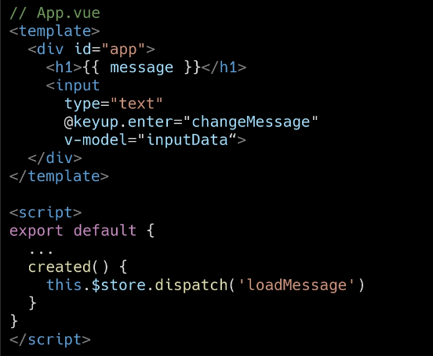
> 
> 

### Plugins

> ##### plugin이란?
> 
> - Vuex store에 추가적인 기능을 제공하는 확장 기능
> 
> - 일반적으로 state의 변화를 감지해, 어플리케이션의 성능을 최적화하는 목적을 가짐

> ##### vuex-persistedstate
> 
> - Vuex store의 상태를 브라우저 local storage에 저장해주는 plugin
> 
> - 페이지를 새로 고침하거나 브라우저를 종료하였다가 다시 열었을 때, 이전 상태를 유지할 수 있도록 해줌
> 
> - 설치
>   
>   - `npm i vuex-persistedstate`
> 
> - 적용
>   
>   - 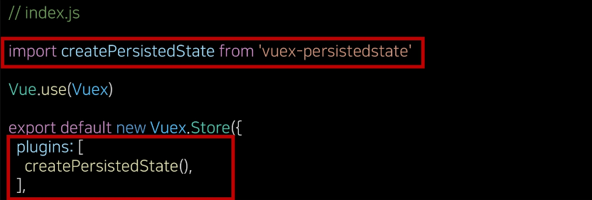
> 
> - 메시지 입력 후, Local Storage 확인
>   
>   - 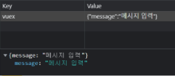
> 
> - Vuex key에 state의 message가 가진 값들이 value로 할당 됨
> 
> - 브라우저를 종료 후, 다시 서버를 열었을 때도 Vuex의 상태가 유지됨을 확인
> 
> - [참고]
>   
>   - 추가 옵션을 사용하여 필요에 따라 저장 방식을 변경할 수 있음
>   
>   - 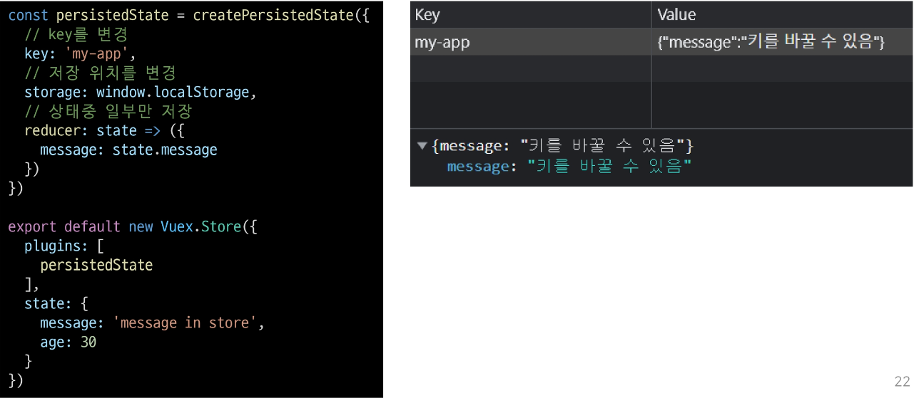

### Vuex Binding Helper

> ##### Vuex Binding Helper
> 
> - Vuex store의 state, mutations, actions 등을 간단하게 사용할 수 있도록 만들어진 헬퍼 함수
> 
> - mapState, mapActions와 같은 형식으로 사용
> 
> - 사용하기 위해서는 import 받아와야 함
>   
>   `import {mapState, mapActions} from 'vuex'`

> ##### mapState
> 
> - Vuex store의 상태를 컴포넌트의 데이터에 매핑할 때 사용
> 
> - 객체 혹은 배열 형태로 상태를 매핑하여 사용할 수 있음
> 
> - 객체 형태로 매핑
>   
>   1. mapState를 import
>   
>   2. Spread operator를 사용하여 mapState를 전개
>   
>   3. mapState 내부에 불러오고자 하는 값을 정의. 화살표 함수를 사용하여 message key에 state의 message 값을 할당
> 
> - key 값은 컴포넌트에서 사용하고자 하는 다른 이름으로 변경하여 사용할 수 있음
>   
>   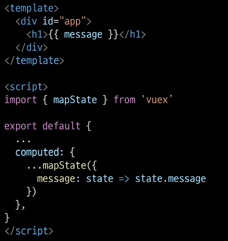
> 
> - 배열 형태로 매핑
>   
>   1. mapState를 import
>   
>   2. Spread operator를 사용하여 mapState를 전개
>   
>   3. Vuex store의 상태 중, 불러오고자 하는 대상을 배열의 원소로 정의
>   
>   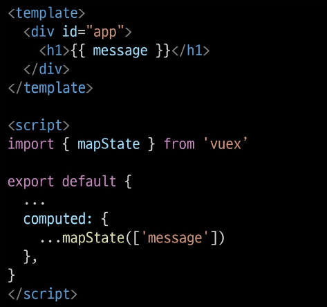

> ##### mapActions
> 
> - 컴포넌트에서 this.$store.dispatch()를 호출하는 대신, 액션 메서드를 직접 호출하여 사용할 수 있음
> 
> - mapState와 같이 객체 혹은 배열 형태로 매핑 가능
> 
> - 배열 형태로 매핑
>   
>   1. mapState와 동일한 형식으로 사용
>      
>      단, 이 경우 changeMessage에 넘겨주어야 할 inputData를 changeMessage 호출 시 인자로 직접 값을 넘겨주어야 함
>      
>      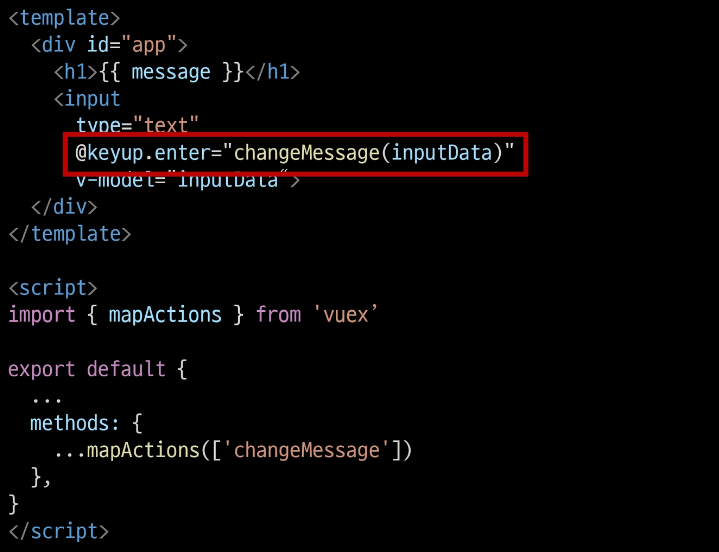
> 
> - 객체 형태로 매핑
>   
>   1. Actions의 changeMessage를 actionsChangeMessage에 매핑
>   
>   2. this.actionsChangeMessage 형식으로 사용
>   
>   3. payload를 넘겨주거나 추가적인 로직 작성 가능
>   
>   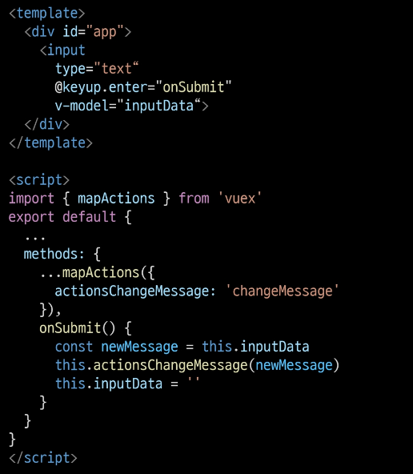

> ##### mapGetters
> 
> - mapState, mapActions와 동일한 방식으로 사용 가능
>   
>   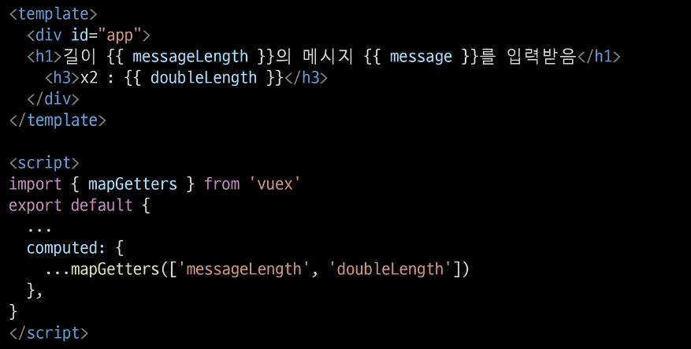
> 
> - [참고]
>   
>   - 상황에 따라서는 배열과 객체 형태로 각각 매핑하여 사용할 수 있음
>     
>     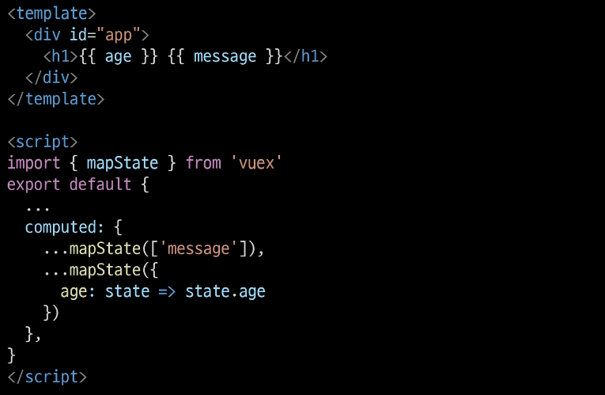

### Modules

> ##### Modules
> 
> - Vuex store를 여러 파일로 나눠서 관리할 수 있게 해주는 기능
> 
> - Vuex store와 동일한 구성을 가진 별도의 객체를 정의하여 modules 옵션에 작성한 객체를 추가하여 사용
> 
> - 별개의 .js 파일에 정의하고 import하는 방식으로도 사용 가능
> 
> - Store의 가독성을 향상시킬 수 있음
> 
> - 별도의 js 파일에 객체 정의
>   
>   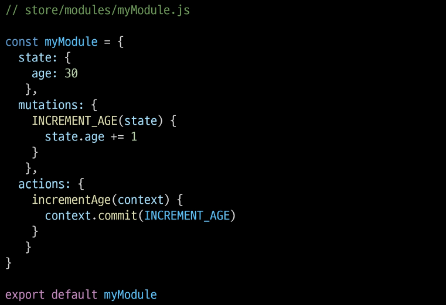
> 
> - 정의한 js 파일의 객체를 import
> 
> - Store의 modules 옵션에 추가
>   
>   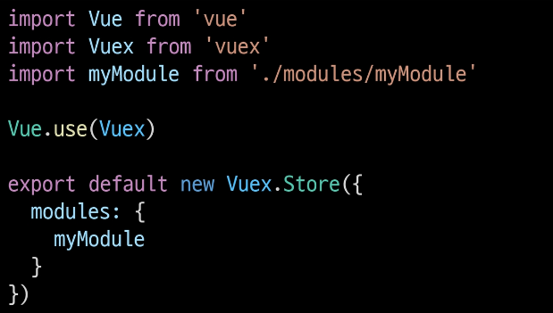

