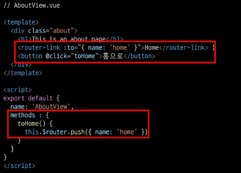
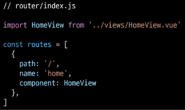

# 5_9

# Vuex Advanced

### UX & UI

> ##### 개요
> 
> - 우리는 비슷한 것끼리 묶거나 내용을 구성해서 인지하는 것이 편하다는 것을 알고 있다. 만약 그렇지 않을 경우 불편하다는 느낌을 받거나 의사결정을 하는데 많은 시간이 걸리기도 한다.
> 
> - 이러한 요소들은 유저와 밀접한 부분이기에 매우 중요하며 모든 서비스에서 반드시 고려되어야 한다.
> 
> - 단순한 느낌이나 심미적인 부분만 고려하는 것이 아닌 체계적인 설계를 통해 기획해야 한다.

> ##### UX (User Experience)
> 
> - 유저와 가장 가까이에 있는 분야, 데이터를 기반으로 유저를 조사하고 분석해서 개발자, 디자이너가 이해할 수 있게 소통
> 
> - 유저가 느끼는 느낌, 태도 그리고 행동을 디자인
> 
> - 사람들의 마음과 생각을 이해하고 정리해서 우리 제품에 녹여내는 과정이 필요
> 
> - 유저 리서치, 데이터 설계 및 정제, 유저 시나리오, 프로토타입 설계 등이 필요

> ##### UI (User Interface)
> 
> - 유저에게 보여지는 화면을 디자인 
> 
> - UX를 고려한 디자인을 반영, 이 과정에서 기능 개선 혹은 추가가 필요한 경우 Front-end 개발자와 가장 많이 소통
> 
> - [참고] Interface
>   
>   - 서로 다른 두 개의 시스템, 장치 사이에서 정보나 신호를 주고받는 경우의 접점
>     
>     - 즉, 사용자가 기기를 쉽게 동작시키는데 도움을 주는 시스템
>   
>   - CLI(command-Line Interface)나 GUI(Graphic User Interface)를 사용해서 컴퓨터를 조작
> 
> - 심미적인 부분만 중요하다기보단 사용자가 보다 쉽고 편리하게 사용할 수 있도록 하는 부분까지 고려되어야 함
> 
> - 통일된 디자인을 위한 디자인 시스템, 소통을 위한 중간 산출물, 프로토타입 등이 필요
> 
> - UI 디자인에 있어 가장 중요한 것은 협업

> ##### 디자이너와 기획자 그리고 개발자
> 
> - 많은 회사에서 UX/UI 디자인을 함께하는 디자이너를 채용하거나 UX는 기획자, UI는 디자이너의 역할로 채용하기도 함
> 
> - UX ( 직무 : UX Researchec, User Researcher)
>   
>   - 구글 : 사용자의 경험을 이해하기 위한 통계 모델을 설계
>   
>   - MS : 리서치를 기획하고 사용자에 대한 지표를 정의
>   
>   - Meta : 정성적인 방법과 정량적인 방법을 사용해서 사용자 조사를 실시
> 
> - UI ( 직무 : Product Designer, Interaction Designer)
>   
>   - 구글 : 다양한 디자인 프로토타이핑 툴을 사용해서 개발 가이드를 제공
>   
>   - MS : 시각 디자인을 고려해서 체계적인 디자인 컨셉을 보여줌
>   
>   - Meta : 제품을 이해하고 더 나은 UI Flow와 사용자 경험을 디자인
> 
> - 개발자는 단순히 기능 개발만 하는 사람이 아니며 제품에 대해 고민하고 소통하는 능력이 반드시 필요
> 
> - 즉 다양한 분야와의 협업이 필수적이기에 기본적인 UX/UI에 대한 이해가 있어야함

> ##### [참고]
> 
> - 더 나은 UX/UI를 고민해볼 수 있는 웹 사이트
>   
>   - https://cantunsee.space/

### Prototyping

> ##### Software prototyping
> 
> - 어플리케이션의 프로토타입을 만드는 것
> 
> - 즉 개발중인 소프트웨어 프로그램의 완성되기 전 버전을 만드는 것
> 
> - 한 번에 완성 버전이 나올 수 없기에 중간마다 현재 상태를 체크하는 과정

> ##### Prototyping Tool 시장
> 
> - UI/UX 디자인을 prototyping하기 위한 도구는 굉장히 많고 빠른 패러다임의 변화로 인해 치열한 경쟁이 계속되고 있음
> 
> - 이전까지는 Sketch라는 툴이 굉장히 많이 사용되었지만, 현재는 Figma라는 툴이 약 70%의 시장 점유율을 보이고 있음

> ##### Figma
> 
> - 인터페이스 디자인을 위한 협업 웹 어플리케이션 (2012 출시)
> 
> - 협업에 중점을 두면서 UI/UX 설계에 초점을 맞춤

> ##### Why Figma
> 
> - 웹 기반 시스템을 가짐 (웹 환경에서 동작)
>   
>   - 매우 가벼운 환경에서 실행가능, 모든 작업 내역이 웹에 저장됨
> 
> - 실시간으로 팀원들이 협업할 수 있는 기능을 제공
> 
> - 직관적이고 다양한 디자인 툴을 제공
> 
> - Figma 사용자들이 만든 다양한 플러그인이 존재 (VSCode의 확장 프로그램 등)
> 
> - 대부분의 기능을 무료로 사용할 수 있음

> ##### Figma 성공의 이유
> 
> - 성능의 희생을 일부 감수하고 웹 기반으로 원활한 협업이 이루어지도록 함
> 
> - 기존 서비스들의 모든 불필요한 과정을 생략하고 디자인 그 자체에만 집중할 수 있게 함
> 
> - 이를 따라잡기 위해 시장 업계 1위 Adobe도 Adobe XD라는 프로그램을 앞세우며 많은 노력을 했지만 경쟁이 불가함을 인정

> ##### 프로젝트를 시작하기 전에
> 
> - 개발부터 시작하지 말고 반드시 충분한 기획을 거칠 것
> 
> - 우리가 완성하고자 하는 대략적인 모습을 그려보는 과정이 필요 (프로토 타입)
> 
> - 이러한 과정을 통해서 기획에서 빠진 화면이나 API등을 확인할 수 있음
> 
> - 설계와 기획이 끝난 후 개발을 시작해야 체계적인 진행이 가능함

> ##### 프로젝트와 협업
> 
> - 협업은 프로젝트와 팀이 성공하기 위한 토대
> 
> - 어떻게 효과적으로 잘 협업할 수 있는지 다양한 방법과 도구를 찾아보고 학습하며 여러 프로젝트를 경험하는 과정이 반드시 필요

# Vue Router

### Router

> ##### Routing
> 
> - 네트워크에서 경로를 선택하는 프로세스
> 
> - 웹 서비스에서의 라우팅
>   
>   - 유저가 방문한 URL에 대해 적절한 결과를 응답하는 것
> 
> - 예시
>   
>   - /articles/index에 접근하면 articles의 index에 대한 결과를 보여줌

> ##### Routing in SSR
> 
> - Server가 모든 라우팅을 통제
> 
> - URL로 요청이 들어오면 응답으로 완성됨 HTML 제공
>   
>   - Django로 보낸 요청의 응답 HTML은 완성본인 상태였음
> 
> - 결론적으로, Routing(URL)에 대한 결정권을 서버가 가짐

> ##### Routing in SPA/SSR
> 
> - 서버는 하나의 HTML만을 제공
> 
> - 이후에 모든 동작은 하나의 HTML 문서 위에서 JavaScript 코드를 활용
>   
>   - DOM을 그리는데 필요한 추가적인 데이터가 있다면 axios와 같은 AJAX 요청을 보낼 수 있는 도구를 사용하여 데이터를 가져오고 처리
>   
>   - 즉, 하나의 URL만 가질 수 있음

> ##### Why Routing
> 
> - 동작마다 URL이 바뀔 필요가 없음
> 
> - Routing이 없다면,
>   
>   - 유저가 URL을 통한 페이지의 변화를 감지할 수 없음
>   
>   - 페이지가 무엇을 렌더링 중인지에 대한 상태를 알 수 없음
>     
>     - 새로고침 시 처음 페이지로 돌아감
>     
>     - 링크를 공유할 시 처음 페이지만 공유 가능
>   
>   - 브라우저의 뒤로 가기 기능을 사용할 수 없음

### Vue Router

> ##### Vue Router
> 
> - Vue의 공식 라우터
> 
> - SPA 상에서 라우팅을 쉽게 개발할 수 있는 기능을 제공
> 
> - 라우트(routes)에 컴포넌트를 매핑한 후, 어떤 URL에서 렌더링 할지 알려줌
>   
>   - 즉, SPA를 MPA처럼 URL을 이동하면서 사용 가능
>   
>   - SPA의 단점 중 하나인 "URL이 변경되지 않는다"를 해결
> 
> - [참고] MPA (Multiple Page Application)
>   
>   - 여러 개의 페이지로 구성된 어플리케이션
>   
>   - SSR 방식으로 랜더링

> ##### Vue Router 시작하기
> 
> - Vuex와 마찬가지의 방식으로 설치 및 반영
>   
>   
> 
> - history mode 사용여부 => Yes
>   
>   
> 
> - App.vue
>   
>   - router-link 요소 및 router-view가 추가됨
>     
>     
> 
> - router/index.js 생성
> 
> - views 폴더 생성
>   
>   
> 
> - 서버 실행

> ##### History mode
> 
> - 브라우저의 History API를 활용한 방식
>   
>   - 새로고침 없이 URL 이동 기록을 남길 수 있음
> 
> - 우리에게 익숙한 URL 구조로 사용 가능
>   
>   - http://localhost:8000/index
> 
> - 만약 History mode를 사용하지 않으면 Default 값인 hash mode로 설정됨 (`#`을 통해 URL을 구분하는 방식)
>   
>   - http://localhost:8000#index

> ##### router-link
> 
> - a 태그와 비슷한 기능 => URL을 이동시킴
>   
>   - routes에 등록된 컴포넌트와 매핑됨
>   
>   - 히스토리 모드에서 router-link는 클릭 이벤트를 차단하여 a태그와 달리 브라우저가 페이지를 다시 로드하지 않도록 함
> 
> - 목표 경로는 `to` 속성으로 지정됨
> 
> - 기능에 맞게 HTML에서 a 태그로 rendering 되지만, 필요에 따라 다른 태그로 바꿀 수 있음
> 
> - 개발자 도구
>   
>   

> ##### router-view
> 
> - 주어진 URL에 대해 일치하는 컴포넌트를 렌더링 하는 컴포넌트
> 
> - 실제 컴포넌트가 DOM에 부착되어 보이는 자리를 의미
> 
> - router-link를 클릭하면 routes에 매핑된 컴포넌트를 렌더링
> 
> - Django에서의 block tag와 비슷함
>   
>   - App.vue는 base.html의 역할
>   
>   - router-view는 block태그로 감싼 부분
> 
> - 개발자 도구
>   
>   

> ##### src/router/index.js
> 
> - 라우터에 관련된 정보 및 설정이 작성되는 곳
> 
> - Django에서의 urls.py에 해당
> 
> - routes에 URL와 컴포넌트를 매핑
>   
>   
> 
> - Django와의 비교
>   
>   

> ##### src/Views
> 
> - router-view에 들어갈 component 작성
> 
> - 기존에 component를 작성하던 곳은 components 폴더 뿐이었지만 이제 두 폴더로 나뉘어짐
> 
> - 각 폴더 안의 .vue 파일들이 기능적으로 다른 것은 아님
> 
> - 이제 폴더별 컴포넌트 배치는 다음과 같이 진행 ( 규약은 아님 )
> 
> - views/
>   
>   - routes에 매핑되는 컴포넌트, 즉 `<router-view>`의 위치에 렌더링되는 component를 모아두는 폴더
>   
>   - 다른 component와 구분하기 위해 view로 끝나도록 만드는 것을 권장
>   
>   - EX) App component 내부의 AboutView & HomeView component
> 
> - components/
>   
>   - routes에 매핑된 컴포넌트의 하위 컴포넌트를 모아두는 폴더
>   
>   - EX) HomeView component 내부의 HelloWorld component

### Vue Router 실습

> ##### 주소를 이동하는 2가지 방법
> 
> 1. 선언적 방식 네비게이션
> 
> 2. 프로그래밍 방식 네비게이션

> ##### 선언적 방식 네비게이션
> 
> - router-link의 `to`속성으로 주소 전달
>   
>   - routes에 등록된 주소와 매핑된 component로 이동
>     
>     
> 
> - 동적인 값을 사용하기 때문에 v-bind를 사용해야 정상적으로 작동
>   
>   

> ##### Named Routes
> 
> - 이름을 가지는 routes
>   
>   - Django에서 path 함수의 name 인자의 활용과 같은 방식
>     
>     

> ##### 프로그래밍 방식 네비게이션
> 
> - Vue 인스턴스 내부에서 라우터 인스턴스에 `$router`로 접근할 수 있음
> 
> - 다른 URL로 이동하려면 `this.$router.push`를 사용
>   
>   - history stack에 이동할 URL을 넣는(push) 방식
>   
>   - history stack에 기록이 남기 때문에 사용자가 브라우저의 뒤로 가기 버튼을 클릭하면 이전 URL로 이동할 수 있음
> 
> - 결국 `<router-link :to="...">`를 클릭하는 것과 `$router.push(...)`를 호출하는 것은 같은 동작
> 
> - 동작 원리는 선언적 방식과 같음
>   
>   
>   
>   

> ##### Dynamic Route Matching
> 
> - 동적 인자 전달
>   
>   - URL의 특정 값을 변수처럼 사용할 수 있음
> 
> - EX) Django에서의 variable routing
> 
> - HelloView.vue 작성 및 route 추가
> 
> - route를 추가할 때 동적 인자를 명시
>   
>   
>   
>   
> 
> - `$route.params`로 변수에 접근 가능
>   
>   
> 
> - 다만 HTML에서 직접 사용하기보다는 data에 넣어서 사용하는 것을 권장
>   
>   

> ##### Dynamic Route Matching - 선언적 방식 네비게이션
> 
> - App.vue에서 harry에게 인사하는 페이지로 이동해보기
> 
> - params를 이용하여 동적인자 전달 가능
>   
>   

> ##### Dynamic Route Matching - 프로그래밍 방식 네비게이션
> 
> - AboutView에서 데이터를 입력 받아 HelloView로 이동하여 입력받은 데이터에게 인사하기
>   
>   
>   
>   

> ##### route에 component를 등록하는 또다른 방법
> 
> - router/index.js에 component를 등록하는 또 다른 방식이 주어지고 있음(about)
>   
>   - 기존 방식
>     
>     
>   
>   - Lazy-loading
>     
>     

> ##### Lazy-loading
> 
> - 모든 파일을 한 번에 로드하려고 하면 모든 것을 다 읽는 시간이 매우 오래 걸림
> 
> - 미리 로드를 하지 않고 특정 라우트에 방문할 때 매핑된 컴포넌트의 코드를 로드하는 방식을 활용할 수 있음
>   
>   - 모든 파일을 한 번에 로드하지 않아도 되기 때문에 최초에 로드하는 시간이 빨라짐
>   
>   - 당장 사용하지 않을 컴포넌트는 먼저 로드하지 않는 것이 핵심
